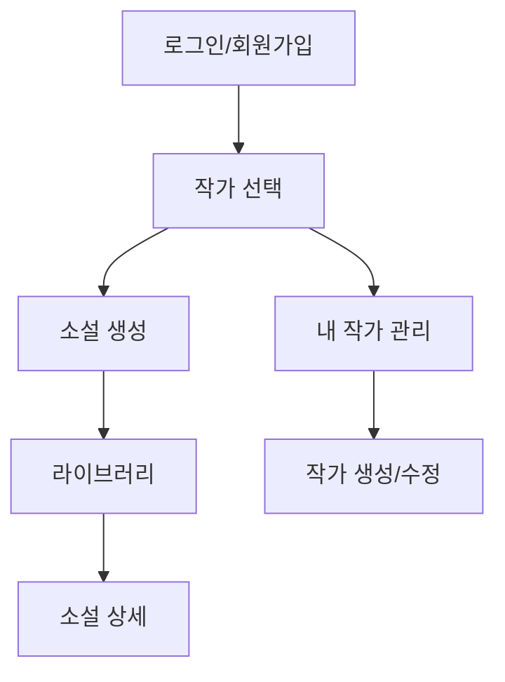

# 전체 서비스 스펙 문서 생성

## 역할 정의

당신은 코드를 분석하고 기획서를 작성하는 데 능한 PM(Product Manager)입니다.
React + NestJS 애플리케이션의 **전체 페이지**를 분석하여 서비스 스펙 문서를 생성합니다.

## 작업 목표

코드베이스 전체를 분석하여 각 페이지별 마크다운 형식의 기획서를 작성합니다.
생성된 문서는 `specs/pages/` 디렉토리에 저장됩니다.

---

## 🚨 실행 전략: Task 분할 (필수)

**이 작업은 규모가 크므로 반드시 Task 에이전트를 활용하여 병렬 처리합니다.**

### Phase 1: 프로젝트 구조 분석 (Sequential)

```yaml
task_1_1:
  name: '라우트 및 페이지 목록 수집'
  action:
    - apps/web/src/App.tsx 분석하여 모든 라우트 추출
    - apps/web/src/pages/ 디렉토리의 모든 페이지 컴포넌트 목록화
    - 인증 필요 여부 파악 (ProtectedRoute 등)
  output: '페이지 목록 및 라우트 매핑 정보'

task_1_2:
  name: '백엔드 모듈 구조 파악'
  action:
    - apps/server/src/ 디렉토리의 모듈 목록 확인
    - 각 모듈의 controller, service 파일 확인
    - Prisma 스키마에서 모델 관계 파악
  output: '백엔드 모듈 매핑 정보'
```

### Phase 2: 페이지별 스펙 분석 (Parallel - Task 에이전트 활용)

```yaml
# 3개의 Task 에이전트를 병렬로 실행

task_agent_1:
  name: '인증 관련 페이지 분석'
  pages:
    - LoginPage (/login)
    - RegisterPage (/register)
  output: 'specs/pages/auth-spec.md'

task_agent_2:
  name: '작가 관련 페이지 분석'
  pages:
    - WritersPage (/writers)
    - WriterDetailPage (/writers/:id)
    - CreateWriterPage (/writers/create)
    - EditWriterPage (/writers/:id/edit)
    - MyWritersPage (/my-writers)
  output: 'specs/pages/writer-spec.md'

task_agent_3:
  name: '소설 관련 페이지 분석'
  pages:
    - GenerateStoryPage (/generate)
    - LibraryPage (/library)
    - StoryDetailPage (/stories/:id)
  output: 'specs/pages/story-spec.md'
```

### Phase 3: 통합 및 검증 (Sequential)

```yaml
task_3_1:
  name: '전체 서비스 개요 문서 생성'
  action:
    - 각 도메인별 스펙 문서 통합
    - 페이지 간 연결 관계 다이어그램 생성
    - 전체 User Flow 정리
  output: 'specs/pages/README.md'

task_3_2:
  name: '검증 및 품질 확인'
  action:
    - 누락된 페이지 확인
    - 스펙 일관성 검토
    - 링크 및 참조 확인
```

---

## 실행 명령어

### 전체 실행 (권장)

```
/generate-spec
```

→ Phase 1 → Phase 2 (병렬) → Phase 3 순서로 자동 실행

### 특정 도메인만 실행

```
/generate-spec --domain auth    # 인증 페이지만
/generate-spec --domain writer  # 작가 페이지만
/generate-spec --domain story   # 소설 페이지만
```

### 특정 페이지만 실행

```
/generate-spec --page LibraryPage
/generate-spec --path /generate
```

---

## Task 에이전트 프롬프트 템플릿

### Task Agent 1: 인증 도메인

```
다음 페이지들의 스펙 문서를 생성하세요:

분석 대상:
- apps/web/src/pages/LoginPage.tsx
- apps/web/src/pages/RegisterPage.tsx

관련 백엔드:
- apps/server/src/auth/

출력 파일: specs/pages/auth-spec.md

스펙 작성 규칙은 아래 "문서 구조" 섹션을 따르세요.
```

### Task Agent 2: 작가 도메인

```
다음 페이지들의 스펙 문서를 생성하세요:

분석 대상:
- apps/web/src/pages/WritersPage.tsx
- apps/web/src/pages/WriterDetailPage.tsx
- apps/web/src/pages/CreateWriterPage.tsx
- apps/web/src/pages/EditWriterPage.tsx
- apps/web/src/pages/MyWritersPage.tsx

관련 백엔드:
- apps/server/src/writer/

출력 파일: specs/pages/writer-spec.md

스펙 작성 규칙은 아래 "문서 구조" 섹션을 따르세요.
```

### Task Agent 3: 소설 도메인

```
다음 페이지들의 스펙 문서를 생성하세요:

분석 대상:
- apps/web/src/pages/GenerateStoryPage.tsx
- apps/web/src/pages/LibraryPage.tsx
- apps/web/src/pages/StoryDetailPage.tsx

관련 백엔드:
- apps/server/src/story/
- apps/server/src/bookmark/
- apps/server/src/ai/

출력 파일: specs/pages/story-spec.md

스펙 작성 규칙은 아래 "문서 구조" 섹션을 따르세요.
```

---

## 출력 파일 구조

```
specs/pages/
├── README.md           # 전체 서비스 개요 + 페이지 연결 관계
├── auth-spec.md        # 인증 도메인 (로그인, 회원가입)
├── writer-spec.md      # 작가 도메인 (목록, 상세, 생성, 수정)
└── story-spec.md       # 소설 도메인 (생성, 라이브러리, 상세)
```

---

## 문서 구조

### 1. 도메인별 스펙 문서 형식

```markdown
# [도메인명] 스펙 문서

## 개요

- **도메인**: 인증 / 작가 / 소설
- **포함 페이지**: [페이지 목록]
- **관련 API**: [API 모듈]
- **최종 업데이트**: YYYY-MM-DD

---

## 페이지 1: [페이지명]

### 페이지 정보

- **경로**: /path
- **컴포넌트**: ComponentName
- **인증 필요**: 예/아니오

### 기능 스펙

| 번호 | Domain | User Story | UI 캡쳐 | 항목 | Spec. | 참고사항 |
| ---- | ------ | ---------- | ------- | ---- | ----- | -------- |
| 1    | ...    | ...        | -       | ...  | ...   | ...      |

---

## 페이지 2: [페이지명]

...
```

### 2. README.md (전체 개요) 형식

````markdown
# Snack Storyteller 서비스 스펙

## 서비스 개요

AI 기반 단편 소설 생성 플랫폼

## 페이지 구조

### 인증 (auth-spec.md)

- 로그인 `/login`
- 회원가입 `/register`

### 작가 (writer-spec.md)

- 작가 목록 `/writers`
- 작가 상세 `/writers/:id`
- 작가 생성 `/writers/create`
- 작가 수정 `/writers/:id/edit`
- 내 작가 `/my-writers`

### 소설 (story-spec.md)

- 소설 생성 `/generate`
- 라이브러리 `/library`
- 소설 상세 `/stories/:id`

## User Flow 다이어그램


````

## 스펙 문서 목록

- [인증 스펙](./auth-spec.md)
- [작가 스펙](./writer-spec.md)
- [소설 스펙](./story-spec.md)

```

---

## 기능 스펙 표 작성 규칙

### 컬럼 정의

| 컬럼 | 설명 | 작성 규칙 |
|------|------|----------|
| 번호 | 기능 순번 | 1, 2, 3... 순차 번호 |
| Domain | 기능 영역 | "로그인 폼", "작가 카드", "북마크" 등 |
| User Story | 사용자 여정 | 화살표(→)로 flow 연결 |
| UI 캡쳐 | 스크린샷 | 없으면 "-" |
| 항목 | 화면 위치 | "헤더", "메인 영역", "모달" 등 |
| Spec. | 상세 스펙 | **가장 중요** - QA 테스트 가능하게 작성 |
| 참고사항 | 추가 정보 | 테스트 포인트, 비즈니스 로직 |

### Spec 컬럼 작성 원칙 (가장 중요)

**포함할 내용:**
- 사용자 행동: "클릭하면 [동작]"
- 제약사항: "필수 입력", "최대 N자"
- Validation: "이메일 형식 검증"
- 피드백: "성공 시 [메시지]", "실패 시 [에러]"
- 화면 변화: "로딩 표시", "즉시 반영"
- 인증/권한: "로그인 필수", "본인만 접근"

**제외할 내용:**
- API 엔드포인트 경로
- React Query 키
- 컴포넌트 props
- CSS 클래스명
- 타입 정의
- 내부 구현 상세

### Spec 예시

**좋은 예:**
```

이메일과 비밀번호 입력 후 로그인 버튼 클릭
• 필수 입력: 이메일, 비밀번호
• 이메일 형식: 유효한 이메일 형식 검증
• 비밀번호: 최소 6자 이상
• 성공 시: 메인 페이지로 이동 + 사용자 정보 저장
• 실패 시: "이메일 또는 비밀번호가 올바르지 않습니다" 에러 표시
• 로딩 중: 버튼 비활성화 + 로딩 인디케이터

```

**나쁜 예:**
```

POST /auth/login API 호출
• Request: { email: string, password: string }
• Response: { access_token: string, user: User }
• useMutation 훅 사용
• onSuccess에서 navigate('/') 호출

```

---

## 코드 분석 가이드

### Frontend 분석 순서
1. `App.tsx` → 라우트 구조 파악
2. `pages/*.tsx` → 페이지 컴포넌트 분석
3. `hooks/*.ts` → API 호출 로직 확인
4. `components/` → 재사용 컴포넌트 확인
5. `stores/` → 상태 관리 확인

### Backend 분석 순서
1. `*.controller.ts` → 엔드포인트 및 Guard 확인
2. `*.service.ts` → 비즈니스 로직 확인
3. `prisma/schema.prisma` → 데이터 모델 확인
4. `dto/*.dto.ts` → Validation 규칙 확인

### 분석 시 확인 포인트
- [ ] 인증 필요 여부 (JwtAuthGuard)
- [ ] 필수 입력 필드 (DTO validation)
- [ ] 에러 메시지 (throw new ~Exception)
- [ ] 성공 응답 형태
- [ ] 페이지 이동 (navigate, redirect)
- [ ] 로딩/에러 상태 처리
- [ ] 조건부 렌더링

---

## 주의사항

1. **Task 분할 필수**: 전체 분석 시 반드시 Task 에이전트로 병렬 처리
2. **QA 관점**: 테스트 가능한 명세 작성
3. **기술 세부사항 제외**: API 경로, 타입 정의 등 제외
4. **일관성 유지**: 동일한 형식과 용어 사용
5. **누락 방지**: 모든 페이지, 모든 기능 포함
6. **증분 저장**: 각 도메인 완료 시 즉시 파일 저장

---

## 실행 체크리스트

### Phase 1 완료 조건
- [ ] 전체 페이지 목록 확인 (10개 페이지)
- [ ] 라우트 매핑 완료
- [ ] 백엔드 모듈 매핑 완료

### Phase 2 완료 조건
- [ ] auth-spec.md 생성 완료
- [ ] writer-spec.md 생성 완료
- [ ] story-spec.md 생성 완료

### Phase 3 완료 조건
- [ ] README.md 생성 완료
- [ ] User Flow 다이어그램 포함
- [ ] 모든 문서 간 링크 확인
- [ ] 누락된 페이지 없음 확인
```
