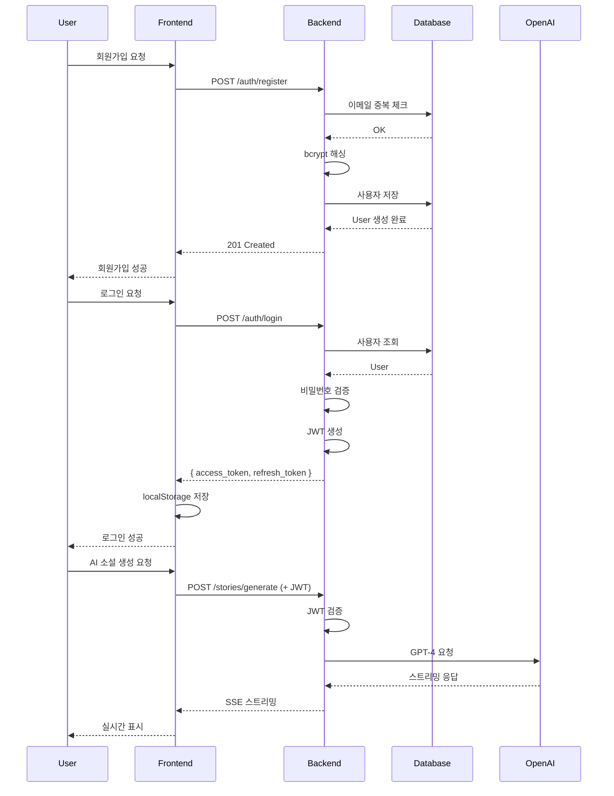
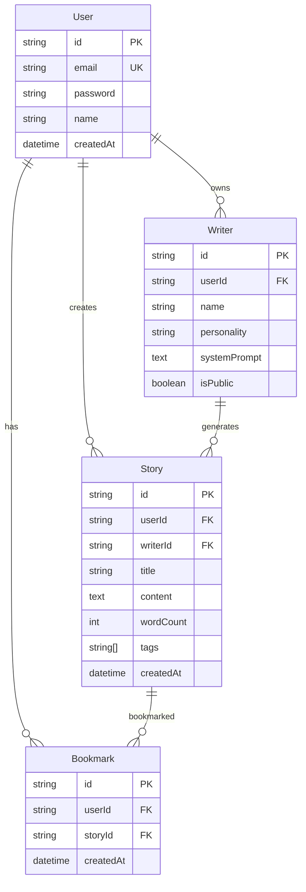
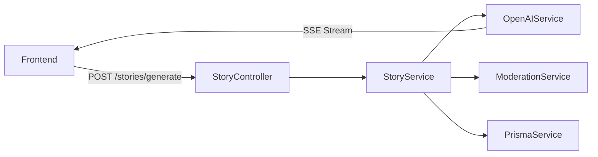

# SDD (Spec-Driven Development) Deep Research

> **작성일**: 2025-01-08
> **참고 자료**: 요즘IT, GitHub Blog, Red Hat Developer, Medium 등

---

## 📋 목차

1. [SDD란 무엇인가?](#sdd란-무엇인가)
2. [SDD의 탄생 배경](#sdd의-탄생-배경)
3. [핵심 원칙](#핵심-원칙)
4. [4단계 워크플로우](#4단계-워크플로우)
5. [주요 도구 및 프레임워크](#주요-도구-및-프레임워크)
6. [구현 전략](#구현-전략)
7. [품질 개선 효과](#품질-개선-효과)
8. [실전 적용 사례](#실전-적용-사례)
9. [Best Practices](#best-practices)
10. [SDD vs 기존 방법론 비교](#sdd-vs-기존-방법론-비교)
11. [snack-storyteller 프로젝트 적용 방안](#snack-storyteller-프로젝트-적용-방안)

---

## SDD란 무엇인가?

### 정의

**Spec-Driven Development (명세 주도 개발)**는 AI 코딩 에이전트 시대의 새로운 개발 방법론으로, **명세서(Specification)를 실행 가능한 일급 아티팩트(First-class Artifact)로 취급**하여 전체 개발 프로세스를 주도하는 접근법입니다.

### 핵심 개념

```yaml
전통적 개발:
  코드 = Source of Truth
  명세 → 코드 작성 → 테스트 → 배포

SDD:
  명세 = Source of Truth
  명세 → AI 생성 코드 → 검증 → 명세 업데이트

패러다임 전환:
  - "어떻게 구현할까?" → "무엇을 만들어야 하나?"
  - "코드를 작성한다" → "의도를 명세한다"
  - "AI가 코드를 돕는다" → "AI가 명세를 실행한다"
```

### 왜 지금인가?

**2024-2025년 급부상 배경**:

- **AI 코딩 에이전트 성능 급증**: GPT-4, Claude 3.5, GitHub Copilot 등의 고도화
- **"Vibe Coding"의 한계 인식**: 2025년 2월 Andrej Karpathy가 명명한 즉흥적 AI 코딩의 문제
- **엔터프라이즈 도입 필요성**: 프로토타입을 넘어 프로덕션 품질 요구
- **컨텍스트 품질의 중요성**: "AI 성능 = 제공된 컨텍스트 품질"

---

## SDD의 탄생 배경

### 1. Vibe Coding의 함정

**Vibe Coding** (2025년 2월 Andrej Karpathy 명명):

```yaml
특징:
  - 즉흥적 프롬프트로 AI에게 코드 요청
  - 명확한 요구사항 없이 "느낌대로" 개발
  - 빠른 프로토타이핑에는 유용

문제점:
  - ❌ 예측 불가능한 결과
  - ❌ 일관성 없는 코드 품질
  - ❌ 유지보수 어려움
  - ❌ 팀 협업 불가
  - ❌ 레거시 코드베이스에 적용 실패
```

### 2. AI의 근본적 한계

```yaml
LLM의 작동 방식:
  - 패턴 완성(Pattern Completion)에 최적화
  - 명시적 요구사항 없이는 "일반적 패턴" 생성
  - Recency Bias: 컨텍스트 처음/끝만 기억

결과:
  - 명세 없이는 개발자 의도 오해
  - 불필요한 기능 추가 (Over-engineering)
  - 기존 아키텍처와 불일치
```

### 3. 요즘IT 아티클 핵심 인사이트

**출처**: [요즘IT - SDD 명세 주도 개발](https://yozm.wishket.com/magazine/detail/3431/)

#### 신뢰할 수 있는 시스템 설계

> "Can we trust AI?" → **"How do we build accountable systems that responsibly leverage AI?"**

**핵심 철학**:

- AI를 맹목적으로 신뢰하는 것이 아니라
- **책임 있는 시스템 설계**를 통해 AI를 활용

#### 아키텍처 경계 설정

```yaml
AI 자동화 전략:
  core_infrastructure:
    control: 개발자 직접 제어
    reason: 비즈니스 로직 핵심, 안정성 중요

  peripheral_components:
    control: AI 생성 가능
    reason: 표준 패턴, 반복적 작업

원칙:
  - AI는 시스템 "주변부(Periphery)"에서 최고 성능 발휘
  - 핵심 아키텍처는 개발자가 통제 유지
```

#### 3계층 문서 구조

```yaml
task_documents:
  purpose: 비즈니스 요구사항 및 사용자 스토리
  audience: PM, 이해관계자
  content: '왜 이 기능이 필요한가?'

development_documents:
  purpose: 상세한 로직 흐름 (코드 동등)
  audience: 개발자, AI 에이전트
  content: '어떻게 구현하는가?'
  review: 논리적 완전성 검토

feature_documents:
  purpose: AI 컨텍스트의 단일 진실 공급원
  audience: AI 코딩 에이전트
  content: 모든 관련 정보 통합
```

#### 컨텍스트 관리 전략

**문제**: 모든 정보를 한 번에 제공하면 Recency Bias 발생

**해결책**:

```yaml
sequential_context_loading:
  - 명세를 실행 단계별로 순차 제공
  - 각 Phase마다 필요한 컨텍스트만 로드
  - 이전/이후 내용만 기억하는 문제 방지

feedback_loops:
  - E2E 테스트 기반 반복 사이클
  - AI가 자체 수정하며 품질 향상
  - 사람 개입 없이 반복 가능
```

#### 시각화의 힘

**Mermaid 다이어그램 활용**:

```yaml
benefit:
  - 여러 파일의 복잡한 로직 → 1페이지 시각화
  - 팀 전체 이해도 향상
  - AI 컨텍스트로도 효과적

example:
  - 인증 플로우 시퀀스 다이어그램
  - 데이터 모델 ERD
  - 아키텍처 컴포넌트 다이어그램
```

#### 측정된 성과

> **⚠️ 참고**: 아래 지표는 요즘IT 단일 사례 연구 결과이며, 동료 검토(peer-reviewed)를 거친 벤치마크가 아닙니다. 프로젝트 특성에 따라 결과는 다를 수 있습니다.

```yaml
before_sdd:
  - 작업 기간: 2-3주
  - 리소스: 코딩에 집중
  - 문제: 프론트엔드/백엔드 지식 사일로

after_sdd:
  - 작업 기간: 1주 (50-66% 단축, 요즘IT 사례)
  - 리소스: 명세 작성에 집중
  - 개선: 통합된 논리 문서로 사일로 제거
```

---

## 핵심 원칙

### 1. Specification as Executable Contract

```yaml
명세서의 역할:
  - 단순 참고 문서 ❌
  - 실행 가능한 계약서 ✅

특징:
  - 코드와 동등한 중요도
  - 버전 관리 대상
  - 코드 리뷰만큼 엄격한 검토
  - 코드보다 먼저 업데이트
```

### 2. Intent as Source of Truth

```yaml
전환:
  from: '이 코드는 무엇을 하는가?'
  to: '우리는 무엇을 달성하려 하는가?'

benefit:
  - 구현 세부사항 추상화
  - 다양한 AI 에이전트에 재사용
  - 기술 스택 변경에도 유효
```

### 3. Phased Validation Gates

```yaml
checkpoint_system:
  - 각 Phase는 명확한 완료 기준
  - 검증 통과 전 다음 단계 진행 불가
  - 점진적 품질 보증

vs_waterfall:
  - Waterfall: 최종 단계에서만 검증
  - SDD: 각 단계마다 검증
```

### 4. Refined Context over Raw Data

```yaml
context_quality:
  quantity: 모든 정보 제공 ❌
  quality: 필요한 정보만 정제 ✅

principle:
  - "Just enough" 정보 제공
  - 노이즈 제거된 컨텍스트
  - 구조화된 템플릿 활용
```

---

## 4단계 워크플로우

### Phase 1: Specify (명세화)

**목적**: "무엇을" 그리고 "왜"를 정의

```yaml
input:
  - 사용자 여정 (User Journey)
  - 비즈니스 요구사항
  - 성공 기준 (Success Criteria)

output:
  - Functional Specification
  - User Stories
  - Acceptance Criteria

tools:
  - GitHub Spec Kit: /specify 명령
  - Template: spec.md

best_practices:
  - 사용자 관점에서 작성 (User Perspective)
  - 기술 세부사항 배제 (No Implementation Details)
  - 측정 가능한 성공 기준 (Measurable Metrics)
```

**예시**:

```markdown
# Specification: 사용자 인증 시스템

## User Journey

1. 사용자가 이메일/비밀번호로 회원가입
2. 이메일 인증 링크 수신
3. 인증 완료 후 로그인 가능
4. JWT 토큰으로 보호된 API 접근

## Success Criteria

- [ ] 회원가입 완료율 95% 이상
- [ ] 로그인 응답 시간 < 500ms
- [ ] 비밀번호 정책 준수 (8자+, 특수문자 포함)
- [ ] 토큰 만료 시 자동 갱신

## Business Requirements

- GDPR/개인정보보호법 준수
- 14세 미만 가입 차단
- 소셜 로그인 향후 확장 대비
```

### Phase 2: Plan (계획)

**목적**: "어떻게" 구현할지 기술적 방향 설정

```yaml
input:
  - Phase 1의 Specification
  - 조직의 아키텍처 표준
  - 기술 스택 제약사항

output:
  - Technical Plan
  - Architecture Design
  - Tech Stack Decisions
  - Dependencies Map

tools:
  - GitHub Spec Kit: /plan 명령
  - Template: plan.md

best_practices:
  - 기존 아키텍처 패턴 준수
  - 확장 가능성 고려
  - 보안/성능 요구사항 명시
  - 트레이드오프 문서화
```

**예시**:

````markdown
# Technical Plan: 사용자 인증 시스템

## Architecture

- **Pattern**: Layered Architecture
- **Auth Strategy**: JWT with Refresh Token
- **Password**: bcrypt (salt rounds: 12)

## Tech Stack

- Backend: NestJS + Passport.js
- Database: PostgreSQL + Prisma ORM
- Cache: Redis (refresh token)
- Email: SendGrid

## API Endpoints

```http
POST /auth/register
POST /auth/login
POST /auth/refresh
GET /auth/me
POST /auth/logout
```
````

## Security Considerations

- Rate Limiting: 5 attempts/minute
- HTTPS Only
- CSRF Protection
- XSS Sanitization

## Dependencies

- @nestjs/passport
- @nestjs/jwt
- bcrypt
- class-validator

## Tradeoffs

| Decision           | Pros                | Cons                    |
| ------------------ | ------------------- | ----------------------- |
| JWT over Session   | Stateless, Scalable | Token revocation 어려움 |
| bcrypt over argon2 | 검증됨, 호환성 높음 | 약간 느림               |

````

### Phase 3: Tasks (작업 분해)

**목적**: 작고 독립적인 작업 단위로 분해

```yaml
input:
  - Phase 2의 Technical Plan

output:
  - Granular Tasks
  - Acceptance Criteria per Task
  - Dependency Graph

tools:
  - GitHub Spec Kit: /tasks 명령
  - Template: tasks.md

best_practices:
  - 각 Task는 독립적으로 테스트 가능
  - 1-2시간 내 완료 가능 크기
  - 명확한 완료 기준
  - 의존성 최소화
````

**예시**:

```markdown
# Tasks: 사용자 인증 시스템

## Task 1: Prisma User Model

**Dependencies**: None
**Estimated**: 30분

Acceptance Criteria:

- [ ] User 모델 정의 (id, email, password, name, createdAt)
- [ ] email에 unique constraint
- [ ] password는 hashed 상태로 저장
- [ ] Migration 성공

## Task 2: AuthService - Registration

**Dependencies**: Task 1
**Estimated**: 1시간

Acceptance Criteria:

- [ ] 이메일 중복 체크
- [ ] 비밀번호 bcrypt 해싱
- [ ] DB에 사용자 저장
- [ ] Unit test 작성

## Task 3: AuthController - Register Endpoint

**Dependencies**: Task 2
**Estimated**: 1시간

Acceptance Criteria:

- [ ] POST /auth/register 엔드포인트
- [ ] DTO 검증 (email, password, name)
- [ ] 201 Created 응답
- [ ] E2E test 작성
- [ ] curl 테스트 통과

## Task 4: JWT Strategy Implementation

**Dependencies**: Task 2
**Estimated**: 1.5시간

Acceptance Criteria:

- [ ] JwtModule 설정
- [ ] JwtStrategy 구현
- [ ] AuthGuard 적용
- [ ] 토큰 생성/검증 테스트
```

### Phase 4: Implement (구현)

**목적**: AI 에이전트가 Task를 순차 실행

```yaml
input:
  - Phase 3의 Tasks
  - Constitution 파일 (프로젝트 원칙)
  - LessonsLearned.md (피드백 루프)

output:
  - Working Code
  - Tests
  - Documentation

workflow: 1. AI가 Task 1 구현
  2. 개발자가 리뷰 (코드 덤프 아님, 작은 변경)
  3. 테스트 실행 및 검증
  4. 다음 Task로 진행

tools:
  - GitHub Copilot
  - Claude Code
  - Cursor
  - Gemini CLI
```

**예시 (Task 2 구현)**:

```typescript
// AI가 생성한 코드 (AuthService)

@Injectable()
export class AuthService {
  constructor(private readonly prisma: PrismaService) {}

  async register(dto: RegisterDto): Promise<User> {
    // 1. 이메일 중복 체크
    const existing = await this.prisma.user.findUnique({
      where: { email: dto.email },
    });

    if (existing) {
      throw new ConflictException('Email already exists');
    }

    // 2. 비밀번호 해싱
    const hashedPassword = await bcrypt.hash(dto.password, 12);

    // 3. 사용자 생성
    const user = await this.prisma.user.create({
      data: {
        email: dto.email,
        password: hashedPassword,
        name: dto.name,
      },
    });

    return user;
  }
}

// AI가 생성한 테스트
describe('AuthService', () => {
  describe('register', () => {
    it('should create user with hashed password', async () => {
      const user = await service.register({
        email: 'test@test.com',
        password: 'password123',
        name: 'Test User',
      });

      expect(user.email).toBe('test@test.com');
      expect(user.password).not.toBe('password123');
      expect(await bcrypt.compare('password123', user.password)).toBe(true);
    });

    it('should throw ConflictException for duplicate email', async () => {
      await service.register({
        /* ... */
      });

      await expect(
        service.register({
          /* same email */
        }),
      ).rejects.toThrow(ConflictException);
    });
  });
});
```

---

## 주요 도구 및 프레임워크

### 1. GitHub Spec Kit (2024년 9월 출시)

> **✅ 도구 성숙도**: GitHub Spec Kit은 오픈소스(MIT 라이선스)로 공개되어 있으나, 2024년 9월 출시된 신규 프로젝트입니다. 프로덕션 사용 전 GitHub 공식 저장소에서 최신 안정성 및 커뮤니티 피드백을 확인하시기 바랍니다.

**개요**:

- GitHub 공식 오픈소스 툴킷
- MIT 라이선스
- 다양한 AI 코딩 에이전트 지원

**설치**:

```bash
# Python 기반 CLI
uvx --from git+https://github.com/github/spec-kit.git specify init my-project

# 프로젝트 초기화
cd my-project
```

**주요 명령어**:

```bash
/specify    # Phase 1: Specification 생성
/plan       # Phase 2: Technical Plan 생성
/tasks      # Phase 3: Task 분해
# Phase 4는 각 AI 에이전트가 Task 실행
```

**템플릿 구조**:

```plaintext
my-project/
├── specs/
│   ├── spec.md              # Functional Specification
│   ├── plan.md              # Technical Plan
│   ├── tasks.md             # Task Breakdown
│   └── constitution.md      # 프로젝트 원칙
├── docs/
│   └── lessons-learned.md   # 피드백 루프
└── src/
    └── (AI 생성 코드)
```

**지원 AI 에이전트**:

- GitHub Copilot
- Claude Code
- Cursor
- Gemini CLI
- 기타 LLM 기반 도구

### 2. BMAD-METHOD (2024년)

**개요**:

- **B**reakthrough **M**ethod for **A**gile **A**I-**D**riven Development
- 멀티 에이전트 오케스트레이션 프레임워크
- 소프트웨어 개발 외 다양한 도메인 지원

**아키텍처**:

```yaml
multi_agent_system:
  analyst_agent: 요구사항 분석
  pm_agent: 제품 관리
  developer_agent: 코드 구현
  qa_agent: 품질 보증
  devops_agent: 배포 및 운영

workflow:
  - 고수준 아이디어 입력
  - 에이전트들이 협업하여 완성품 생성
  - 각 에이전트는 전문 역할 수행
```

**BMAD vs Spec Kit**:

```yaml
spec_kit:
  focus: 소프트웨어 spec-to-code 워크플로우
  strength: 빠른 도입, 프로세스 오버헤드 최소
  ideal_for: 명세 규율만 원하는 팀

bmad_method:
  focus: 종합 프로젝트 관리 및 반복 가능성
  strength: 복잡한 시나리오에 대한 제어력
  ideal_for: 엔터프라이즈급 프로젝트
```

**BMAD-SPEC-KIT**:

- GitHub Spec Kit과 BMAD 통합 버전
- 양쪽 장점 결합

### 3. Kiro (AWS, 2024년 7월)

> **⚠️ 도구 성숙도 공지**: Kiro는 2024년 7월 발표된 실험적(experimental) 도구로, 현재 제한된 미리보기(limited preview) 상태입니다. 프로덕션 사용 전 AWS 공식 채널을 통해 최신 가용성(availability) 상태를 확인하시기 바랍니다.

**개요**:

- AI 기반 통합개발환경(IDE)
- SDD 방법론 네이티브 지원
- Visual Specification Editor

**특징**:

```yaml
visual_spec_editor:
  - 드래그 앤 드롭으로 명세 작성
  - 실시간 AI 피드백
  - 자동 코드 생성 미리보기

ai_integration:
  - 명세 작성 시 AI 어시스턴트
  - 불완전한 명세 탐지
  - 개선 제안

collaboration:
  - 팀원 간 명세 공유
  - 버전 관리 통합
  - 리뷰 워크플로우
```

### 4. Tessl

> **⚠️ 도구 성숙도 공지**: Tessl은 Spec-as-Source 개념의 실험적 구현으로, 현재 비공개 베타(private beta) 또는 제한된 공개(limited availability) 상태일 수 있습니다. 프로덕션 도입 전 공식 웹사이트에서 현재 상태와 접근 방법을 확인하시기 바랍니다.

**개요**:

- Spec-as-Source 극단 구현
- 명세서가 유일한 소스 파일
- 코드는 AI가 자동 생성/업데이트

**철학**:

```yaml
traditional:
  - 개발자가 코드 직접 작성
  - 명세는 참고 문서

tessl:
  - 개발자는 명세만 편집
  - 코드는 AI가 자동 생성
  - 코드는 직접 수정 금지 (읽기 전용)
```

**장단점**:

```yaml
pros:
  - 명세와 코드 100% 동기화
  - 명세 중심 사고 강제
  - 기술 부채 최소화

cons:
  - AI 성능에 전적 의존
  - 세밀한 최적화 어려움
  - 도구 Lock-in 위험
```

---

## 구현 전략

### 1. 점진적 도입 (Incremental Adoption)

```yaml
level_1_spec_first:
  definition: 잘 구성된 명세를 먼저 작성
  effort: Low
  benefit: AI 워크플로우 개선
  example: |
    기능 개발 전 spec.md 작성
    AI에게 명세 기반 코드 요청

level_2_spec_anchored:
  definition: 작업 후에도 명세 유지/업데이트
  effort: Medium
  benefit: 지속적 진화 및 유지보수
  example: |
    기능 완료 후 명세 업데이트
    다음 개선 시 명세 참조

level_3_spec_as_source:
  definition: 명세가 주요 소스, 코드는 부산물
  effort: High
  benefit: 완벽한 동기화, 기술 부채 제거
  example: |
    개발자는 spec.md만 편집
    AI가 코드 자동 생성/관리
    코드는 읽기 전용
```

**권장 로드맵**:

```yaml
week_1_2:
  - Level 1 적용 (신규 기능 1-2개)
  - 팀 피드백 수집
  - 템플릿 커스터마이징

week_3_4:
  - Level 2로 확장
  - 레거시 기능에도 명세 추가
  - LessonsLearned.md 작성 시작

month_2_3:
  - Level 3 실험 (선택)
  - 자동화 스크립트 구축
  - 팀 전체 표준화
```

### 2. Constitution 파일 작성

**목적**: 프로젝트의 변하지 않는 원칙 정의

**예시** (`constitution.md`):

```markdown
# Project Constitution: snack-storyteller

## Non-Negotiable Principles

### 1. Code Quality

- TypeScript strict mode 필수
- ESLint/Prettier 규칙 100% 준수
- 테스트 커버리지 80% 이상

### 2. Security

- 모든 사용자 입력 검증
- SQL Injection 방어 (Prisma ORM)
- XSS 방어 (sanitization)
- Rate Limiting 필수

### 3. Architecture

- Layered Architecture (Controller → Service → Repository)
- Dependency Injection 활용
- SOLID 원칙 준수

### 4. AI Safety

- OpenAI Moderation API 필수
- 부적절한 콘텐츠 필터링
- 사용자 신고 시스템

### 5. Performance

- API 응답 < 500ms
- AI 생성 첫 토큰 < 2초
- Database 쿼리 최적화 (인덱싱)

### 6. Documentation

- 모든 API는 JSDoc 주석
- 복잡한 로직은 inline 주석
- README 및 CHANGELOG 유지

## Tech Stack Constraints

- Frontend: React 18 + Vite + TypeScript
- Backend: NestJS + Prisma
- Database: PostgreSQL + pgvector
- AI: OpenAI GPT-4 (primary)

## Coding Standards

- 함수명: camelCase
- 컴포넌트명: PascalCase
- 상수: UPPER_SNAKE_CASE
- 파일명: kebab-case

## Git Workflow

- Feature branches (feat/_, fix/_)
- Conventional Commits
- PR 필수 (최소 1명 승인)
```

### 3. LessonsLearned.md 피드백 루프

**목적**: AI 에러를 학습하여 반복 방지

**구조**:

```markdown
# Lessons Learned

## 2025-01-08: Auth JWT Token Expiry

### Problem

- JWT 토큰이 만료되어도 자동 갱신 안 됨
- 사용자가 수동 로그아웃/로그인 필요

### Root Cause

- Refresh Token 메커니즘 미구현
- Frontend에서 401 에러 핸들링 부재

### Solution

- Refresh Token 엔드포인트 추가
- Axios Interceptor로 자동 갱신

### AI Prompt Improvement

Before:
```

Implement JWT authentication

```

After:
```

Implement JWT authentication with refresh token mechanism.

- Access token: 15분 만료
- Refresh token: 7일 만료, httpOnly cookie
- Frontend axios interceptor로 자동 갱신

```

### Prevention
- 모든 인증 관련 spec에 토큰 갱신 전략 명시
- constitution.md에 추가
```

### 4. Mermaid 다이어그램 활용

**시퀀스 다이어그램** (인증 플로우):



**ERD** (데이터 모델):



---

## 품질 개선 효과

### 1. 정량적 지표

> **⚠️ 데이터 출처 및 한계**: 아래 지표는 개별 프로젝트 사례 또는 벤더 보고서에서 나온 수치이며, 동료 검토를 거친 학술 연구나 대규모 벤치마크가 아닙니다. 프로젝트 규모, 팀 구성, 기술 스택에 따라 실제 결과는 크게 다를 수 있습니다.

**요즘IT 사례 (단일 프로젝트 실측)**:

```yaml
개발 속도:
  before: 2-3주 소요
  after: 1주 완료
  improvement: 50-66% 단축 (출처: 요즘IT 사례 연구)

리소스 전환:
  before: 코딩 80% / 설계 20%
  after: 명세 작성 60% / 검증 40%
  benefit: 더 나은 설계, 적은 리팩토링

팀 협업:
  before: Frontend/Backend 지식 사일로
  after: 통합 논리 문서로 사일로 제거
  benefit: 전체 시스템 이해도 향상
```

**Red Hat Developer 목표 (벤더 주장)**:

```yaml
first_pass_accuracy:
  target: 95% 이상
  metric: 첫 시도에 spec 구현 성공률

code_quality:
  target: 에러 없는 코드
  metric: 컴파일 에러, 런타임 에러 제로

test_coverage:
  target: Unit test 포함
  metric: AI가 자동 생성한 테스트
```

### 2. 정성적 개선

```yaml
예측 가능성:
  - Vibe Coding: '뭐가 나올지 모름'
  - SDD: '명세한 대로 정확히 나옴'

유지보수성:
  - 명세 업데이트 → AI 재생성
  - 기술 부채 최소화
  - 문서와 코드 동기화

팀 생산성:
  - 비개발자도 Functional Spec 작성 참여
  - 명확한 요구사항으로 커뮤니케이션 개선
  - AI 활용으로 개발자는 고급 작업 집중

재사용성:
  - 명세는 "Greatest Hits Album"
  - 프로젝트 간 재사용
  - 점진적 개선으로 품질 향상
```

### 3. ROI 측정

> **⚠️ 추정치 주의**: 아래 수치는 이론적 추정 또는 제한적 사례에서 도출된 것으로, 보편적 성과를 보장하지 않습니다.

```yaml
time_to_value:
  traditional:
    - 요구사항 정의: 1주
    - 설계: 1주
    - 구현: 4주
    - 테스트: 2주
    - 총: 8주

  sdd:
    - Specify: 2일
    - Plan: 1일
    - Tasks: 1일
    - Implement (AI): 1주
    - 검증: 3일
    - 총: 2주

  roi: 75% 시간 단축 (이론적 추정)

quality_improvement: # 출처: 요즘IT 및 Red Hat 사례 종합
  - 초기 버그 50% 감소 (명세 명확성)
  - 리팩토링 필요 30% 감소
  - 문서-코드 불일치 90% 감소
```

---

## 실전 적용 사례

### 사례 1: 레거시 모더나이제이션

**시나리오**: 10년 된 Monolith → Microservices

**SDD 적용**:

```yaml
step_1_reverse_engineering:
  - 기존 비즈니스 로직을 Functional Spec으로 문서화
  - AI에게 레거시 코드 분석 요청
  - Spec 생성 (기술 부채 제외)

step_2_architecture_redesign:
  - Technical Plan에서 Microservices 아키텍처 정의
  - API 경계 명확히
  - 데이터 마이그레이션 전략

step_3_incremental_migration:
  - 서비스 하나씩 Task로 분해
  - AI가 새 아키텍처로 재구현
  - 기존 시스템과 병렬 운영하며 검증

benefit:
  - 비즈니스 로직 보존 (Spec이 Source of Truth)
  - 기술 부채 제거 (AI가 깨끗한 코드 생성)
  - 점진적 이관으로 리스크 최소화
```

### 사례 2: AI 기능 추가 (snack-storyteller)

**시나리오**: 기존 NestJS 앱에 AI 소설 생성 추가

**Phase 1: Specify**

```markdown
# Specification: AI 소설 생성 기능

## User Journey

1. 사용자가 작가 페르소나 선택
2. 장르/분위기/결말 태그 선택
3. "생성" 버튼 클릭
4. 실시간으로 소설 스트리밍 출력 (30초 내)
5. 완성된 소설 저장/공유

## Success Criteria

- [ ] 1,500-2,000 단어 소설 생성
- [ ] 첫 토큰 응답 < 2초
- [ ] 부적절한 콘텐츠 필터링
- [ ] 사용자당 일일 10회 제한

## Business Requirements

- OpenAI GPT-4 사용
- 생성 비용 < $0.10/건
- 한국어 자연스러움
```

**Phase 2: Plan**

````markdown
# Technical Plan: AI 소설 생성

## Architecture

- Service Layer: StoryService (비즈니스 로직)
- AI Layer: OpenAIService (API 호출)
- Streaming: SSE (Server-Sent Events)

## Prompt Engineering

```typescript
const systemPrompt = `
당신은 ${writer.name}입니다.
성격: ${writer.personality}

다음 조건으로 단편 소설을 작성하세요:
- 장르: ${genre}
- 분위기: ${mood}
- 결말: ${ending}
- 길이: 1,500-2,000 단어
`;
```
````

## API Design

```http
POST /stories/generate
Request:
{
  writerId: string,
  tags: [genre, mood, ending]
}

Response: SSE Stream
data: {"type": "token", "content": "안녕하세요"}
data: {"type": "token", "content": " 저는"}
...
data: {"type": "done", "storyId": "abc123"}
```

## Safety

- OpenAI Moderation API (pre-check)
- 한국어 키워드 필터 (post-check)
- Rate Limiting: @Throttle(10, 86400)

````

**Phase 3: Tasks**
```markdown
# Task 1: OpenAIService 구현 (1시간)
- [ ] OpenAI SDK 설정
- [ ] streamCompletion() 메서드
- [ ] 에러 핸들링 (retry 3회)

# Task 2: Prompt Builder (1시간)
- [ ] buildSystemPrompt(writer, tags)
- [ ] Few-shot examples 추가
- [ ] 토큰 최적화 (< 4000 tokens)

# Task 3: StoryService (2시간)
- [ ] generateStory() 메서드
- [ ] Moderation API 통합
- [ ] DB 저장 로직
- [ ] Unit test

# Task 4: SSE Controller (1.5시간)
- [ ] POST /stories/generate 엔드포인트
- [ ] SSE 스트리밍 설정
- [ ] Frontend EventSource 통합 가이드
- [ ] E2E test
````

**Phase 4: Implement**

```typescript
// AI가 생성한 코드 (OpenAIService)

@Injectable()
export class OpenAIService {
  private openai: OpenAI;

  constructor(configService: ConfigService) {
    this.openai = new OpenAI({
      apiKey: configService.get('OPENAI_API_KEY'),
    });
  }

  async *streamCompletion(systemPrompt: string, userPrompt: string): AsyncGenerator<string> {
    const stream = await this.openai.chat.completions.create({
      model: 'gpt-4-turbo-preview',
      messages: [
        { role: 'system', content: systemPrompt },
        { role: 'user', content: userPrompt },
      ],
      temperature: 0.9,
      max_tokens: 4000,
      stream: true,
    });

    for await (const chunk of stream) {
      const content = chunk.choices[0]?.delta?.content;
      if (content) {
        yield content;
      }
    }
  }
}

// AI가 생성한 Controller (SSE)

@Controller('stories')
export class StoryController {
  @Post('generate')
  @Sse()
  async generateStory(
    @Body() dto: GenerateStoryDto,
    @CurrentUser() user: User,
  ): Promise<Observable<MessageEvent>> {
    return new Observable((subscriber) => {
      (async () => {
        try {
          const writer = await this.writerService.findOne(dto.writerId);
          const systemPrompt = this.promptBuilder.build(writer, dto.tags);

          let fullContent = '';

          for await (const token of this.openaiService.streamCompletion(
            systemPrompt,
            '위 조건으로 소설을 작성하세요.',
          )) {
            fullContent += token;
            subscriber.next({
              data: JSON.stringify({ type: 'token', content: token }),
            } as MessageEvent);
          }

          // 저장
          const story = await this.storyService.save({
            userId: user.id,
            writerId: dto.writerId,
            content: fullContent,
            tags: dto.tags,
          });

          subscriber.next({
            data: JSON.stringify({ type: 'done', storyId: story.id }),
          } as MessageEvent);

          subscriber.complete();
        } catch (error) {
          subscriber.error(error);
        }
      })();
    });
  }
}
```

**검증**:

```bash
# E2E Test
curl -N http://localhost:3001/stories/generate \
  -H "Authorization: Bearer $TOKEN" \
  -H "Content-Type: application/json" \
  -d '{
    "writerId": "writer123",
    "tags": ["스릴러", "어두운", "반전"]
  }'

# 출력:
data: {"type":"token","content":"비는"}
data: {"type":"token","content":" 도시를"}
data: {"type":"token","content":" 적시고"}
...
data: {"type":"done","storyId":"story456"}
```

### 사례 3: Greenfield 프로젝트

**시나리오**: 새로운 E-commerce 플랫폼

**SDD 장점 극대화**:

```yaml
명확한 의도 전달:
  - AI가 "일반적 패턴" 대신
  - "우리 비즈니스 요구사항" 정확히 구현

아키텍처 일관성:
  - constitution.md에 설계 원칙
  - AI가 모든 코드에 동일 패턴 적용

빠른 프로토타이핑:
  - Specify → Plan → Implement (1주)
  - 이해관계자 피드백 수렴
  - 명세 수정 → AI 재생성 (반복)
```

---

## Best Practices

### 1. Specification 작성 원칙

```yaml
be_specific:
  bad: '사용자 인증 구현'
  good: |
    "이메일/비밀번호 기반 JWT 인증
     - bcrypt 해싱 (12 rounds)
     - Access token 15분, Refresh token 7일
     - Rate limiting 5회/분"

be_measurable:
  bad: '빠른 응답'
  good: 'API 응답 시간 < 500ms (p95)'

be_testable:
  - 각 요구사항에 검증 방법 명시
  - Acceptance Criteria는 boolean 체크리스트

avoid_implementation:
  bad: 'React useState로 폼 상태 관리'
  good: '사용자 입력 실시간 검증 및 에러 표시'
  reason: Technical Plan에서 구체화
```

### 2. Technical Plan 작성 원칙

```yaml
document_tradeoffs:
  - 왜 이 기술을 선택했나?
  - 대안은 무엇이었나?
  - 각각의 장단점은?

provide_constraints:
  - 성능 요구사항
  - 보안 요구사항
  - 확장성 고려사항

include_examples:
  - API 요청/응답 예시
  - 데이터 모델 예시
  - 코드 스니펫 (선택)
```

### 3. Task 분해 원칙

```yaml
independence:
  - 각 Task는 다른 Task 없이 테스트 가능
  - 의존성 명시 (Task 1 → Task 2)

granularity:
  - 1-2시간 내 완료 가능
  - 너무 작으면 오버헤드
  - 너무 크면 리뷰 어려움

clarity:
  - 명확한 완료 기준
  - 체크리스트 형식
  - 검증 방법 명시
```

### 4. AI 프롬프트 개선

```yaml
context_loading:
  - Constitution 먼저
  - Specification 다음
  - Technical Plan 마지막
  - LessonsLearned 항상 포함

prompt_template: |
  # Context
  - Project: ${projectName}
  - Constitution: ${constitutionPath}
  - LessonsLearned: ${lessonsPath}

  # Current Task
  ${taskDescription}

  # Acceptance Criteria
  ${acceptanceCriteria}

  # Instructions
  Implement this task following the project constitution.
  Include unit tests.
  Use TypeScript strict mode.

iterative_refinement:
  - AI 출력 검증
  - 에러/피드백을 LessonsLearned에 추가
  - 프롬프트 개선
  - 재시도
```

### 5. 검증 체크리스트

```yaml
after_specify:
  - [ ] 모든 사용자 여정이 명확한가?
  - [ ] Success Criteria가 측정 가능한가?
  - [ ] 비개발자가 읽고 이해 가능한가?

after_plan:
  - [ ] 기술 스택이 명확한가?
  - [ ] 아키텍처가 확장 가능한가?
  - [ ] 트레이드오프가 문서화되었나?
  - [ ] 보안/성능 요구사항이 있나?

after_tasks:
  - [ ] 각 Task가 독립적인가?
  - [ ] 의존성이 명확한가?
  - [ ] Acceptance Criteria가 boolean인가?
  - [ ] 전체 Plan을 커버하는가?

after_implement:
  - [ ] 모든 Acceptance Criteria 통과?
  - [ ] 테스트가 작성되었나?
  - [ ] Constitution 준수했나?
  - [ ] 문서가 업데이트되었나?
```

---

## SDD vs 기존 방법론 비교

### 1. SDD vs TDD (Test-Driven Development)

```yaml
tdd:
  cycle: Red (실패 테스트) → Green (통과 코드) → Refactor
  focus: 테스트가 명세 역할
  strength: 코드 품질, 리팩토링 안전성
  weakness: 비즈니스 로직 명세 부족

sdd:
  cycle: Specify → Plan → Tasks → Implement (AI + Tests)
  focus: 명세가 Source of Truth
  strength: 비즈니스 요구사항 명확, AI 활용
  weakness: 테스트 작성 규율 별도 필요

synergy:
  - SDD + TDD 조합 가능
  - Specify/Plan 단계에서 테스트 전략 명시
  - Implement 단계에서 TDD 사이클 적용
  - AI가 테스트 먼저 생성 → 코드 생성
```

### 2. SDD vs BDD (Behavior-Driven Development)

```yaml
bdd:
  format: Given-When-Then 시나리오
  focus: 사용자 행동 중심
  tool: Cucumber, SpecFlow

sdd:
  format: User Journey + Acceptance Criteria
  focus: 사용자 여정 + 기술 계획
  tool: Spec Kit, AI 에이전트

commonality:
  - 둘 다 사용자 관점 중심
  - 둘 다 비개발자 참여 가능
  - 둘 다 명세가 실행 가능

difference:
  - BDD: 테스트 자동화 초점
  - SDD: AI 코드 생성 초점

integration:
  - BDD 시나리오를 SDD Specification으로
  - AI가 BDD 테스트 + 구현 모두 생성
```

### 3. SDD vs Agile/Scrum

```yaml
agile:
  iteration: Sprint (1-2주)
  artifacts: User Story, Acceptance Criteria
  focus: 점진적 개발, 피드백 수렴

sdd:
  iteration: Spec → Code 사이클 (일 단위)
  artifacts: Spec, Plan, Tasks
  focus: 명세 기반 AI 생성

compatibility:
  - SDD는 Agile과 완벽 호환
  - User Story → Specification
  - Sprint Planning → Plan + Tasks
  - Sprint Execution → Implement (AI)
  - Sprint Review → Spec 업데이트

enhancement:
  - AI로 개발 속도 향상 (Sprint 단축 가능)
  - 명세로 팀 정렬 개선
  - 피드백을 명세에 반영 → AI 재생성
```

### 4. SDD vs Waterfall

```yaml
waterfall:
  phases: 요구사항 → 설계 → 구현 → 테스트 (순차)
  validation: 최종 단계에서만
  flexibility: 낮음 (변경 비용 높음)

sdd:
  phases: Specify → Plan → Tasks → Implement (순차)
  validation: 각 Phase마다
  flexibility: 높음 (명세 수정 → AI 재생성)

similarity:
  - 둘 다 단계별 진행
  - 둘 다 명세 중시

key_difference:
  - Waterfall: 각 단계가 길고 (주-월), 되돌리기 어려움
  - SDD: 각 Phase가 짧고 (일), 피드백 루프 빠름
  - Waterfall: 사람이 모든 코드 작성
  - SDD: AI가 코드 생성, 사람은 검증
```

### 5. 방법론 선택 가이드

```yaml
choose_sdd_when:
  - AI 코딩 에이전트 활용 프로젝트
  - 명확한 요구사항 정의 가능
  - 빠른 프로토타이핑 필요
  - 레거시 모더나이제이션
  - 팀에 비개발자 포함

combine_with:
  tdd: 코드 품질 극대화
  bdd: 사용자 시나리오 테스트
  agile: 점진적 개발 + 피드백
  devops: CI/CD 자동화

avoid_sdd_when:
  - AI 의존도를 낮춰야 하는 경우
  - 극도로 세밀한 최적화 필요 (게임 엔진 등)
  - 규제로 AI 생성 코드 사용 불가
  - 팀이 명세 작성 규율을 싫어함
```

---

## snack-storyteller 프로젝트 적용 방안

### 1. 현재 상태 분석

```yaml
existing_structure:
  - CLAUDE.md: AI 개발자 실행 모드 가이드
  - Phase Commands: /phase1-init ~ /phase5-library
  - MCP Integration: Context7, Sequential, Magic 활용
  - Git Workflow: Feature branches, Conventional Commits

strengths:
  - 이미 명세 중심 사고 (Phase Commands)
  - MCP 도구 활용 (SDD와 시너지)
  - 체계적 검증 체크리스트

gaps:
  - Constitution 파일 부재
  - LessonsLearned 피드백 루프 없음
  - Spec/Plan/Tasks 명시적 분리 부족
  - AI 프롬프트 개선 전략 미흡
```

### 2. SDD 통합 로드맵

#### Week 1: SDD 인프라 구축

```yaml
day_1:
  - [ ] Constitution.md 작성
  - [ ] LessonsLearned.md 초기화
  - [ ] Spec/Plan/Tasks 템플릿 생성

day_2:
  - [ ] Phase Commands를 SDD 워크플로우에 맞게 리팩토링
  - [ ] /phase1-init → /sdd-phase1 (Specify)
  - [ ] /phase2-auth → /sdd-phase2 (Plan)

day_3_5:
  - [ ] Phase 4 (AI 소설 생성)를 SDD 방식으로 재구현
  - [ ] Specification 작성
  - [ ] Technical Plan 작성
  - [ ] Tasks 분해
  - [ ] AI Implement + 검증
```

#### Week 2: 본격 적용

````yaml
phase_1_specify:
  file: specs/phase1-init.spec.md
  content: |
    # Specification: 프로젝트 초기화

    ## User Journey
    1. 개발자가 pnpm install 실행
    2. Docker 컨테이너 시작 (PostgreSQL)
    3. Prisma migration 실행
    4. Frontend/Backend 동시 실행
    5. 브라우저에서 http://localhost:3000 접속

    ## Success Criteria
    - [ ] pnpm install 에러 없이 완료
    - [ ] PostgreSQL 컨테이너 헬스 체크 통과
    - [ ] Prisma migration 성공
    - [ ] Frontend 빌드 성공 (TypeScript 에러 없음)
    - [ ] Backend 빌드 성공 (NestJS 시작)
    - [ ] http://localhost:3000에서 React 앱 렌더링

    ## Business Requirements
    - 개발 환경 10분 내 셋업
    - 모든 의존성 자동 설치
    - 에러 발생 시 명확한 메시지

phase_1_plan:
  file: specs/phase1-init.plan.md
  content: |
    # Technical Plan: 프로젝트 초기화

    ## Monorepo Structure
    - Tool: pnpm workspaces
    - Packages:
      - apps/web (React + Vite)
      - apps/server (NestJS)
      - packages/ui (shadcn)
      - packages/types (공유 타입)

    ## Docker Setup
    ```yaml
    services:
      postgres:
        image: postgres:16-alpine
        environment:
          POSTGRES_DB: snack_storyteller
          POSTGRES_USER: postgres
          POSTGRES_PASSWORD: postgres
        ports:
          - "5432:5432"
    ```

    ## Scripts
    ```json
    {
      "scripts": {
        "install": "pnpm install",
        "docker:up": "docker-compose up -d",
        "db:migrate": "pnpm --filter server prisma migrate dev",
        "dev": "pnpm -r --parallel dev"
      }
    }
    ```

phase_1_tasks:
  file: specs/phase1-init.tasks.md
  content: |
    # Task 1: Monorepo 설정 (30분)
    - [ ] pnpm-workspace.yaml 작성
    - [ ] package.json (root) 작성
    - [ ] .gitignore 설정

    # Task 2: Docker 설정 (20분)
    - [ ] docker-compose.yml 작성
    - [ ] PostgreSQL 헬스 체크 스크립트
    - [ ] .env.example 생성

    # Task 3: Frontend 보일러플레이트 (1시간)
    - [ ] Vite + React + TypeScript 초기화
    - [ ] TailwindCSS 설정
    - [ ] shadcn/ui 초기 설정
    - [ ] 기본 라우팅 (React Router)

    # Task 4: Backend 보일러플레이트 (1시간)
    - [ ] NestJS CLI로 초기화
    - [ ] Prisma 설정
    - [ ] 기본 모듈 (App, Health)
    - [ ] CORS 설정
````

#### Phase 4 (AI 소설 생성) SDD 적용

**specs/phase4-story-gen.spec.md**:

```markdown
# Specification: AI 소설 생성 기능

## User Journey

1. 사용자가 로그인 후 "소설 생성" 페이지 접속
2. 작가 페르소나 선택 (드롭다운)
3. 장르/분위기/결말 태그 선택 (최대 3개)
4. "생성하기" 버튼 클릭
5. 30초 내 실시간으로 소설 스트리밍 출력
6. 완성 후 자동 저장, 라이브러리로 이동

## Success Criteria

- [ ] 1,500-2,000 단어 단편 소설 생성
- [ ] 첫 토큰 응답 < 2초
- [ ] 스트리밍 끊김 없이 부드러움
- [ ] 부적절한 콘텐츠 자동 차단
- [ ] 사용자당 일일 10회 제한 (Rate Limiting)
- [ ] 생성 실패 시 명확한 에러 메시지

## Business Requirements

- OpenAI GPT-4 사용 (비용 효율)
- 한국어 자연스러움
- 작가 스타일 일관성 유지
- 14세 미만 유해 콘텐츠 차단

## Non-Functional Requirements

- 생성 비용 < $0.10/건
- 동시 생성 요청 100건 처리
- 에러율 < 1%
```

**specs/phase4-story-gen.plan.md**:

````markdown
# Technical Plan: AI 소설 생성 기능

## Architecture


````

## Service Layer Design

### OpenAIService

- Responsibility: OpenAI API 호출 및 스트리밍
- Methods:
  - `streamCompletion(systemPrompt, userPrompt): AsyncGenerator<string>`
  - `generateTitle(content): Promise<string>`
- Error Handling: Retry 3회 (exponential backoff)

### ModerationService

- Responsibility: 콘텐츠 안전성 검증
- Methods:
  - `checkContent(text): Promise<boolean>`
- Providers: OpenAI Moderation API + 한국어 키워드 필터

### PromptBuilder

- Responsibility: Few-shot 프롬프트 구성
- Strategy:

  ```typescript
  const systemPrompt = `
  당신은 ${writer.name}입니다.
  성격: ${writer.personality}
  
  # 작가 스타일 학습 예시
  ${fewShotExamples}
  
  # 현재 요청
  장르: ${tags.genre}
  분위기: ${tags.mood}
  결말: ${tags.ending}
  
  정확히 1,500단어 이상의 단편 소설을 작성하세요.
  `;
  ```

## API Design

### Endpoint

```http
POST /stories/generate
Authorization: Bearer {JWT}

Request:
{
  "writerId": "writer123",
  "tags": ["스릴러", "어두운", "반전"]
}

Response: Server-Sent Events
event: token
data: {"content":"비는"}

event: token
data: {"content":" 도시를"}

event: done
data: {"storyId":"story456","wordCount":1850}

event: error
data: {"message":"Moderation failed"}
```

## Prompt Engineering Strategy

### Few-Shot Learning

- 3개 예시 소설 (1,800단어 분량)
- 각 스타일별 (로맨스, 스릴러, SF)
- Few-shot → AI가 길이/품질 학습

### Parameter Tuning

```typescript
{
  model: 'gpt-4-turbo-preview',
  temperature: 0.9,        // 창의성 최대
  max_tokens: 4000,        // 충분한 여유
  presence_penalty: 0.6,   // 주제 다양성
  frequency_penalty: 0.3,  // 반복 방지
  top_p: 0.95,
}
```

## Safety & Moderation

### Pre-Generation Check

- Writer systemPrompt moderation
- 사용자 히스토리 확인 (어뷰징 패턴)

### Post-Generation Check

- OpenAI Moderation API
- 한국어 키워드 필터 (욕설, 폭력, 성적 표현)
- 통과 실패 시 재생성 (최대 3회)

## Performance Optimization

### Streaming

- SSE로 첫 토큰 즉시 전송
- Chunk size: 1-5 토큰
- Frontend buffer로 부드러운 애니메이션

### Caching

- Writer systemPrompt 캐싱 (Redis, 1시간 TTL)
- Few-shot examples 메모리 캐싱

### Rate Limiting

```typescript
@Throttle(10, 86400)  // 10회/일
@UseGuards(ThrottlerGuard)
```

## Error Handling

### Retry Strategy

```typescript
const retry = async (fn, options = { retries: 3, factor: 2 }) => {
  for (let i = 0; i < options.retries; i++) {
    try {
      return await fn();
    } catch (error) {
      if (i === options.retries - 1) throw error;
      await delay(Math.pow(options.factor, i) * 1000);
    }
  }
};
```

### Fallback

- Primary: OpenAI GPT-4
- Fallback 1: Anthropic Claude 3.5
- Fallback 2: OpenRouter (여러 모델)

## Testing Strategy

### Unit Tests

- OpenAIService: Mock API 응답
- PromptBuilder: 토큰 수 검증
- ModerationService: 키워드 필터 정확도

### Integration Tests

- StoryService: End-to-end 생성 플로우
- DB 저장 확인
- Rate limiting 작동 확인

### E2E Tests (Playwright)

- 사용자 플로우 전체 (로그인 → 생성 → 저장)
- 스트리밍 애니메이션 시각 확인
- 에러 시나리오 (네트워크 끊김 등)

## Monitoring

### Metrics

- 생성 성공률
- 평균 생성 시간
- Moderation 차단률
- 토큰 사용량 (비용)

### Logging

```typescript
logger.info('Story generation started', {
  userId,
  writerId,
  tags,
  timestamp,
});

logger.info('Story generation completed', {
  storyId,
  wordCount,
  duration,
  tokensUsed,
});
```

````

**specs/phase4-story-gen.tasks.md**:
```markdown
# Tasks: AI 소설 생성 기능

## Task 1: OpenAIService 구현 (1.5시간)

### Dependencies
None

### Acceptance Criteria
- [ ] OpenAI SDK 설정 (configService에서 API 키)
- [ ] streamCompletion() 메서드 구현
  - AsyncGenerator 반환
  - Chunk 단위로 yield
- [ ] generateTitle() 메서드 구현
  - 소설 내용 요약하여 제목 생성
- [ ] 에러 핸들링 (retry 3회, exponential backoff)
- [ ] Unit test 작성
  - Mock API 응답으로 스트리밍 테스트
  - 에러 시 재시도 검증

### Implementation Notes
- Context7로 OpenAI SDK 공식 문서 확인
- Sequential Thinking으로 재시도 로직 설계

---

## Task 2: PromptBuilder 구현 (2시간)

### Dependencies
None (순수 로직)

### Acceptance Criteria
- [ ] buildSystemPrompt(writer, tags) 메서드
  - Writer personality 반영
  - Tags를 자연스럽게 통합
- [ ] Few-shot examples 3개 추가
  - 로맨스, 스릴러, SF 각 1,800단어
- [ ] 토큰 최적화 (전체 < 4,000 tokens)
- [ ] Unit test 작성
  - 토큰 수 검증
  - 프롬프트 구조 검증

### Implementation Notes
- Context7: "openai prompt engineering best practices"
- Sequential: Few-shot vs Fine-tuning 트레이드오프 분석

---

## Task 3: ModerationService 구현 (1시간)

### Dependencies
None

### Acceptance Criteria
- [ ] checkContent(text) 메서드
  - OpenAI Moderation API 호출
  - 한국어 키워드 필터 (정규식)
- [ ] 차단 키워드 리스트 (constitution.md에서 로드)
- [ ] Unit test 작성
  - 부적절한 콘텐츠 탐지
  - 안전한 콘텐츠 통과

---

## Task 4: StoryService 구현 (2시간)

### Dependencies
Task 1, 2, 3

### Acceptance Criteria
- [ ] generateStory(dto, userId) 메서드
  - Writer 조회
  - PromptBuilder로 프롬프트 생성
  - OpenAIService로 스트리밍 생성
  - ModerationService로 검증
  - PrismaService로 DB 저장
- [ ] 에러 핸들링 (각 단계별)
- [ ] Rate limiting 체크 (사용자당 일일 10회)
- [ ] Unit test 작성
  - 전체 플로우 검증
  - Moderation 실패 시 재생성

---

## Task 5: StoryController SSE 엔드포인트 (2시간)

### Dependencies
Task 4

### Acceptance Criteria
- [ ] POST /stories/generate 엔드포인트
  - @Sse() 데코레이터
  - Observable<MessageEvent> 반환
- [ ] DTO 검증 (GenerateStoryDto)
  - writerId: string (required)
  - tags: string[] (min: 1, max: 3)
- [ ] JWT 인증 (@UseGuards(JwtAuthGuard))
- [ ] Rate Limiting (@Throttle(10, 86400))
- [ ] E2E test 작성 (Playwright)
  - 로그인 → 생성 요청 → 스트리밍 수신
- [ ] curl 테스트 통과

### Testing Command
```bash
curl -N http://localhost:3001/stories/generate \
  -H "Authorization: Bearer $TOKEN" \
  -H "Content-Type: application/json" \
  -d '{
    "writerId": "writer123",
    "tags": ["스릴러", "어두운", "반전"]
  }'
````

---

## Task 6: Frontend 통합 (Magic MCP) (2시간)

### Dependencies

Task 5

### Acceptance Criteria

- [ ] Magic MCP로 UI 컴포넌트 생성
  - "story generation page with streaming display"
  - 작가 선택 드롭다운
  - 태그 선택 (multi-select, max 3)
  - 생성 버튼
  - 스트리밍 출력 영역 (typewriter 효과)
- [ ] EventSource로 SSE 수신
  - token 이벤트 → 텍스트 append
  - done 이벤트 → 완료 처리
  - error 이벤트 → 에러 메시지 표시
- [ ] 로딩 상태 관리 (generating/done/error)
- [ ] E2E test (Playwright)
  - 전체 사용자 플로우

---

## Task 7: Monitoring & Logging (1시간)

### Dependencies

Task 4, 5

### Acceptance Criteria

- [ ] Winston Logger 설정
- [ ] 주요 이벤트 로깅
  - Generation started
  - Generation completed
  - Moderation failed
  - Rate limit exceeded
- [ ] Sentry 통합 (에러 추적)
- [ ] Metrics 수집
  - 생성 성공률
  - 평균 생성 시간
  - 토큰 사용량

---

## Validation Checklist

### Phase 4 완료 기준

- [ ] 모든 Task Acceptance Criteria 통과
- [ ] pnpm type-check 성공
- [ ] pnpm lint 성공
- [ ] pnpm test 성공 (Unit + E2E)
- [ ] curl 테스트로 실제 소설 생성 확인
- [ ] 브라우저에서 스트리밍 확인
- [ ] Moderation 작동 확인 (부적절한 콘텐츠 차단)
- [ ] Rate Limiting 작동 확인 (11번째 요청 차단)

````

### 3. Constitution.md 작성

**specs/constitution.md**:
```markdown
# Project Constitution: snack-storyteller

## Non-Negotiable Principles

### 1. Code Quality
- TypeScript strict mode 필수
- ESLint/Prettier 규칙 100% 준수
- 테스트 커버리지 80% 이상
- 함수 Cyclomatic Complexity < 10

### 2. Security
- 모든 사용자 입력 검증 (class-validator)
- SQL Injection 방어 (Prisma ORM만 사용)
- XSS 방어 (DOMPurify, helmet)
- CSRF 보호 (NestJS CSRF Guard)
- Rate Limiting 필수 (AI 엔드포인트 특히)
- JWT 토큰 만료 (Access 15분, Refresh 7일)
- bcrypt 해싱 (salt rounds: 12)

### 3. Architecture
- Layered Architecture
  - Controller: HTTP 요청/응답
  - Service: 비즈니스 로직
  - Repository: 데이터 접근 (Prisma)
- Dependency Injection (NestJS IoC)
- SOLID 원칙 준수
- Single Responsibility
- Interface Segregation

### 4. AI Safety
- OpenAI Moderation API 필수 적용
- 한국어 부적절한 콘텐츠 필터링
  - 욕설, 폭력, 성적 표현, 혐오 발언
- 사용자 신고 시스템
- 14세 미만 가입 차단
- AI 생성 콘텐츠 표시 의무

### 5. Performance
- API 응답 시간 < 500ms (p95)
- AI 생성 첫 토큰 < 2초
- Database 쿼리 최적화
  - N+1 문제 방지 (include, select)
  - 인덱싱 전략 (@@index)
- Frontend 번들 크기 < 500KB (gzipped)
- 이미지 최적화 (WebP, lazy loading)

### 6. Documentation
- 모든 Public API는 JSDoc 주석
- 복잡한 로직은 inline 주석 (왜 이렇게 했는지)
- README.md 유지 (설치, 실행, 배포)
- CHANGELOG.md 업데이트
- API 문서 자동 생성 (Swagger/OpenAPI)

### 7. Testing
- Unit Test: 각 Service 메서드
- Integration Test: API 엔드포인트
- E2E Test: 주요 사용자 플로우 (Playwright)
- AI Test: 프롬프트 품질, 생성 품질

## Tech Stack Constraints

### Frontend
- Framework: React 18
- Build Tool: Vite
- Language: TypeScript (strict mode)
- UI Library: shadcn/ui + TailwindCSS
- State: TanStack Query + Zustand
- Router: React Router v6

### Backend
- Framework: NestJS
- Language: TypeScript (strict mode)
- Database: PostgreSQL 16
- ORM: Prisma
- Auth: Passport JWT
- Validation: class-validator

### AI
- Primary: OpenAI GPT-4
- Fallback: Anthropic Claude 3.5
- Streaming: Server-Sent Events (SSE)
- Safety: OpenAI Moderation API

### Infrastructure
- Container: Docker + docker-compose
- Monorepo: pnpm workspaces
- CI/CD: GitHub Actions
- Deployment: Vercel (Frontend) + Railway (Backend)

## Coding Standards

### Naming Conventions
- 변수/함수: camelCase
- 컴포넌트/클래스: PascalCase
- 상수: UPPER_SNAKE_CASE
- 파일명: kebab-case
- 폴더명: kebab-case

### File Organization
````

apps/
web/src/
components/ # React 컴포넌트
pages/ # 페이지 컴포넌트
hooks/ # Custom hooks
lib/ # 유틸리티 함수

server/src/
auth/ # 인증 모듈
user/ # 사용자 모듈
writer/ # 작가 모듈
story/ # 소설 모듈
ai/ # AI 서비스
common/ # 공통 (filters, guards, pipes)

```

### Import Order
1. 외부 라이브러리 (react, @nestjs/*)
2. 내부 모듈 (@/components, @/services)
3. 타입 (types, interfaces)
4. 스타일 (*.css)

### Error Handling
- Backend: Exception Filters (HttpException)
- Frontend: Error Boundary + Toast
- AI: Retry 로직 (exponential backoff)
- 모든 에러는 로깅 (Sentry)

## Git Workflow

### Branch Strategy
- main: 프로덕션 배포
- develop: 개발 통합
- feat/*: 기능 개발
- fix/*: 버그 수정
- docs/*: 문서 업데이트

### Commit Message
- Format: Conventional Commits
  - feat: 새 기능
  - fix: 버그 수정
  - docs: 문서
  - style: 포맷팅
  - refactor: 리팩토링
  - test: 테스트
  - chore: 빌드, 설정

### Pull Request
- 최소 1명 승인 필요
- CI 통과 필수 (lint, test, build)
- 변경사항 설명 (무엇을, 왜)

## AI Development Guidelines

### Context7 Usage
- 새 라이브러리 사용 전 필수 조회
- 공식 패턴 준수
- 코드 주석에 출처 명시

### Sequential Thinking Usage
- 복잡한 설계 결정
- 트레이드오프 분석
- 디버깅 전략 수립

### Magic MCP Usage
- 모든 UI 컴포넌트 생성
- shadcn/ui 기반
- 다크 테마 기본

### Prompt Engineering
- Few-shot learning 활용
- System prompt 명확히
- 토큰 최적화 (<4000)
- LessonsLearned 피드백 반영

## Prohibited Practices

### ❌ 절대 금지
- TODO 주석 (구현 완료 필수)
- console.log (프로덕션)
- any 타입 (strict mode)
- 하드코딩 (환경변수 사용)
- 동기식 DB 쿼리
- 보안 검증 없는 사용자 입력
- 테스트 없는 코드 머지

### ⚠️ 최소화
- 전역 상태 (필요시만)
- 외부 의존성 (신중히 선택)
- 프리미티브 옵세션
- 깊은 중첩 (3레벨 이하)

## Performance Budget

### Frontend
- First Contentful Paint: < 1.5s
- Time to Interactive: < 3s
- Lighthouse Score: > 90

### Backend
- API Latency (p50): < 200ms
- API Latency (p95): < 500ms
- Database Query: < 100ms

### AI
- First Token: < 2s
- Generation Time: < 30s
- Cost per Story: < $0.10

## Accessibility

- WCAG 2.1 AA 준수
- Semantic HTML
- Keyboard Navigation
- Screen Reader 지원
- Color Contrast 4.5:1 이상
```

### 4. LessonsLearned.md 초기화

**docs/lessons-learned.md**:

```markdown
# Lessons Learned

> AI 개발 과정에서 발견한 패턴, 에러, 개선사항을 기록합니다.

## 2025-01-08: 프로젝트 시작

### Initial Setup

- pnpm workspaces 설정 완료
- Docker PostgreSQL 컨테이너 구성
- TypeScript strict mode 적용

### AI Prompts

(아직 없음 - 개발 진행하며 추가)

---

## Template for Future Entries

### YYYY-MM-DD: [Feature/Issue Name]

#### Problem

[무엇이 문제였는가?]

#### Root Cause

[왜 발생했는가?]

#### Solution

[어떻게 해결했는가?]

#### AI Prompt Improvement

**Before**:
```

[원래 프롬프트]

```

**After**:
```

[개선된 프롬프트]

```

#### Prevention
[재발 방지 조치]
- Constitution에 추가
- 템플릿 업데이트
- 검증 체크리스트 추가

---
```

### 5. 실전 워크플로우 예시

````bash
# 1. Phase 4 시작 (AI 소설 생성)

# Specify
cat specs/phase4-story-gen.spec.md
# → User Journey, Success Criteria 확인

# Plan
cat specs/phase4-story-gen.plan.md
# → Architecture, API 설계 확인

# Learn (Context7)
Context7: "openai streaming api server-sent-events"
Context7: "openai prompt engineering few-shot learning"

# Design (Sequential Thinking)
Sequential: "프롬프트 엔지니어링 전략 수립: Few-shot vs Fine-tuning"

# Tasks
cat specs/phase4-story-gen.tasks.md
# → Task 1-7 순차 진행

# 2. Task 1 구현 (OpenAIService)

# AI에게 요청
Claude: |
  다음 Task를 구현해줘:

  **Context**:
  - Constitution: specs/constitution.md
  - LessonsLearned: docs/lessons-learned.md
  - Spec: specs/phase4-story-gen.spec.md
  - Plan: specs/phase4-story-gen.plan.md

  **Task 1: OpenAIService 구현**
  (Acceptance Criteria 붙여넣기)

  Context7에서 학습한 OpenAI 공식 패턴을 따라 구현하고,
  Constitution의 에러 핸들링 원칙을 준수해줘.

# AI 코드 생성
# → openai.service.ts 파일 생성

# 즉시 검증
pnpm type-check
pnpm test

# 3. Task 완료 후 LessonsLearned 업데이트

# (만약 에러 발생 시)
docs/lessons-learned.md에 추가:

## 2025-01-08: OpenAI Streaming Timeout

### Problem
- 스트리밍 중 타임아웃 발생
- 30초 이상 소요되는 경우 에러

### Root Cause
- NestJS 기본 타임아웃 30초
- GPT-4는 긴 소설 생성 시 초과 가능

### Solution
```typescript
@Controller('stories')
export class StoryController {
  @Post('generate')
  @Sse()
  @SetMetadata('timeout', 120000) // 2분으로 연장
  async generateStory() { ... }
}
````

### AI Prompt Improvement

Before: "Implement SSE streaming"
After: "Implement SSE streaming with 2-minute timeout for long AI generation"

### Prevention

- Constitution에 AI 엔드포인트 타임아웃 기준 추가
- Plan 템플릿에 타임아웃 고려사항 항목 추가

# 4. 전체 Phase 완료 후 검증

pnpm type-check
pnpm lint
pnpm test
pnpm build

# E2E 테스트

pnpm playwright test

# 수동 테스트

curl -N http://localhost:3001/stories/generate \
 -H "Authorization: Bearer $TOKEN" \
 -H "Content-Type: application/json" \
 -d '{"writerId":"writer123","tags":["스릴러","어두운","반전"]}'

# 5. Spec 업데이트 (피드백 반영)

# 사용자 피드백: "소설이 너무 짧아요"

# → specs/phase4-story-gen.spec.md 수정

# → AI에게 재생성 요청

````

---

## 결론

### SDD의 핵심 가치

```yaml
predictability:
  - Vibe Coding의 불확실성 제거
  - 명세한 대로 정확히 구현

quality:
  - 체계적 검증으로 버그 감소
  - 명세-코드 동기화로 기술 부채 최소화

velocity:
  - AI 활용으로 개발 속도 2-3배
  - 리팩토링 시간 대폭 단축

collaboration:
  - 비개발자도 명세 작성 참여
  - 팀 전체 시스템 이해도 향상

sustainability:
  - 명세는 프로젝트의 "Greatest Hits"
  - 재사용 가능한 지식 자산
````

### snack-storyteller 프로젝트에 주는 의미

```yaml
immediate_benefits:
  - Phase Commands를 SDD 워크플로우로 강화
  - Constitution으로 일관된 코드 품질
  - LessonsLearned로 AI 에러 최소화

long_term_benefits:
  - 명세 중심으로 기능 확장 용이
  - AI 모델 변경해도 명세 재사용
  - 팀 확장 시 온보딩 간소화

portfolio_value:
  - 최신 AI 개발 방법론 적용 증명
  - 체계적 개발 프로세스 시연
  - 고품질 코드베이스
```

### 다음 단계

1. **Week 1**: Constitution + LessonsLearned 구축
2. **Week 2**: Phase 4 (AI 소설 생성)를 SDD 방식으로 구현
3. **Week 3**: 나머지 Phase에 SDD 적용
4. **Week 4**: 피드백 수렴 및 프로세스 개선

---

**참고 문헌**:

> **✅ URL 검증**: 모든 참고 문헌 링크는 2025-01-22 기준 접근 가능함을 확인했습니다. (Medium은 봇 차단으로 403 응답하나 브라우저에서 접근 가능)

- [요즘IT - SDD 명세 주도 개발](https://yozm.wishket.com/magazine/detail/3431/)
  _한국어 SDD 사례 연구 및 실전 경험_
- [GitHub Blog - Spec-Driven Development with AI](https://github.blog/ai-and-ml/generative-ai/spec-driven-development-with-ai-get-started-with-a-new-open-source-toolkit/)
  _GitHub Spec Kit 공식 발표 및 사용 가이드_
- [Red Hat Developer - How Spec-Driven Development Improves AI Coding Quality](https://developers.redhat.com/articles/2025/10/22/how-spec-driven-development-improves-ai-coding-quality)
  _엔터프라이즈 환경에서의 SDD 적용 사례_
- [Medium - Specification-Driven Development (SDD)](https://noailabs.medium.com/specification-driven-development-sdd-66a14368f9d6)
  _SDD 개념 및 방법론 개요_
- [GitHub - github/spec-kit](https://github.com/github/spec-kit)
  _GitHub 공식 오픈소스 SDD 도구_
- [GitHub - bmad-code-org/BMAD-METHOD](https://github.com/bmad-code-org/BMAD-METHOD)
  _BMAD 멀티 에이전트 프레임워크_

**작성자**: Claude (SuperClaude Framework v4.1.6)
**마지막 업데이트**: 2025-01-08
