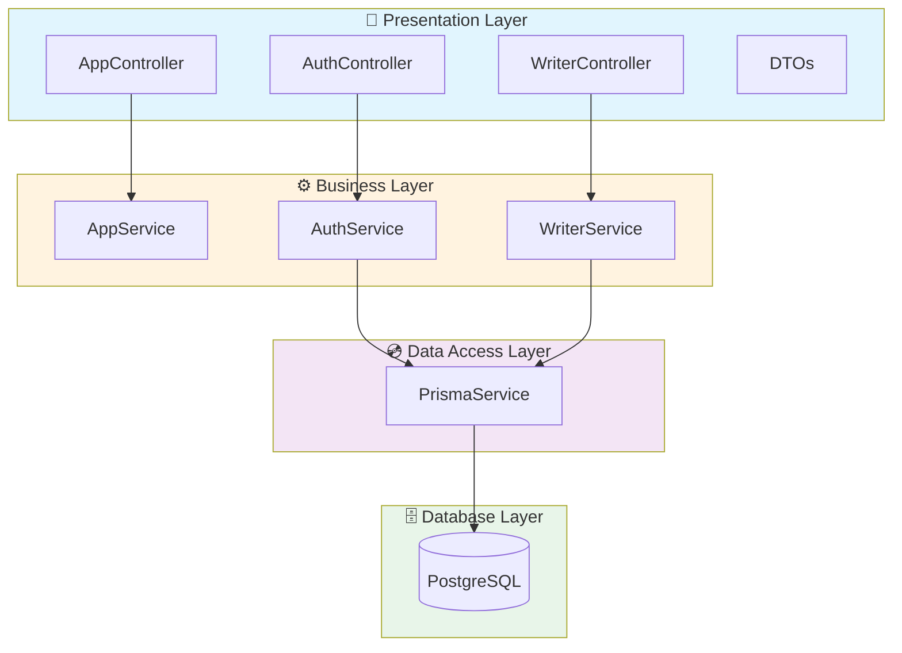
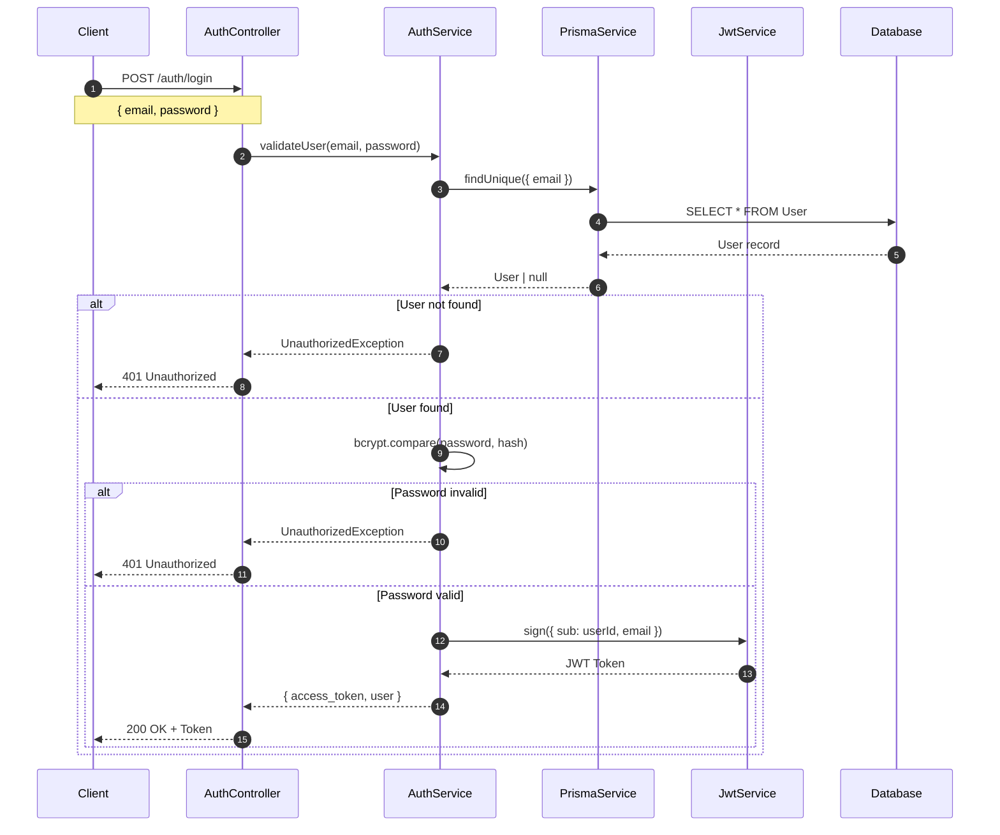
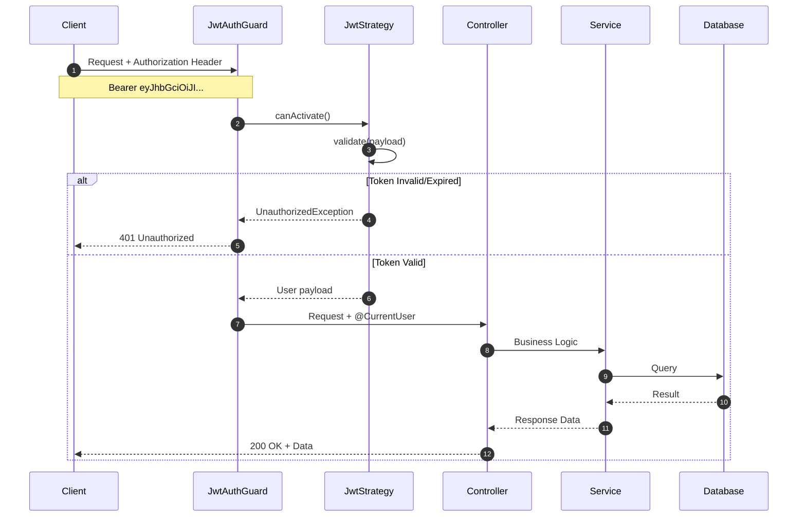
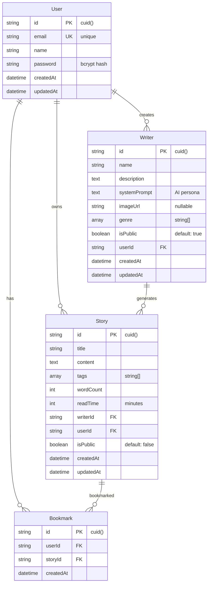
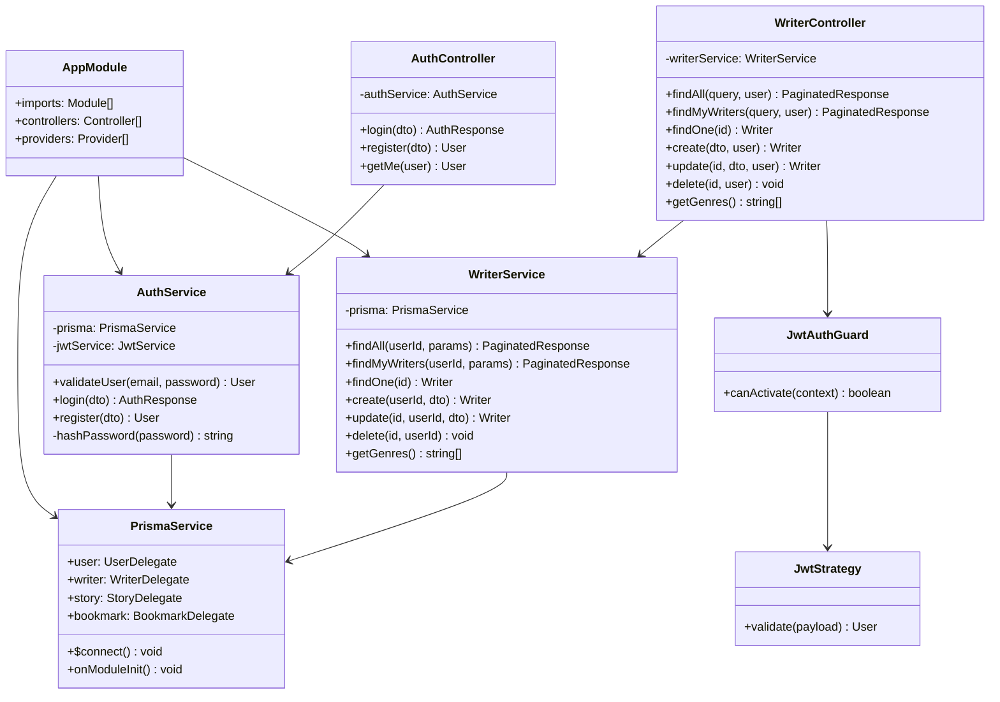
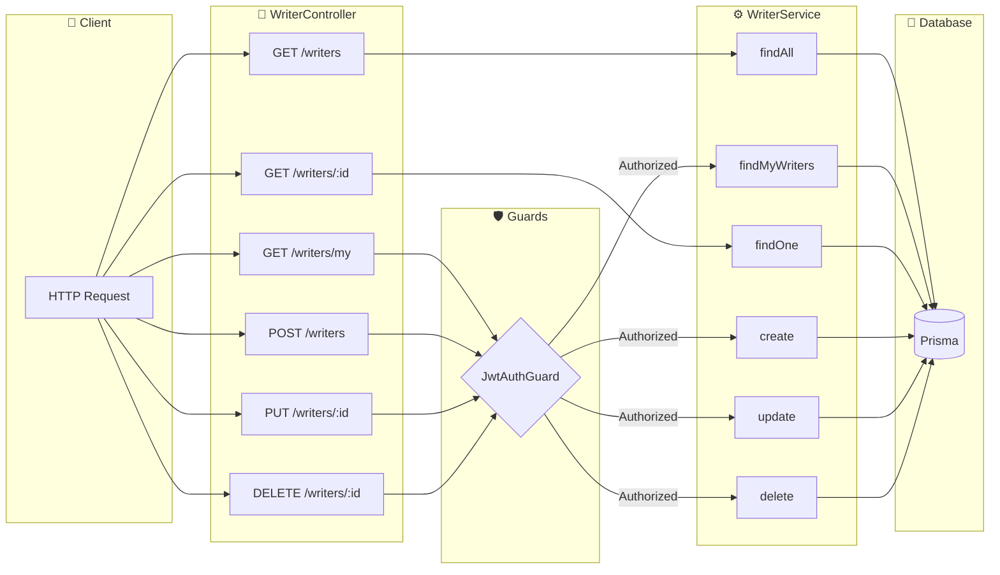
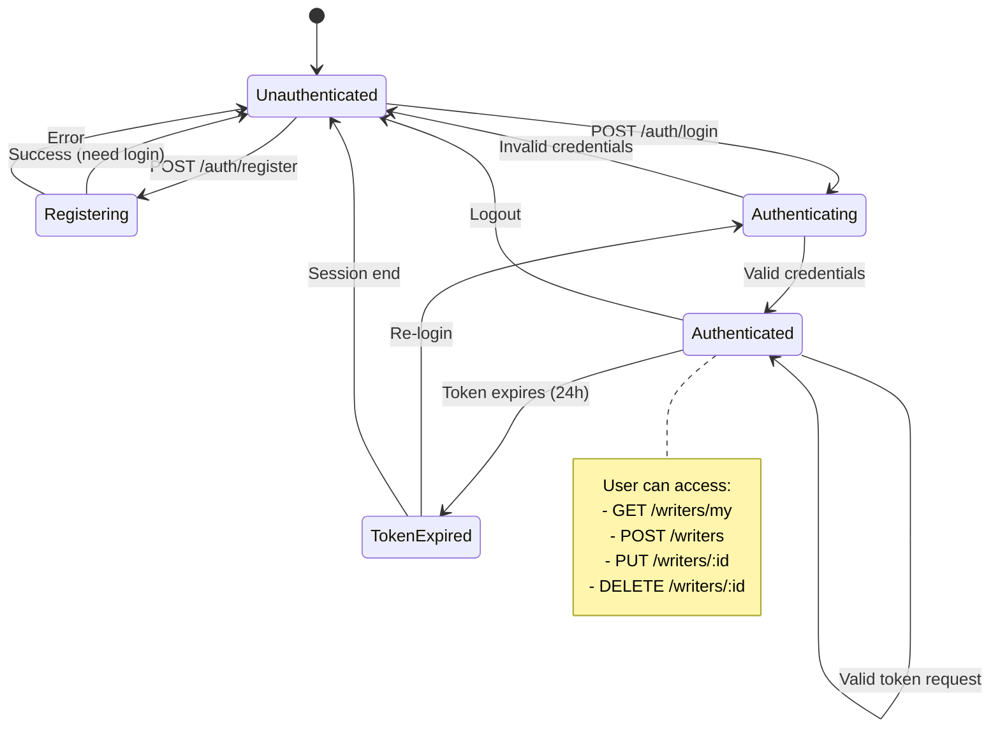
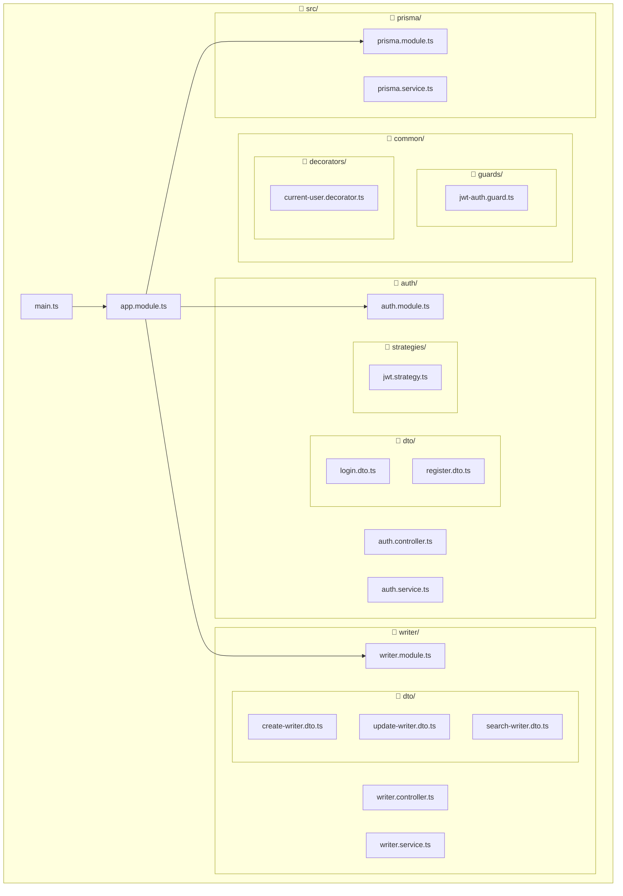
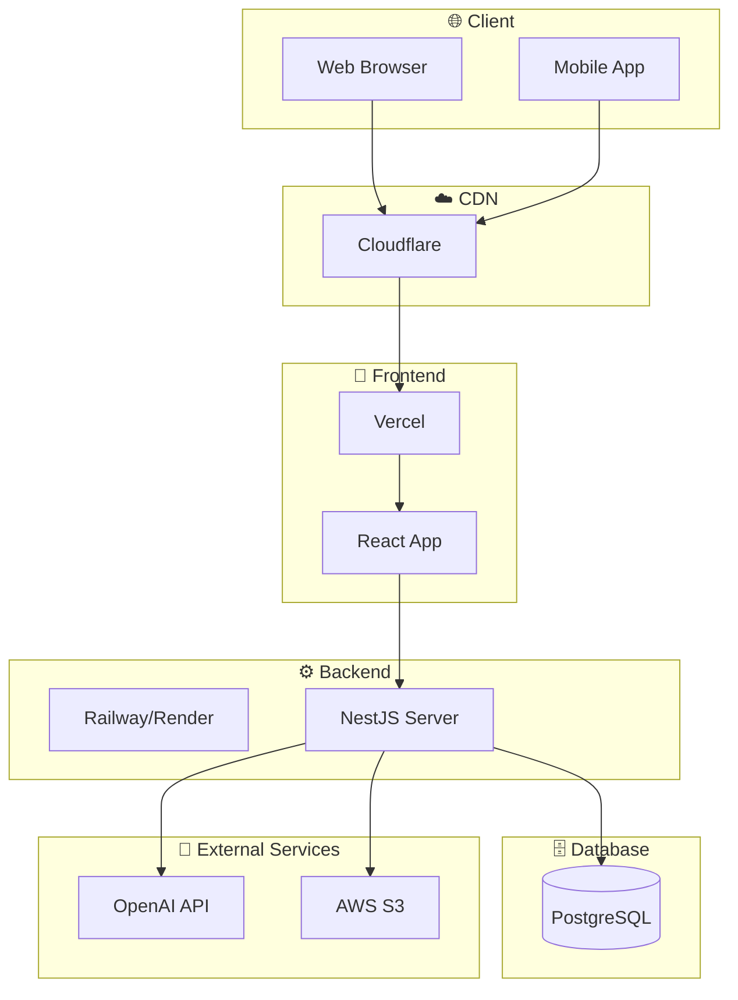

# Server UML Diagrams

> NestJS 백엔드 서버 UML 다이어그램 (Mermaid)
> Phase 3 완료 시점 기준

---

## 1. 모듈 구조 (Component Diagram)

```mermaid
graph TB
    subgraph AppModule["🏠 AppModule (Root)"]
        AC[AppController]
        AS[AppService]
    end

    subgraph PrismaModule["💾 PrismaModule (Global)"]
        PS[PrismaService]
    end

    subgraph AuthModule["🔐 AuthModule"]
        AuC[AuthController]
        AuS[AuthService]
        JS[JwtStrategy]
        JM[JwtModule]
    end

    subgraph WriterModule["✍️ WriterModule"]
        WC[WriterController]
        WS[WriterService]
    end

    subgraph Common["🔧 Common"]
        JAG[JwtAuthGuard]
        CUD[@CurrentUser]
    end

    AppModule --> PrismaModule
    AppModule --> AuthModule
    AppModule --> WriterModule

    AuC --> AuS
    AuS --> PS
    AuS --> JM
    JS --> JM

    WC --> WS
    WS --> PS
    WC --> JAG
    WC --> CUD

    JAG --> JS
```

---

## 2. 레이어드 아키텍처 (Layered Architecture)



---

## 3. 인증 시퀀스 (Login Sequence Diagram)



---

## 4. 인증된 요청 시퀀스 (Protected Route Sequence)



---

## 5. 데이터베이스 ERD (Entity Relationship Diagram)



---

## 6. 클래스 다이어그램 (Class Diagram)



---

## 7. API 흐름 다이어그램 (Writer CRUD)



---

## 8. 상태 다이어그램 (Authentication State)



---

## 9. 패키지 다이어그램 (Package Structure)



---

## 10. 배포 다이어그램 (Deployment - 계획)



---

## 사용 방법

이 문서의 다이어그램은 [Mermaid](https://mermaid.js.org/) 문법으로 작성되었습니다.

- **GitHub**: 자동으로 렌더링됩니다
- **VS Code**: [Mermaid Preview](https://marketplace.visualstudio.com/items?itemName=bierner.markdown-mermaid) 확장 설치
- **로컬**: [Mermaid Live Editor](https://mermaid.live/) 사용

---

## 참고

- [Mermaid Documentation](https://mermaid.js.org/intro/)
- [NestJS Architecture](https://docs.nestjs.com/fundamentals/lifecycle-events)
- [Prisma Schema](https://www.prisma.io/docs/concepts/components/prisma-schema)
