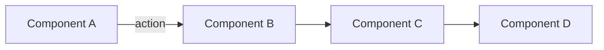
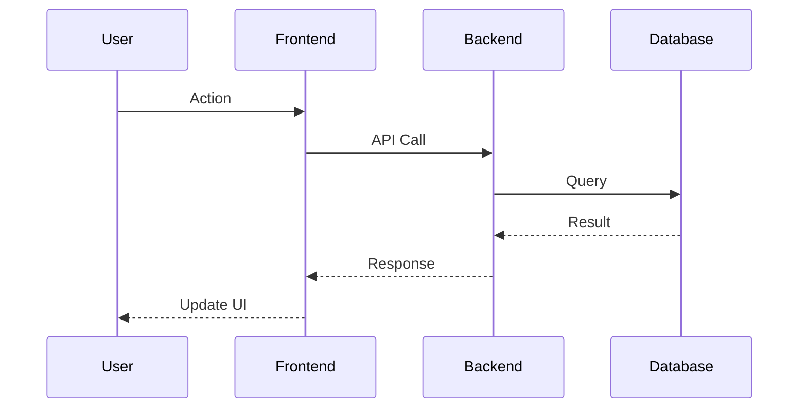

# Technical Plan: Phase X - [Feature Name]

> **Spec**: `spec.md`
> **Status**: 🔄 작성 중 / ✅ 완료
> **Created**: YYYY-MM-DD

---

## 🏗️ Architecture Overview

### High-Level Design



### Architecture Decisions

```yaml
Decision_1:
  choice: [선택한 것]
  alternatives: [고려한 대안들]
  rationale: [이유]
  tradeoffs:
    pros: [장점들]
    cons: [단점들]
```

---

## 📊 Data Model

### Prisma Schema

```prisma
model Example {
  id        String   @id @default(cuid())
  field1    String
  field2    Int

  createdAt DateTime @default(now())
  updatedAt DateTime @updatedAt

  @@index([field1])
}
```

### Data Flow



---

## 🔌 API Design

### Endpoints

```yaml
POST /api/resource:
  description: [설명]
  request:
    body:
      field1: string
      field2: number
  response:
    200:
      data: ResourceDto
    400:
      error: ValidationError
    401:
      error: Unauthorized

GET /api/resource/:id:
  description: [설명]
  params:
    id: string
  response:
    200:
      data: ResourceDto
    404:
      error: NotFound
```

### DTOs

```typescript
// Request DTOs
export class CreateResourceDto {
  @IsString()
  @IsNotEmpty()
  field1: string;

  @IsNumber()
  @Min(0)
  field2: number;
}

// Response DTOs
export class ResourceDto {
  id: string;
  field1: string;
  field2: number;
  createdAt: Date;
}
```

---

## 🎨 Frontend Components

### Component Hierarchy

```
Page/
├── Container/
│   ├── Component1/
│   ├── Component2/
│   └── Component3/
└── Shared/
    ├── Button
    └── Input
```

### State Management

```typescript
// Zustand Store
interface ResourceStore {
  resources: Resource[];
  loading: boolean;
  error: string | null;

  fetchResources: () => Promise<void>;
  createResource: (data: CreateResourceDto) => Promise<void>;
}
```

---

## 🔧 Implementation Strategy

### Backend Services

```yaml
Service_Layer:
  ResourceService:
    responsibility: 비즈니스 로직
    methods:
      - create(dto): Promise<Resource>
      - findAll(query): Promise<Resource[]>
      - findOne(id): Promise<Resource>
      - update(id, dto): Promise<Resource>
      - remove(id): Promise<void>

Repository_Layer:
  - Prisma ORM 사용
  - Transaction 관리
  - 쿼리 최적화
```

### Frontend Hooks

```typescript
// Custom Hook
export function useResource() {
  const { data, isLoading, error } = useQuery({
    queryKey: ['resources'],
    queryFn: fetchResources,
  });

  const createMutation = useMutation({
    mutationFn: createResource,
    onSuccess: () => queryClient.invalidateQueries(['resources']),
  });

  return { data, isLoading, error, create: createMutation.mutate };
}
```

---

## 🛡️ Security Considerations

### Authentication & Authorization

```yaml
- JWT Guard 적용
- Role-based access control (필요 시)
- Input validation
```

### Data Protection

```yaml
- Sensitive data 암호화
- SQL Injection 방어 (Prisma)
- XSS 방어 (sanitization)
```

---

## ⚡ Performance Optimization

### Backend

```yaml
Database:
  - 인덱싱 전략: [인덱스 필드들]
  - N+1 방지: [include/select 사용]
  - Connection pooling: [설정]

Caching:
  - Cache strategy: [캐싱 전략]
  - TTL: [만료 시간]
```

### Frontend

```yaml
Rendering:
  - Code splitting: [번들 분할]
  - Lazy loading: [지연 로딩]
  - Memoization: [React.memo, useMemo]

State:
  - TanStack Query caching
  - Optimistic updates
```

---

## 🧪 Testing Strategy

### Unit Tests

```yaml
Backend:
  - Service 메서드별 테스트
  - Mock dependencies
  - Coverage > 80%

Frontend:
  - Component 테스트
  - Hook 테스트
  - Utility 함수 테스트
```

### Integration Tests

```yaml
- API 엔드포인트 테스트
- Database 통합 테스트
```

### E2E Tests

```yaml
- Playwright 시나리오
- 주요 사용자 플로우
```

---

## 📦 Dependencies

### New Dependencies

```yaml
Backend:
  - [패키지명]: [버전] # [사용 목적]

Frontend:
  - [패키지명]: [버전] # [사용 목적]
```

### Version Constraints

```yaml
- [중요 버전 제약사항]
```

---

## 🔄 Migration Strategy (해당 시)

```yaml
- [기존 데이터 마이그레이션]
- [하위 호환성]
- [롤백 계획]
```

---

## 📊 Monitoring & Logging

```yaml
Metrics:
  - [수집할 메트릭 1]
  - [수집할 메트릭 2]

Logs:
  - [로깅 레벨]
  - [로그 포맷]
```

---

## 🚀 Deployment Considerations

```yaml
Environment_Variables:
  - [환경 변수 1]
  - [환경 변수 2]

Build_Steps: 1. [빌드 단계 1]
  2. [빌드 단계 2]
```

---

## 📝 AI Development Notes

### Context7 Research

```bash
# 사용할 Context7 검색어
/context7 [라이브러리명] [주제]
```

### Sequential Thinking Points

```yaml
- [복잡한 설계 결정 1]
- [트레이드오프 분석 2]
```

### Magic MCP Components

```yaml
- [생성할 UI 컴포넌트 리스트]
```

---

## 🔗 References

- Constitution: `specs/constitution.md`
- Related Spec: `specs/phaseX/spec.md`
- External Docs: [링크]

---

**Next Step**: Tasks 분해 (tasks.md)
