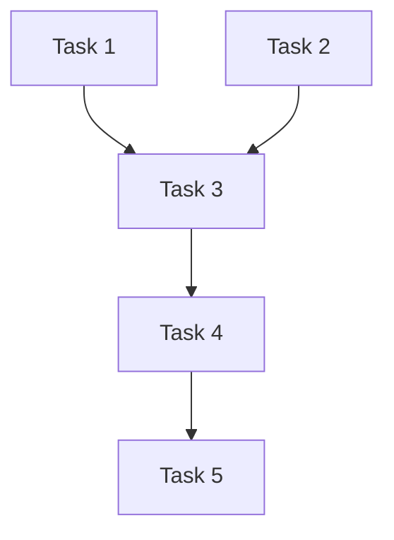

# Tasks: Phase X - [Feature Name]

> **Spec**: `spec.md`
> **Plan**: `plan.md`
> **Status**: 🔄 진행 중 / ✅ 완료

---

## 📋 Task Breakdown

### Task Dependency Graph



---

## Task 1: [Task Name]

### Meta

```yaml
Dependencies: None
Estimated_Time: [X hours]
Priority: P0 (필수) / P1 (중요) / P2 (선택)
```

### Acceptance Criteria

- [ ] [구체적 완료 기준 1]
- [ ] [구체적 완료 기준 2]
- [ ] [구체적 완료 기준 3]
- [ ] [테스트 작성 완료]

### Implementation Notes

```typescript
// 핵심 코드 스니펫 또는 가이드
```

### Testing

```bash
# 검증 명령어
pnpm test [test-file]
# 또는
curl [endpoint]
```

---

## Task 2: [Task Name]

### Meta

```yaml
Dependencies: None
Estimated_Time: [X hours]
Priority: P0
```

### Acceptance Criteria

- [ ] [기준 1]
- [ ] [기준 2]

### Implementation Notes

```typescript
// 가이드
```

### Testing

```bash
# 검증
```

---

## Task 3: [Task Name]

### Meta

```yaml
Dependencies: Task 1, Task 2
Estimated_Time: [X hours]
Priority: P0
```

### Acceptance Criteria

- [ ] [기준 1]
- [ ] [기준 2]

### Implementation Notes

```typescript
// 가이드
```

### Testing

```bash
# 검증
```

---

## 🔄 Iteration Plan

### Sprint 1 (Day 1-2)

```yaml
- [ ] Task 1
- [ ] Task 2
```

### Sprint 2 (Day 3-4)

```yaml
- [ ] Task 3
- [ ] Task 4
```

### Sprint 3 (Day 5)

```yaml
- [ ] Task 5
- [ ] Integration Testing
- [ ] Bug Fixes
```

---

## ✅ Phase Completion Checklist

### Code Quality

```yaml
- [ ] pnpm type-check 통과
- [ ] pnpm lint 통과
- [ ] pnpm test 통과 (coverage > 80%)
- [ ] pnpm build 성공
```

### Constitution Compliance

```yaml
- [ ] No TODO comments
- [ ] No any types
- [ ] All functions fully implemented
- [ ] Error handling included
- [ ] Security checks applied
```

### Spec Validation

```yaml
- [ ] All Success Criteria met
- [ ] Performance requirements met
- [ ] Security requirements met
- [ ] Acceptance tests pass
```

### Documentation

```yaml
- [ ] JSDoc comments added
- [ ] Complex logic commented
- [ ] README updated (if needed)
- [ ] LessonsLearned updated
```

---

## 🧪 Testing Checklist

### Unit Tests

```yaml
- [ ] Service 메서드별 테스트
- [ ] Hook 테스트 (Frontend)
- [ ] Utility 함수 테스트
```

### Integration Tests

```yaml
- [ ] API 엔드포인트 테스트
- [ ] Database 통합 테스트
```

### E2E Tests (Playwright)

```yaml
- [ ] 주요 사용자 플로우
- [ ] 에러 시나리오
```

### Manual Tests

```yaml
- [ ] curl로 API 테스트
- [ ] 브라우저에서 UI 확인
- [ ] Edge cases 검증
```

---

## 📝 AI Development Workflow

### For Each Task:

1. **Read Context**

```bash
- Constitution: specs/constitution.md
- LessonsLearned: docs/lessons-learned.md
- Spec: specs/phaseX/spec.md
- Plan: specs/phaseX/plan.md
```

2. **Context7 Research** (필요 시)

```bash
/context7 [topic]
```

3. **Sequential Thinking** (복잡한 Task)

```bash
# 설계 전략 수립
# 트레이드오프 분석
```

4. **Implement**

```bash
# 코드 작성
```

5. **Validate**

```bash
pnpm type-check
pnpm lint
pnpm test
# 수동 테스트
```

6. **Update LessonsLearned** (에러 발생 시)

```bash
# docs/lessons-learned.md에 추가
```

---

## 📊 Progress Tracking

### Task Status

```yaml
Task_1: ⬜ Pending / 🔄 In Progress / ✅ Done
Task_2: ⬜ Pending / 🔄 In Progress / ✅ Done
Task_3: ⬜ Pending / 🔄 In Progress / ✅ Done
Task_4: ⬜ Pending / 🔄 In Progress / ✅ Done
Task_5: ⬜ Pending / 🔄 In Progress / ✅ Done
```

### Time Tracking

```yaml
Estimated_Total: [X hours]
Actual_Total: [Y hours]
Variance: [+/- Z hours]
```

---

## 🚨 Blockers & Issues

### Current Blockers

```yaml
- [Blocker 1]: [해결 방법]
```

### Resolved Issues

```yaml
- [Issue 1]: [해결 완료]
```

---

## 🔗 References

- Constitution: `specs/constitution.md`
- Spec: `specs/phaseX/spec.md`
- Plan: `specs/phaseX/plan.md`
- LessonsLearned: `docs/lessons-learned.md`

---

**Start Implementation**: Task 1부터 순차 진행
