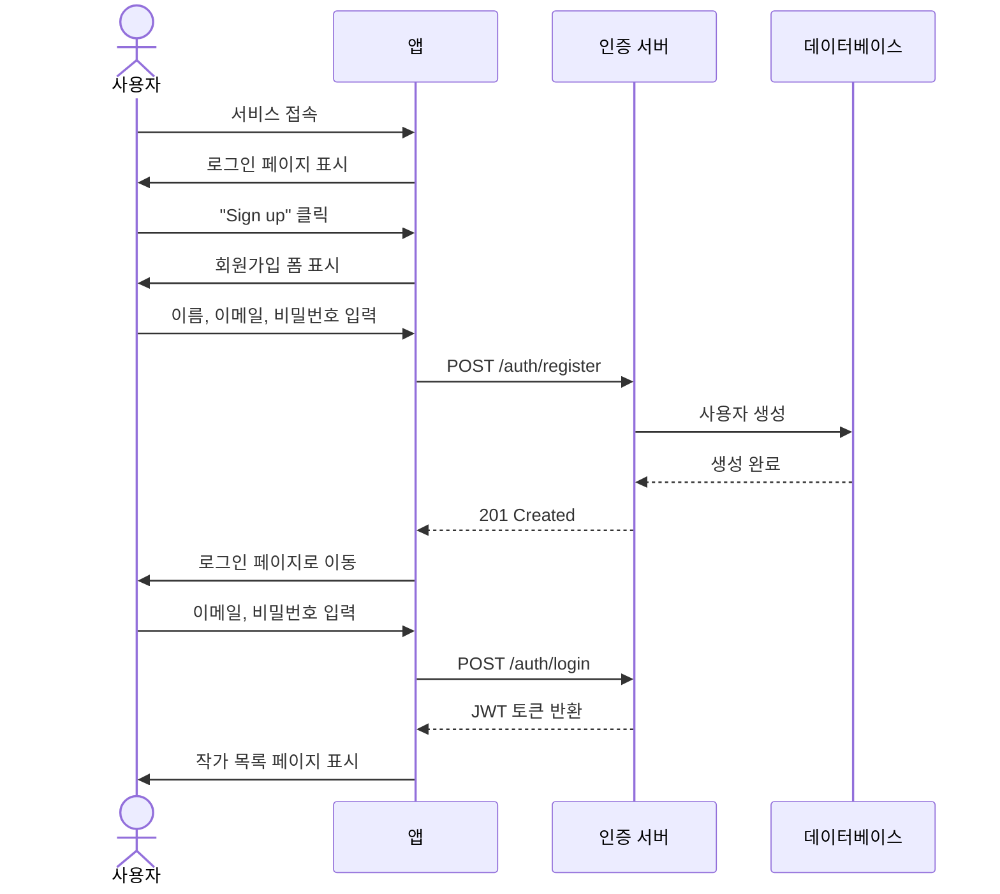
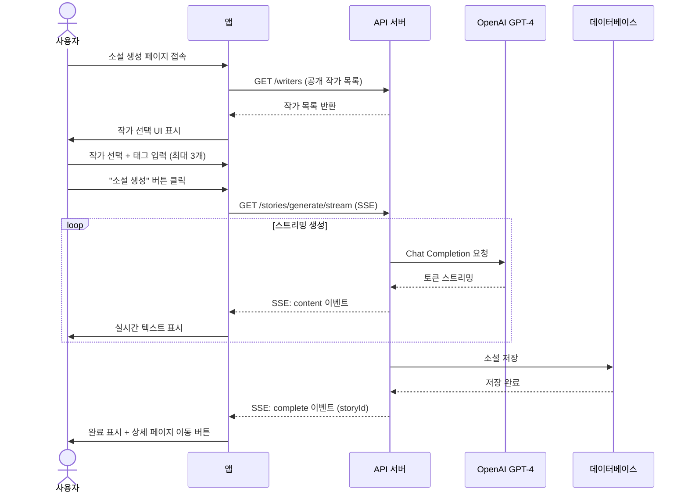
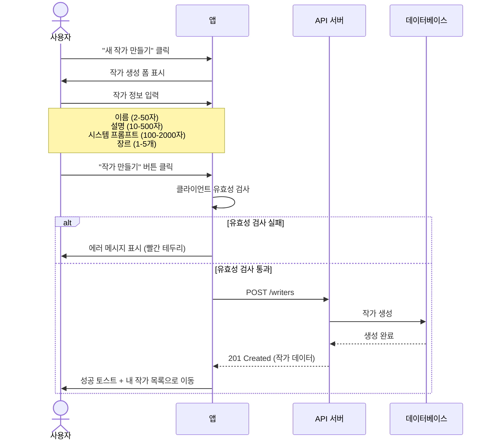
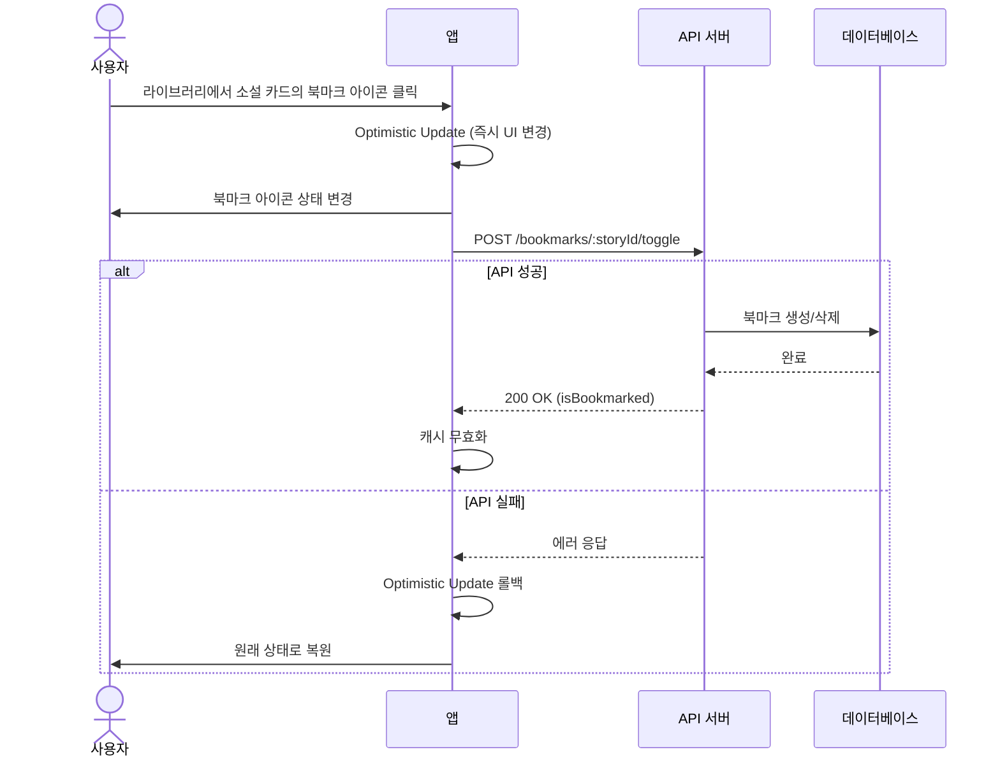

# Snack Storyteller - 서비스 스펙 문서

## 개요

- **서비스명**: Snack Storyteller
- **설명**: AI 작가 페르소나를 활용한 단편 소설 생성 플랫폼
- **기술 스택**: React + NestJS + Prisma + PostgreSQL + Multi-AI (OpenAI/Gemini)
- **최종 업데이트**: 2025-12-10

---

## 페이지 구조

### 인증 도메인 (Auth)

| 경로        | 페이지       | 설명     | 인증 필요 |
| ----------- | ------------ | -------- | --------- |
| `/login`    | LoginPage    | 로그인   | 아니오    |
| `/register` | RegisterPage | 회원가입 | 아니오    |

### 작가 도메인 (Writer)

| 경로                | 페이지           | 설명           | 인증 필요     |
| ------------------- | ---------------- | -------------- | ------------- |
| `/writers`          | WritersPage      | 공개 작가 목록 | 아니오        |
| `/writers/:id`      | WriterDetailPage | 작가 상세 정보 | 아니오        |
| `/writers/create`   | CreateWriterPage | 새 작가 생성   | 예            |
| `/writers/:id/edit` | EditWriterPage   | 작가 정보 수정 | 예 (소유자만) |
| `/my-writers`       | MyWritersPage    | 내 작가 관리   | 예            |

### 소설 도메인 (Story)

| 경로                | 페이지            | 설명               | 인증 필요 |
| ------------------- | ----------------- | ------------------ | --------- |
| `/stories/generate` | GenerateStoryPage | AI 소설 생성       | 예        |
| `/library`          | LibraryPage       | 내 소설 라이브러리 | 예        |
| `/stories/:id`      | StoryDetailPage   | 소설 상세 보기     | 예        |

---

## 페이지 연결 관계

```mermaid
flowchart TD
    subgraph Public["공개 영역"]
        LOGIN["/login<br/>로그인"]
        REGISTER["/register<br/>회원가입"]
        WRITERS["/writers<br/>공개 작가 목록"]
        WRITER_DETAIL["/writers/:id<br/>작가 상세"]
    end

    subgraph Protected["인증 필요 영역"]
        CREATE_WRITER["/writers/create<br/>작가 생성"]
        EDIT_WRITER["/writers/:id/edit<br/>작가 수정"]
        MY_WRITERS["/my-writers<br/>내 작가 관리"]
        GENERATE["/stories/generate<br/>소설 생성"]
        LIBRARY["/library<br/>소설 라이브러리"]
        STORY_DETAIL["/stories/:id<br/>소설 상세"]
    end

    %% Auth Flow
    LOGIN -->|회원가입 링크| REGISTER
    REGISTER -->|로그인 링크| LOGIN
    LOGIN -->|로그인 성공| WRITERS

    %% Writer Flow
    WRITERS -->|작가 클릭| WRITER_DETAIL
    WRITER_DETAIL -->|수정 버튼<br/>(소유자만)| EDIT_WRITER
    WRITER_DETAIL -->|소설 생성| GENERATE
    MY_WRITERS -->|수정 버튼| EDIT_WRITER
    MY_WRITERS -->|새 작가 생성| CREATE_WRITER
    CREATE_WRITER -->|생성 완료| MY_WRITERS
    EDIT_WRITER -->|수정 완료| WRITER_DETAIL

    %% Story Flow
    GENERATE -->|작가 선택 필요| WRITERS
    GENERATE -->|생성 완료| STORY_DETAIL
    LIBRARY -->|소설 클릭| STORY_DETAIL
    STORY_DETAIL -->|목록으로| LIBRARY

    %% Navigation
    WRITERS -.->|헤더 네비게이션| MY_WRITERS
    WRITERS -.->|헤더 네비게이션| GENERATE
    WRITERS -.->|헤더 네비게이션| LIBRARY
```

---

## 사용자 플로우 (User Flow)

### 1. 신규 사용자 온보딩



### 2. 소설 생성 플로우



### 3. 작가 생성 플로우



### 4. 북마크 관리 플로우



---

## 도메인별 스펙 문서

### [인증(Auth) 스펙](./auth-spec.md)

- 로그인 페이지 (LoginPage)
- 회원가입 페이지 (RegisterPage)

### [작가(Writer) 스펙](./writer-spec.md)

- 공개 작가 목록 (WritersPage)
- 작가 상세 (WriterDetailPage)
- 작가 생성 (CreateWriterPage)
- 작가 수정 (EditWriterPage)
- 내 작가 관리 (MyWritersPage)

### [소설(Story) 스펙](./story-spec.md)

- 소설 생성 (GenerateStoryPage)
- 소설 라이브러리 (LibraryPage)
- 소설 상세 (StoryDetailPage)
- SSE 스트리밍 이벤트 스펙

### [AI 인프라 스펙](./ai-infrastructure-spec.md)

- Multi-Provider Fallback System (OpenAI → Gemini)
- Circuit Breaker 패턴
- Provider 추상화 및 확장성
- 장애 대응 및 고가용성

---

## 공통 컴포넌트

### 헤더 네비게이션

| 메뉴       | 경로                | 인증 필요 |
| ---------- | ------------------- | --------- |
| 작가 탐색  | `/writers`          | 아니오    |
| 내 작가    | `/my-writers`       | 예        |
| 소설 생성  | `/stories/generate` | 예        |
| 라이브러리 | `/library`          | 예        |
| 로그아웃   | -                   | 예        |

### 에러 상태 공통 패턴

| 에러 유형        | UI 표현                          |
| ---------------- | -------------------------------- |
| 네트워크 오류    | "연결 실패" 메시지 + 재시도 버튼 |
| 401 Unauthorized | 로그인 페이지로 리다이렉트       |
| 403 Forbidden    | "권한이 없습니다" 메시지         |
| 404 Not Found    | "찾을 수 없습니다" 메시지        |
| 500 Server Error | "서버 오류" 메시지 + 재시도 안내 |

### 로딩 상태 공통 패턴

| 상황        | UI 표현                           |
| ----------- | --------------------------------- |
| 페이지 로딩 | 전체 화면 스피너                  |
| 버튼 액션   | 버튼 내 Loader2 아이콘 + 비활성화 |
| 목록 로딩   | Skeleton 카드 그리드              |
| 스트리밍    | 깜빡이는 커서 + 실시간 텍스트     |

---

## 성능 요구사항

| 기능              | 목표 시간 |
| ----------------- | --------- |
| 페이지 초기 로드  | < 1초     |
| API 응답 (일반)   | < 500ms   |
| 소설 생성 첫 토큰 | < 3초     |
| 소설 생성 완료    | < 60초    |
| 검색/필터 응답    | < 300ms   |

---

## 접근성 요구사항

- 모든 입력 필드에 Label 연결
- 키보드만으로 전체 기능 사용 가능 (Tab + Enter)
- 에러 메시지 스크린리더 접근 가능 (aria-live)
- 로딩 상태 시각적 + 텍스트 표시
- 색상 대비 WCAG AA 기준 충족
- 포커스 표시 명확 (outline)

---

## QA 테스트 가이드

### 크로스 도메인 시나리오

| #   | 시나리오                             | 시작 페이지       | 종료 페이지  | 검증 포인트               |
| --- | ------------------------------------ | ----------------- | ------------ | ------------------------- |
| 1   | 신규 가입 → 작가 생성 → 소설 생성    | /register         | /stories/:id | 전체 플로우 작동          |
| 2   | 작가 수정 → 해당 작가로 소설 생성    | /writers/:id/edit | /stories/:id | 수정된 systemPrompt 반영  |
| 3   | 소설 생성 → 라이브러리 확인 → 북마크 | /stories/generate | /library     | 생성된 소설이 목록에 표시 |
| 4   | 다른 사용자의 작가로 소설 생성       | /writers          | /stories/:id | 공개 작가 선택 가능       |
| 5   | 로그아웃 → 보호된 페이지 접근        | /library          | /login       | 자동 리다이렉트           |

### 에지 케이스 테스트

| #   | 시나리오                         | 기대 결과                      |
| --- | -------------------------------- | ------------------------------ |
| 1   | 네트워크 끊김 상태에서 소설 생성 | 에러 메시지 + 재시도 가능      |
| 2   | 소설 생성 중 페이지 이탈         | beforeunload 경고 표시         |
| 3   | 동시에 같은 작가 수정            | 최후 저장자 승리 (낙관적 잠금) |
| 4   | 매우 긴 소설 내용 표시           | 스크롤 가능, 레이아웃 유지     |
| 5   | 특수문자가 포함된 검색어         | 정상 검색 또는 적절한 에러     |

---

## 버전 히스토리

| 버전  | 날짜       | 변경 내용           |
| ----- | ---------- | ------------------- |
| 1.0.0 | 2024-12-10 | 초기 스펙 문서 작성 |
