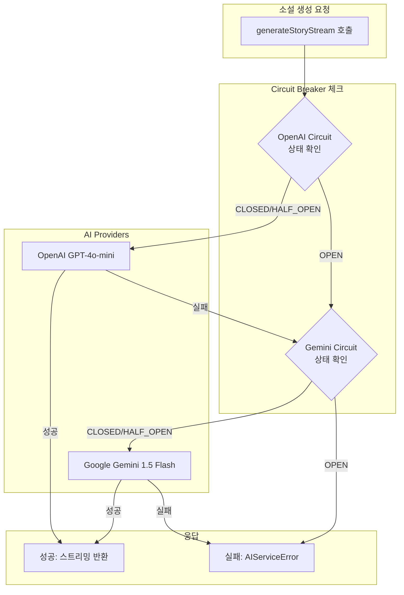
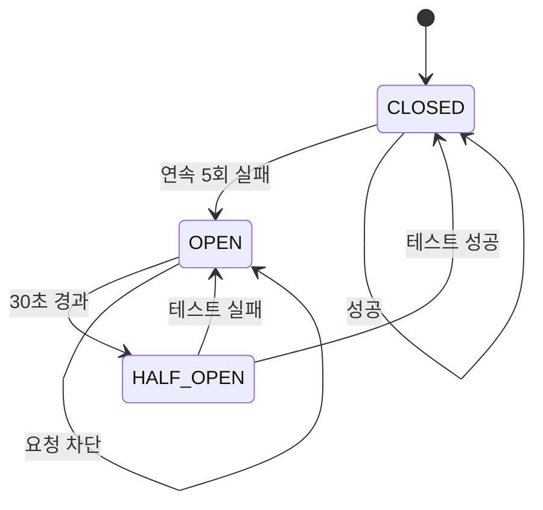

# AI 인프라(AI Infrastructure) 스펙 문서

## 개요

- **도메인**: AI 인프라 (Multi-Provider Fallback System)
- **관련 모듈**: `apps/server/src/ai/`
- **관련 API**: /stories/generate/stream
- **최종 업데이트**: 2025-12-10

---

## 아키텍처

### 파일 구조

```
apps/server/src/ai/
├── ai.module.ts                      # 모듈 정의
├── ai.service.ts                     # 오케스트레이터 (Fallback 로직)
├── errors/
│   └── ai.errors.ts                  # 에러 클래스 정의
├── moderation/
│   ├── korean-filter.ts
│   └── moderation.service.ts
├── prompt/
│   ├── examples.data.ts
│   ├── prompt-builder.service.ts
│   └── prompt.types.ts
├── providers/
│   ├── ai-provider.interface.ts      # Provider 인터페이스
│   ├── openai.provider.ts            # OpenAI 구현
│   ├── gemini.provider.ts            # Gemini 구현
│   └── index.ts
└── circuit-breaker/
    ├── circuit-breaker.service.ts    # Circuit Breaker 로직
    └── circuit-breaker.types.ts      # 타입 정의
```

### Fallback 흐름



### Circuit Breaker 상태 다이어그램



---

## 기능 스펙: AI Provider

### Provider 목록

| 번호 | Domain   | Provider | Model            | 우선순위 | Timeout | Spec.                                                                             | 참고사항            |
| ---- | -------- | -------- | ---------------- | -------- | ------- | --------------------------------------------------------------------------------- | ------------------- |
| 1    | Primary  | OpenAI   | gpt-4o-mini      | 1        | 60s     | • API 키 존재 시 자동 활성화<br>• 스트리밍 지원<br>• Max Tokens: 4000             | 기본 Provider       |
| 2    | Fallback | Gemini   | gemini-2.0-flash | 2        | 45s     | • API 키 + GEMINI_ENABLED=true 시 활성화<br>• 스트리밍 지원<br>• Max Tokens: 4000 | 무료 티어 활용 가능 |

### Provider Interface

| 번호 | Domain    | User Story                   | 항목                | Spec.                                                                                                                                                   | 참고사항               |
| ---- | --------- | ---------------------------- | ------------------- | ------------------------------------------------------------------------------------------------------------------------------------------------------- | ---------------------- |
| 1    | 설정      | Provider 설정을 정의한다     | AIProviderConfig    | • name: 프로바이더 식별자<br>• priority: 우선순위 (1이 가장 높음)<br>• enabled: 활성화 여부<br>• supportsStreaming: 스트리밍 지원<br>• timeoutMs, model | readonly 속성          |
| 2    | 소설 생성 | 스트리밍으로 소설을 생성한다 | generateStoryStream | • systemPrompt와 tags 입력<br>• AsyncGenerator로 chunk 반환<br>• 실패 시 AIProviderError throw                                                          | AsyncGenerator<string> |
| 3    | 제목 생성 | 소설 제목을 생성한다         | generateTitle       | • 생성된 content 입력<br>• 제목 문자열 반환<br>• 실패 시 AIProviderError throw                                                                          | Promise<string>        |
| 4    | 헬스체크  | Provider 상태를 확인한다     | healthCheck         | • 선택적 구현<br>• API 연결 확인<br>• boolean 반환                                                                                                      | Circuit Breaker용      |

---

## 기능 스펙: Circuit Breaker

### 설정값

| 번호 | Domain    | 파라미터           | 기본값   | Spec.                                          | 환경변수                        |
| ---- | --------- | ------------------ | -------- | ---------------------------------------------- | ------------------------------- |
| 1    | 실패 임계 | failureThreshold   | 5        | 연속 N회 실패 시 OPEN 상태로 전환              | AI_CIRCUIT_FAILURE_THRESHOLD    |
| 2    | 리셋 시간 | resetTimeoutMs     | 30,000ms | OPEN 상태에서 HALF_OPEN으로 전환까지 대기 시간 | AI_CIRCUIT_RESET_TIMEOUT_MS     |
| 3    | 테스트    | halfOpenRequests   | 1        | HALF_OPEN에서 허용할 테스트 요청 수            | AI_CIRCUIT_HALF_OPEN_REQUESTS   |
| 4    | 모니터링  | monitoringWindowMs | 60,000ms | 실패 카운트 리셋 윈도우                        | AI_CIRCUIT_MONITORING_WINDOW_MS |

### 상태별 동작

| 번호 | Domain | 상태      | User Story                        | Spec.                                                                           | 참고사항  |
| ---- | ------ | --------- | --------------------------------- | ------------------------------------------------------------------------------- | --------- |
| 1    | 정상   | CLOSED    | 모든 요청이 통과된다              | • 요청 허용<br>• 성공 시 상태 유지<br>• 연속 5회 실패 시 OPEN 전환              | 초기 상태 |
| 2    | 차단   | OPEN      | 요청이 즉시 차단된다              | • 모든 요청 즉시 실패<br>• 30초 후 HALF_OPEN 전환<br>• 다음 Provider로 Fallback | 장애 격리 |
| 3    | 테스트 | HALF_OPEN | 제한된 요청으로 복구를 테스트한다 | • 1회 테스트 요청 허용<br>• 성공 시 CLOSED 전환<br>• 실패 시 OPEN 유지          | 자동 복구 |

---

## 기능 스펙: 에러 처리

### 에러 클래스

| 번호 | Domain     | 에러 클래스               | 코드                 | Retryable | Spec.                                                  |
| ---- | ---------- | ------------------------- | -------------------- | --------- | ------------------------------------------------------ |
| 1    | 기본       | AIServiceError            | -                    | -         | 모든 AI 에러의 기본 클래스                             |
| 2    | 타임아웃   | OpenAITimeoutError        | OPENAI_TIMEOUT       | true      | "AI 서비스 응답 시간이 초과되었습니다"                 |
| 3    | Rate Limit | OpenAIRateLimitError      | OPENAI_RATE_LIMIT    | true      | "AI 서비스 사용량 한도를 초과했습니다"                 |
| 4    | 모더레이션 | ModerationFailedError     | MODERATION_FAILED    | true      | "콘텐츠 검토 실패: {reason}"                           |
| 5    | 콘텐츠     | ContentUnsafeError        | CONTENT_UNSAFE       | false     | "부적절한 콘텐츠 감지: {reason}"                       |
| 6    | 전체 실패  | AIAllProvidersFailedError | ALL_PROVIDERS_FAILED | false     | "모든 AI 서비스 연결에 실패했습니다"                   |
| 7    | Circuit    | AICircuitOpenError        | CIRCUIT_OPEN         | false     | "AI 서비스({provider})가 일시적으로 이용 불가능합니다" |

### Provider 에러 코드

| 번호 | Domain     | 코드            | Retryable | Spec.                    |
| ---- | ---------- | --------------- | --------- | ------------------------ |
| 1    | 타임아웃   | TIMEOUT         | true      | 요청 시간 초과           |
| 2    | Rate Limit | RATE_LIMIT      | true      | API 호출 제한 초과       |
| 3    | 인증       | AUTHENTICATION  | false     | API 키 오류              |
| 4    | 요청       | INVALID_REQUEST | false     | 잘못된 요청 형식         |
| 5    | 서버       | SERVER_ERROR    | true      | Provider 서버 에러 (5xx) |
| 6    | 네트워크   | NETWORK_ERROR   | true      | 네트워크 연결 실패       |
| 7    | 필터       | CONTENT_FILTER  | true      | 콘텐츠 필터링            |
| 8    | 알 수 없음 | UNKNOWN         | true      | 분류되지 않은 에러       |

---

## 환경 변수

| 번호 | Domain          | 변수명                          | 필수   | 기본값           | Spec.                        |
| ---- | --------------- | ------------------------------- | ------ | ---------------- | ---------------------------- |
| 1    | OpenAI          | OPENAI_API_KEY                  | 예     | -                | OpenAI API 키                |
| 2    | OpenAI          | OPENAI_MODEL                    | 아니오 | gpt-4o-mini      | 사용할 모델명                |
| 3    | OpenAI          | OPENAI_TIMEOUT_MS               | 아니오 | 60000            | 요청 타임아웃 (ms)           |
| 4    | Gemini          | GEMINI_API_KEY                  | 아니오 | -                | Gemini API 키                |
| 5    | Gemini          | GEMINI_ENABLED                  | 아니오 | false            | Gemini Provider 활성화 여부  |
| 6    | Gemini          | GEMINI_MODEL                    | 아니오 | gemini-2.0-flash | 사용할 모델명                |
| 7    | Gemini          | GEMINI_TIMEOUT_MS               | 아니오 | 45000            | 요청 타임아웃 (ms)           |
| 8    | Circuit Breaker | AI_CIRCUIT_FAILURE_THRESHOLD    | 아니오 | 5                | OPEN 전환까지 연속 실패 수   |
| 9    | Circuit Breaker | AI_CIRCUIT_RESET_TIMEOUT_MS     | 아니오 | 30000            | HALF_OPEN 전환까지 대기 시간 |
| 10   | Circuit Breaker | AI_CIRCUIT_HALF_OPEN_REQUESTS   | 아니오 | 1                | HALF_OPEN에서 테스트 요청 수 |
| 11   | Circuit Breaker | AI_CIRCUIT_MONITORING_WINDOW_MS | 아니오 | 60000            | 실패 카운트 리셋 윈도우      |

---

## QA 테스트 시나리오

### 정상 동작 테스트

| #   | 시나리오             | 기대 결과                     |
| --- | -------------------- | ----------------------------- |
| 1   | 모든 Provider 정상   | OpenAI로 생성 완료            |
| 2   | 태그 3개로 소설 생성 | 정상 스트리밍                 |
| 3   | 연속 5회 생성 요청   | 모두 성공 (Rate limit 미발생) |

### Fallback 테스트

| #   | 시나리오           | 기대 결과                                 |
| --- | ------------------ | ----------------------------------------- |
| 1   | OpenAI 5XX 에러    | Gemini로 자동 전환, 생성 완료             |
| 2   | OpenAI Timeout     | Gemini로 자동 전환                        |
| 3   | 모든 Provider 실패 | "모든 AI 서비스 연결에 실패했습니다" 에러 |

### Circuit Breaker 테스트

| #   | 시나리오                  | 기대 결과                        |
| --- | ------------------------- | -------------------------------- |
| 1   | OpenAI 5회 연속 실패      | Circuit OPEN, Gemini로 즉시 전환 |
| 2   | Circuit OPEN 후 30초 경과 | HALF_OPEN, 1회 테스트            |
| 3   | HALF_OPEN 테스트 성공     | CLOSED 전환, OpenAI 사용 재개    |
| 4   | HALF_OPEN 테스트 실패     | OPEN 유지, Gemini 계속 사용      |

### 에러 케이스 테스트

| #   | 시나리오           | 기대 결과                           |
| --- | ------------------ | ----------------------------------- |
| 1   | 모든 API 키 미설정 | 서버 시작 시 경고 로그              |
| 2   | 네트워크 완전 차단 | "네트워크 연결을 확인해주세요" 에러 |
| 3   | Rate Limit 초과    | 다음 Provider로 전환                |

---

## 성능 요구사항

| 기능                    | 목표 시간 |
| ----------------------- | --------- |
| 첫 토큰 응답 (Primary)  | < 3초     |
| 첫 토큰 응답 (Fallback) | < 5초     |
| 전체 소설 생성          | < 60초    |
| Provider 전환           | < 1초     |
| Circuit 상태 전환       | 즉시      |

---

## 알려진 제한사항

1. **프롬프트 호환성**: 각 Provider마다 최적 프롬프트가 다를 수 있음
2. **품질 차이**: Fallback Provider의 출력 품질이 다를 수 있음
3. **비용 관리**: Gemini만 Fallback으로 사용 (무료 티어 활용)
