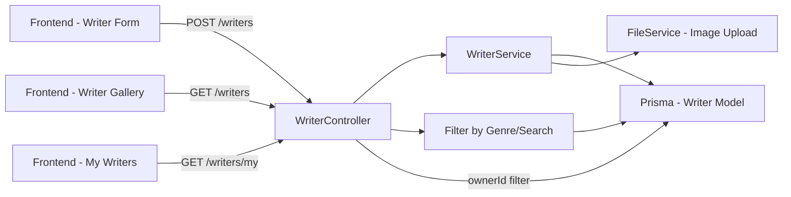
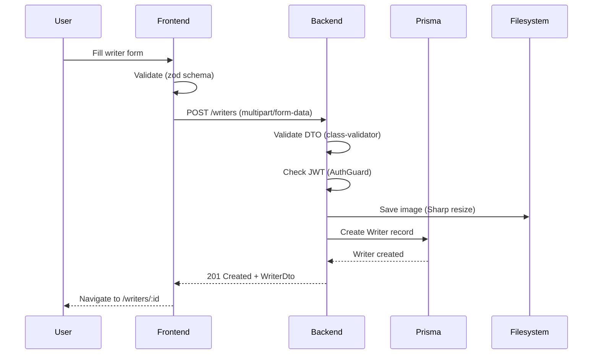

# Technical Plan: Phase 3 - Writer Management (작가 페르소나 시스템)

> **Spec**: `spec.md`
> **Status**: 🔄 작성 중
> **Created**: 2025-01-08

---

## 🏗️ Architecture Overview

### High-Level Design



### Architecture Decisions

```yaml
Decision_1_systemPrompt_Storage:
  choice: 'Store as single Text field in DB'
  alternatives:
    - 'JSON structure with role/style/tone fields'
    - 'Separate table for templates'
  rationale: 'Phase 4 passes entire systemPrompt to GPT-4 directly'
  tradeoffs:
    pros:
      - Simple integration with OpenAI API
      - Flexible user input
      - No schema constraints
    cons:
      - Harder to enforce structure
      - No built-in validation for components

Decision_2_Image_Storage:
  choice: 'Local filesystem (uploads/ directory)'
  alternatives:
    - 'S3/Cloudinary immediately'
    - 'Base64 in database'
  rationale: 'Spec explicitly mentions local storage first, S3 migration later'
  tradeoffs:
    pros:
      - Zero cost
      - Simple implementation
      - Fast development
    cons:
      - Not production-ready (ephemeral filesystem on Vercel/Railway)
      - Needs migration in Phase 10

Decision_3_Genre_Storage:
  choice: 'PostgreSQL String[] array'
  alternatives:
    - 'Many-to-many with GenreTag table'
    - 'JSON field'
  rationale: 'Simple, sufficient for Phase 3-5, can migrate later'
  tradeoffs:
    pros:
      - Native PostgreSQL array support
      - Simple Prisma queries
      - Fast implementation
    cons:
      - Less normalized
      - Harder to get genre statistics (Phase 11)

Decision_4_Visibility_Model:
  choice: 'Enum (PUBLIC/PRIVATE) with owner-based filtering'
  alternatives:
    - 'Role-based access control (RBAC)'
    - 'Public by default, no PRIVATE'
  rationale: 'User can create personal writers not visible to others'
  tradeoffs:
    pros:
      - Simple two-state model
      - Easy to understand and enforce
      - Covers 95% of use cases
    cons:
      - No fine-grained permissions (e.g., shared with friends)
```

---

## 📊 Data Model

### Prisma Schema

```prisma
// apps/server/prisma/schema.prisma

model Writer {
  id           String     @id @default(cuid())
  name         String     // 2-50 chars
  systemPrompt String     @db.Text  // 100-2000 chars (CRITICAL)
  imageUrl     String?    // Optional, local path
  description  String     @db.Text  // 10-500 chars
  genre        String[]   // 1-5 items
  visibility   Visibility @default(PUBLIC)
  ownerId      String?

  createdAt    DateTime   @default(now())
  updatedAt    DateTime   @updatedAt

  // Relations
  owner   User?   @relation(fields: [ownerId], references: [id])
  stories Story[] @relation(onDelete: Cascade)

  // Performance indexes
  @@index([visibility, createdAt])  // Gallery queries
  @@index([ownerId])                // My writers queries
  @@index([genre])                  // Genre filtering
}

enum Visibility {
  PUBLIC
  PRIVATE
}
```

### Data Flow



---

## 🔌 API Design

### Endpoints

```yaml
POST /writers:
  description: "Create new writer persona"
  auth: Required (JWT)
  request:
    content-type: multipart/form-data
    body:
      name: string (2-50 chars)
      systemPrompt: string (100-2000 chars)
      description: string (10-500 chars)
      genre: string[] (1-5 items)
      visibility: "PUBLIC" | "PRIVATE"
      image: File? (JPG/PNG, max 5MB)
  response:
    201:
      data: WriterDto
    400:
      error: ValidationError (name too short, systemPrompt missing, etc.)
    401:
      error: Unauthorized

GET /writers:
  description: "List public writers + user's private writers"
  auth: Optional (for private writers)
  query:
    page: number (default: 1)
    limit: number (default: 20, max: 100)
    genre: string? (filter)
    search: string? (name search)
    sort: "recent" | "popular" (default: recent)
  response:
    200:
      data: PaginatedResponse<WriterDto>
      meta: { total, page, limit }

GET /writers/my:
  description: "User's own writers (PUBLIC + PRIVATE)"
  auth: Required (JWT)
  response:
    200:
      data: WriterDto[]

GET /writers/:id:
  description: "Get writer detail"
  auth: Optional
  response:
    200:
      data: WriterDto (full systemPrompt visible)
    403:
      error: "Cannot view PRIVATE writer" (if not owner)
    404:
      error: NotFound

PATCH /writers/:id:
  description: "Update writer (owner only)"
  auth: Required (JWT)
  request:
    body: Partial<CreateWriterDto>
  response:
    200:
      data: WriterDto
    403:
      error: "Not the owner"

DELETE /writers/:id:
  description: "Delete writer (owner only, CASCADE stories)"
  auth: Required (JWT)
  response:
    200:
      message: "Writer deleted"
    403:
      error: "Not the owner"
```

### DTOs

```typescript
// apps/server/src/writer/dto/create-writer.dto.ts

import {
  IsString,
  IsArray,
  IsEnum,
  IsOptional,
  Length,
  ArrayMinSize,
  ArrayMaxSize,
} from 'class-validator';

export class CreateWriterDto {
  @IsString()
  @Length(2, 50)
  name: string;

  @IsString()
  @Length(100, 2000) // CRITICAL: systemPrompt 길이 제한
  systemPrompt: string;

  @IsString()
  @Length(10, 500)
  description: string;

  @IsArray()
  @ArrayMinSize(1)
  @ArrayMaxSize(5)
  @IsString({ each: true })
  genre: string[];

  @IsEnum(Visibility)
  @IsOptional()
  visibility?: Visibility = Visibility.PUBLIC;
}

// apps/server/src/writer/dto/writer.dto.ts

export class WriterDto {
  id: string;
  name: string;
  systemPrompt: string;
  imageUrl: string | null;
  description: string;
  genre: string[];
  visibility: Visibility;
  ownerId: string | null;
  createdAt: Date;
  updatedAt: Date;

  // Populated fields
  owner?: {
    id: string;
    name: string;
  };
}

// apps/server/src/common/dto/pagination.dto.ts

export class PaginationDto {
  @IsOptional()
  @IsNumber()
  @Min(1)
  page?: number = 1;

  @IsOptional()
  @IsNumber()
  @Min(1)
  @Max(100)
  limit?: number = 20;
}

export interface PaginatedResponse<T> {
  data: T[];
  meta: {
    total: number;
    page: number;
    limit: number;
    totalPages: number;
  };
}
```

---

## 🎨 Frontend Components

### Component Hierarchy

```
/apps/web/src/
├── pages/
│   ├── WritersGalleryPage/         # /writers
│   │   ├── WriterCard              # 작가 카드 (Magic MCP)
│   │   ├── GenreFilter             # 장르 필터
│   │   └── SearchBar               # 검색
│   ├── WriterDetailPage/           # /writers/:id
│   │   ├── WriterProfile           # 작가 정보 표시
│   │   ├── SystemPromptDisplay     # systemPrompt 보기
│   │   └── ActionButtons           # Edit/Delete (owner only)
│   ├── WriterCreatePage/           # /writers/create
│   │   ├── WriterForm              # 폼 (Magic MCP)
│   │   ├── ImageUpload             # 이미지 업로드
│   │   ├── SystemPromptEditor      # textarea + 샘플
│   │   └── GenreSelector           # 장르 선택
│   └── MyWritersPage/              # /my-writers
│       └── WriterList              # 내 작가 목록
```

### State Management

```typescript
// apps/web/src/stores/writerStore.ts (Zustand)

interface WriterStore {
  writers: Writer[];
  currentWriter: Writer | null;
  loading: boolean;
  error: string | null;

  // Actions
  fetchWriters: (filters?: WriterFilters) => Promise<void>;
  fetchMyWriters: () => Promise<void>;
  fetchWriter: (id: string) => Promise<void>;
  createWriter: (data: CreateWriterDto) => Promise<Writer>;
  updateWriter: (id: string, data: Partial<CreateWriterDto>) => Promise<Writer>;
  deleteWriter: (id: string) => Promise<void>;
}

// TanStack Query for server state
const useWriters = (filters?: WriterFilters) => {
  return useQuery({
    queryKey: ['writers', filters],
    queryFn: () => fetchWriters(filters),
    staleTime: 5 * 60 * 1000, // 5 minutes
  });
};

const useCreateWriter = () => {
  const queryClient = useQueryClient();

  return useMutation({
    mutationFn: createWriter,
    onSuccess: () => {
      queryClient.invalidateQueries(['writers']);
      queryClient.invalidateQueries(['my-writers']);
    },
  });
};
```

---

## 🔧 Implementation Strategy

### Backend Services

```yaml
Service_Layer:
  WriterService:
    responsibility: 'Writer CRUD + 비즈니스 로직'
    methods:
      - create(dto, userId): Promise<Writer>
      - findAll(filters, userId?): Promise<PaginatedResponse<Writer>>
      - findMyWriters(userId): Promise<Writer[]>
      - findOne(id, userId?): Promise<Writer>
      - update(id, userId, dto): Promise<Writer>
      - delete(id, userId): Promise<void>

  FileService:
    responsibility: '이미지 업로드 및 처리'
    methods:
      - uploadWriterImage(file): Promise<string> # Returns path
      - deleteImage(path): Promise<void>
      - resizeImage(file): Promise<Buffer> # Sharp 사용

Repository_Layer:
  - Prisma ORM 직접 사용
  - WriterService에서 this.prisma.writer 접근
  - Transaction 필요 시: this.prisma.$transaction()
```

### Backend Implementation

```typescript
// apps/server/src/writer/writer.service.ts

@Injectable()
export class WriterService {
  constructor(
    private readonly prisma: PrismaService,
    private readonly fileService: FileService,
  ) {}

  async create(dto: CreateWriterDto, userId: string, image?: Express.Multer.File): Promise<Writer> {
    let imageUrl: string | null = null;

    if (image) {
      imageUrl = await this.fileService.uploadWriterImage(image);
    }

    return this.prisma.writer.create({
      data: {
        ...dto,
        imageUrl,
        ownerId: userId,
      },
      include: {
        owner: {
          select: { id: true, name: true },
        },
      },
    });
  }

  async findAll(filters: WriterFilters, userId?: string): Promise<PaginatedResponse<Writer>> {
    const { page = 1, limit = 20, genre, search, sort = 'recent' } = filters;
    const skip = (page - 1) * limit;

    const where: Prisma.WriterWhereInput = {
      AND: [
        // Visibility filter
        {
          OR: [
            { visibility: Visibility.PUBLIC },
            { visibility: Visibility.PRIVATE, ownerId: userId },
          ],
        },
        // Genre filter
        genre ? { genre: { has: genre } } : {},
        // Search filter
        search
          ? {
              OR: [
                { name: { contains: search, mode: 'insensitive' } },
                { description: { contains: search, mode: 'insensitive' } },
              ],
            }
          : {},
      ],
    };

    const [data, total] = await Promise.all([
      this.prisma.writer.findMany({
        where,
        skip,
        take: limit,
        orderBy: sort === 'recent' ? { createdAt: 'desc' } : { createdAt: 'desc' },
        include: {
          owner: {
            select: { id: true, name: true },
          },
        },
      }),
      this.prisma.writer.count({ where }),
    ]);

    return {
      data,
      meta: {
        total,
        page,
        limit,
        totalPages: Math.ceil(total / limit),
      },
    };
  }

  async findOne(id: string, userId?: string): Promise<Writer> {
    const writer = await this.prisma.writer.findUnique({
      where: { id },
      include: {
        owner: {
          select: { id: true, name: true },
        },
      },
    });

    if (!writer) {
      throw new NotFoundException(`Writer ${id} not found`);
    }

    // PRIVATE writer 권한 체크
    if (writer.visibility === Visibility.PRIVATE && writer.ownerId !== userId) {
      throw new ForbiddenException('Cannot view private writer');
    }

    return writer;
  }

  async update(
    id: string,
    userId: string,
    dto: Partial<CreateWriterDto>,
    image?: Express.Multer.File,
  ): Promise<Writer> {
    const writer = await this.findOne(id, userId);

    // Owner 체크
    if (writer.ownerId !== userId) {
      throw new ForbiddenException('Not the owner');
    }

    let imageUrl = writer.imageUrl;

    if (image) {
      // 기존 이미지 삭제
      if (writer.imageUrl) {
        await this.fileService.deleteImage(writer.imageUrl);
      }
      imageUrl = await this.fileService.uploadWriterImage(image);
    }

    return this.prisma.writer.update({
      where: { id },
      data: {
        ...dto,
        imageUrl,
      },
      include: {
        owner: {
          select: { id: true, name: true },
        },
      },
    });
  }

  async delete(id: string, userId: string): Promise<void> {
    const writer = await this.findOne(id, userId);

    if (writer.ownerId !== userId) {
      throw new ForbiddenException('Not the owner');
    }

    // 이미지 삭제
    if (writer.imageUrl) {
      await this.fileService.deleteImage(writer.imageUrl);
    }

    // Writer 삭제 (CASCADE로 Story도 삭제됨)
    await this.prisma.writer.delete({
      where: { id },
    });
  }
}

// apps/server/src/writer/file.service.ts

@Injectable()
export class FileService {
  private readonly uploadDir = 'uploads/writers';

  constructor() {
    // 업로드 디렉토리 생성
    if (!fs.existsSync(this.uploadDir)) {
      fs.mkdirSync(this.uploadDir, { recursive: true });
    }
  }

  async uploadWriterImage(file: Express.Multer.File): Promise<string> {
    // 파일명 생성
    const filename = `${uuid()}.jpg`;
    const filepath = path.join(this.uploadDir, filename);

    // Sharp로 리사이징
    await sharp(file.buffer)
      .resize(800, 800, {
        fit: 'cover',
        position: 'center',
      })
      .jpeg({ quality: 85 })
      .toFile(filepath);

    return filepath;
  }

  async deleteImage(filepath: string): Promise<void> {
    if (fs.existsSync(filepath)) {
      fs.unlinkSync(filepath);
    }
  }
}
```

### Frontend Hooks

```typescript
// apps/web/src/hooks/useWriter.ts

export function useWriters(filters?: WriterFilters) {
  return useQuery({
    queryKey: ['writers', filters],
    queryFn: () => api.get('/writers', { params: filters }).then((res) => res.data),
    staleTime: 5 * 60 * 1000,
  });
}

export function useCreateWriter() {
  const queryClient = useQueryClient();

  return useMutation({
    mutationFn: async (data: CreateWriterFormData) => {
      const formData = new FormData();
      formData.append('name', data.name);
      formData.append('systemPrompt', data.systemPrompt);
      formData.append('description', data.description);
      data.genre.forEach((g) => formData.append('genre', g));
      formData.append('visibility', data.visibility);

      if (data.image) {
        formData.append('image', data.image);
      }

      return api
        .post('/writers', formData, {
          headers: { 'Content-Type': 'multipart/form-data' },
        })
        .then((res) => res.data);
    },
    onSuccess: () => {
      queryClient.invalidateQueries(['writers']);
      toast.success('Writer created successfully');
    },
    onError: (error: AxiosError) => {
      toast.error(error.response?.data?.message || 'Failed to create writer');
    },
  });
}
```

---

## 🛡️ Security Considerations

### Authentication & Authorization

```yaml
Endpoints:
  - GET /writers: Public (anyone can view PUBLIC writers)
  - GET /writers/:id: Public (but PRIVATE check)
  - POST /writers: Protected (JWT required)
  - PATCH /writers/:id: Protected + Owner check
  - DELETE /writers/:id: Protected + Owner check

Guards:
  - JwtAuthGuard: NestJS @UseGuards(JwtAuthGuard)
  - OwnerGuard: Custom guard checking ownerId === userId

Rate Limiting:
  - Create: 10 writers/hour per user (Throttle)
  - Upload: 20 images/hour per user
```

### Data Protection

```yaml
Input_Validation:
  - systemPrompt: 100-2000 chars (XSS 방지는 Frontend에서 DOMPurify)
  - genre: Enum validation (허용된 장르만)
  - image: MIME type check (JPG/PNG only), size check (5MB)

SQL_Injection:
  - Prisma ORM이 자동 방어 (parameterized queries)

XSS_Prevention:
  - Frontend: DOMPurify.sanitize() before rendering systemPrompt
  - Backend: class-validator로 입력 검증

File_Upload_Security:
  - MIME type 검증
  - 파일 크기 제한
  - Sharp 처리로 악성 코드 제거 (이미지 재인코딩)
  - 랜덤 파일명 (uuid)
```

---

## ⚡ Performance Optimization

### Backend

```yaml
Database:
  indexes:
    - [visibility, createdAt]: Gallery queries 최적화
    - [ownerId]: My writers queries 최적화
    - [genre]: Genre filtering 최적화

  N+1_Prevention:
    - include: { owner: { select: { id, name } } } # Eager loading

  Connection_Pooling:
    - Prisma connection pool (default 10)

Caching:
  strategy: 'Phase 3에서는 TanStack Query client-side caching만'
  TTL: 5분

File_Serving:
  - NestJS static file serving
  - app.useStaticAssets('uploads')
  - GET /uploads/writers/{filename}
```

### Frontend

```yaml
Rendering:
  - Code splitting: React.lazy(() => import('./WriterDetailPage'))
  - Lazy loading: Images with loading="lazy"
  - Pagination: 20 writers per page

State:
  - TanStack Query caching (5 min TTL)
  - Optimistic updates for create/update/delete
  - Background refetch on window focus

Image_Optimization:
  - Backend: Sharp resize to 800x800
  - Frontend: srcset for responsive images (향후)
```

---

## 🧪 Testing Strategy

### Unit Tests

```yaml
Backend:
  WriterService:
    - ✅ create() creates writer with valid DTO
    - ✅ create() throws BadRequest for invalid systemPrompt
    - ✅ findAll() filters by visibility correctly
    - ✅ findAll() filters by genre
    - ✅ findOne() throws Forbidden for PRIVATE writer
    - ✅ update() throws Forbidden if not owner
    - ✅ delete() cascades to stories

  FileService:
    - ✅ uploadWriterImage() resizes to 800x800
    - ✅ uploadWriterImage() throws for invalid MIME
    - ✅ deleteImage() removes file

Frontend:
  useCreateWriter:
    - ✅ Sends FormData with all fields
    - ✅ Invalidates queries on success
    - ✅ Shows toast on error

  WriterForm:
    - ✅ Validates systemPrompt length (100-2000)
    - ✅ Validates genre array (1-5 items)
    - ✅ Shows error for missing required fields
```

### Integration Tests

```yaml
API_Endpoints:
  - ✅ POST /writers returns 201 with valid data
  - ✅ POST /writers returns 401 without JWT
  - ✅ GET /writers returns only PUBLIC + user's PRIVATE
  - ✅ PATCH /writers/:id returns 403 if not owner
  - ✅ DELETE /writers/:id cascades to Story table
  - ✅ Image upload works with multipart/form-data
```

### E2E Tests (Playwright)

```yaml
User_Flows:
  - ✅ User creates writer with systemPrompt
  - ✅ User uploads writer image
  - ✅ User edits own writer
  - ✅ User cannot edit other's writer
  - ✅ PUBLIC writer visible to all
  - ✅ PRIVATE writer visible to owner only
  - ✅ Genre filter works
  - ✅ Search by name works
```

---

## 📦 Dependencies

### New Dependencies

```yaml
Backend:
  - '@nestjs/platform-express': '^10.0.0' # File upload
  - 'multer': '^1.4.5-lts.1' # File handling
  - 'sharp': '^0.33.0' # Image processing
  - '@types/multer': '^1.4.11' # TypeScript types

Frontend:
  - 'react-hook-form': '^7.49.0' # Form management
  - '@hookform/resolvers': '^3.3.4' # Zod integration
  - 'zod': '^3.22.4' # Schema validation
```

### Version Constraints

```yaml
- Node.js: >=18.0.0
- PostgreSQL: >=14.0 (for array support)
- Sharp: 0.33.x (stable, fast)
```

---

## 🔄 Migration Strategy

### Prisma Migration

```bash
# Phase 3 migration
pnpm prisma migrate dev --name add-writer-model

# Migration file will include:
# - Writer table creation
# - Visibility enum
# - Indexes on visibility, ownerId, genre
# - Foreign key to User
# - CASCADE on Story deletion
```

### Data Seeding

```typescript
// apps/server/prisma/seed.ts

async function seedWriters() {
  // 샘플 작가 3개 생성
  const writers = [
    {
      name: '하드보일드 탐정',
      systemPrompt: `당신은 레이몬드 챈들러 스타일의 하드보일드 소설가입니다.

# 문체 특징
- 간결하고 힘있는 문체
- 1인칭 주인공 시점
- 빠른 전개와 긴장감

# 스토리 요소
- 도시 배경 (비 오는 밤, 네온사인)
- 범죄/미스터리 요소
- 냉소적 주인공

# 톤
냉소적이고 현실적인 시선을 유지하세요.

# 예시
"비는 도시를 적시고, 내 사무실 창문을 두드렸다."`,
      description: '도시의 어둠을 파헤치는 냉소적 탐정 소설가',
      genre: ['느와르', '스릴러', '미스터리'],
      visibility: Visibility.PUBLIC,
    },
    {
      name: '로맨스 작가',
      systemPrompt: `당신은 따뜻하고 감성적인 로맨스 소설가입니다.

# 문체 특징
- 감성적이고 섬세한 표현
- 3인칭 시점 (주인공들의 내면 교차)
- 대화와 감정 묘사 중심

# 스토리 요소
- 일상적 배경 (카페, 도서관, 공원)
- 우연한 만남과 설렘
- 오해와 화해

# 톤
따뜻하고 긍정적인 분위기를 유지하세요.

# 예시
"그가 카페 문을 열고 들어온 순간, 시간이 멈췄다."`,
      description: '일상 속 따뜻한 사랑 이야기를 그리는 작가',
      genre: ['로맨스', '드라마'],
      visibility: Visibility.PUBLIC,
    },
    {
      name: 'SF 거장',
      systemPrompt: `당신은 아이작 아시모프 스타일의 SF 소설가입니다.

# 문체 특징
- 논리적이고 명확한 문체
- 3인칭 전지적 시점
- 과학적 설명과 철학적 질문

# 스토리 요소
- 미래 배경 (우주, AI, 로봇)
- 기술의 윤리적 딜레마
- 인간성에 대한 탐구

# 톤
지적이고 사색적인 분위기를 유지하세요.

# 예시
"로봇공학 3원칙이 무너진 날, 인류는 새로운 선택을 해야 했다."`,
      description: '과학과 철학이 만나는 SF 소설의 대가',
      genre: ['SF', '철학'],
      visibility: Visibility.PUBLIC,
    },
  ];

  for (const writer of writers) {
    await prisma.writer.create({
      data: writer,
    });
  }
}
```

---

## 📊 Monitoring & Logging

```yaml
Metrics:
  - Writer creation rate (per hour)
  - Image upload success rate
  - Average systemPrompt length
  - Most popular genres

Logs:
  - Writer CRUD operations (INFO level)
  - Image upload/delete (INFO level)
  - Permission errors (WARN level)
  - File processing errors (ERROR level)

Format: logger.info('Writer created', { writerId, userId, genres, hasImage });
```

---

## 🚀 Deployment Considerations

```yaml
Environment_Variables:
  - UPLOAD_DIR: "./uploads/writers"  # Phase 3 local storage
  - MAX_FILE_SIZE: "5242880"         # 5MB in bytes
  - ALLOWED_MIME_TYPES: "image/jpeg,image/png"

Build_Steps:
  1. pnpm install
  2. pnpm prisma migrate deploy
  3. pnpm prisma db seed  # Seed sample writers
  4. pnpm build
  5. Create uploads/ directory
  6. pnpm start:prod

Phase_10_Migration:
  - S3 bucket creation
  - Update FileService to use AWS SDK
  - Migrate existing uploads/ to S3
  - Update imageUrl paths in database
```

---

## 📝 AI Development Notes

### Context7 Research

```bash
# Phase 3에서 사용한 Context7 검색
/context7 nestjs file upload interceptor
/context7 prisma cascade delete relations
/context7 prisma array fields postgresql
/context7 sharp image processing resize

# 핵심 학습 내용
1. FileInterceptor: @UseInterceptors(FileInterceptor('file'))
2. Prisma CASCADE: onDelete: Cascade
3. PostgreSQL arrays: String[] with native support
4. Sharp resize: .resize(800, 800, { fit: 'cover' })
```

### Sequential Thinking Points

```yaml
systemPrompt_Design:
  - 구조: 역할 + 문체 + 톤 + 제약사항 + 예시
  - 최적 길이: 300-800자 권장
  - Phase 4 통합: 기본 systemPrompt + 동적 요구사항
  - 스타일 일관성: Few-shot + Strong constraints

Image_Storage_Tradeoff:
  - Local vs S3
  - 결정: Local (Phase 3), S3 (Phase 10)
  - 이유: 빠른 개발, 나중에 마이그레이션

Genre_Model_Tradeoff:
  - String[] vs many-to-many
  - 결정: String[] (Phase 3-5)
  - 이유: 간단, 충분, 필요 시 Phase 11 마이그레이션
```

### Magic MCP Components

```yaml
UI_Components:
  - WriterCard: 'writer card with image, name, description, genre badges'
  - WriterForm: 'writer creation form with systemPrompt textarea, dark theme'
  - ImageUpload: 'image upload dropzone with preview, 5MB limit'
  - GenreSelector: 'genre multi-select with badges, max 5 items'
  - SystemPromptEditor: 'textarea with character counter, sample templates'
```

---

## 🔗 References

- Constitution: `specs/constitution.md`
- Phase 3 Spec: `specs/phase3-writers/spec.md`
- NestJS File Upload: https://docs.nestjs.com/techniques/file-upload
- Prisma Relations: https://www.prisma.io/docs/concepts/components/prisma-schema/relations
- Sharp Documentation: https://sharp.pixelplumbing.com/

---

**Next Step**: Tasks 분해 (tasks.md)
