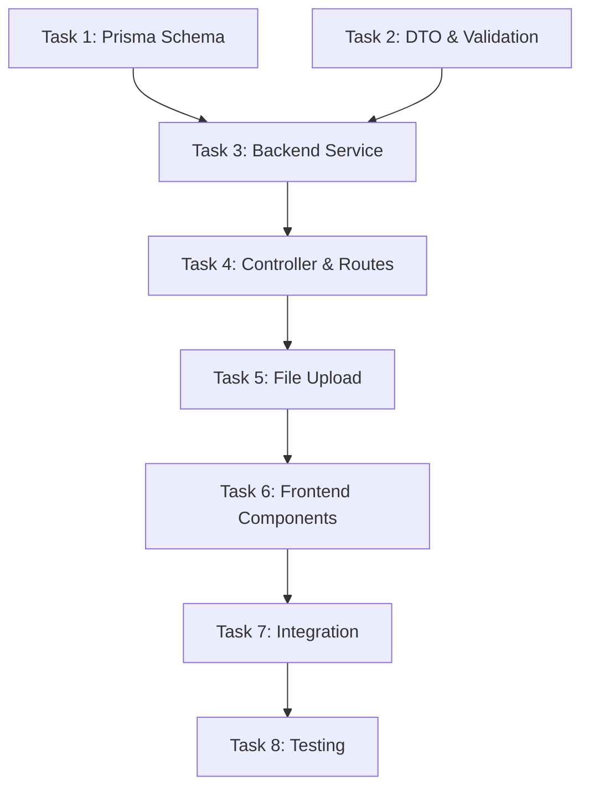

# Tasks: Phase 3 - Writer Management (작가 페르소나 시스템)

> **Spec**: `spec.md`
> **Plan**: `plan.md`
> **Status**: 🔄 진행 중

---

## 📋 Task Breakdown

### Task Dependency Graph



---

## Task 1: Prisma Schema & Migration

### Meta

```yaml
Dependencies: None (Phase 2 완료 전제)
Estimated_Time: 1 hour
Priority: P0 (필수)
```

### Acceptance Criteria

- [x] Writer model with all fields defined
- [x] Visibility enum (PUBLIC/PRIVATE)
- [x] Relations to User (owner) and Story (cascade)
- [x] Indexes on visibility, ownerId, genre
- [x] Migration successful
- [x] Seed data (3 sample writers)

### Implementation Notes

```prisma
// apps/server/prisma/schema.prisma

model Writer {
  id           String     @id @default(cuid())
  name         String
  systemPrompt String     @db.Text
  imageUrl     String?
  description  String     @db.Text
  genre        String[]
  visibility   Visibility @default(PUBLIC)
  ownerId      String?

  createdAt    DateTime   @default(now())
  updatedAt    DateTime   @updatedAt

  owner   User?   @relation(fields: [ownerId], references: [id])
  stories Story[] @relation(onDelete: Cascade)

  @@index([visibility, createdAt])
  @@index([ownerId])
  @@index([genre])
}

enum Visibility {
  PUBLIC
  PRIVATE
}

// User model에 추가
model User {
  // ... existing fields
  writers Writer[]
}
```

### Testing

```bash
# Migration
pnpm --filter server prisma migrate dev --name add-writer-model

# Verify
pnpm --filter server prisma studio
# → Writer 테이블 확인
# → Visibility enum 확인
# → Indexes 확인

# Seed
pnpm --filter server prisma db seed
# → 3개 샘플 작가 생성 확인
```

---

## Task 2: DTO & Validation

### Meta

```yaml
Dependencies: None
Estimated_Time: 1 hour
Priority: P0 (필수)
```

### Acceptance Criteria

- [x] CreateWriterDto with validation
- [x] UpdateWriterDto (Partial)
- [x] WriterDto (response)
- [x] PaginationDto
- [x] WriterFilters interface
- [x] class-validator decorators

### Implementation Notes

```typescript
// apps/server/src/writer/dto/create-writer.dto.ts

import {
  IsString,
  IsArray,
  IsEnum,
  IsOptional,
  Length,
  ArrayMinSize,
  ArrayMaxSize,
} from 'class-validator';

export class CreateWriterDto {
  @IsString()
  @Length(2, 50)
  name: string;

  @IsString()
  @Length(100, 2000) // CRITICAL
  systemPrompt: string;

  @IsString()
  @Length(10, 500)
  description: string;

  @IsArray()
  @ArrayMinSize(1)
  @ArrayMaxSize(5)
  @IsString({ each: true })
  genre: string[];

  @IsEnum(Visibility)
  @IsOptional()
  visibility?: Visibility;
}

// apps/server/src/writer/dto/update-writer.dto.ts
export class UpdateWriterDto extends PartialType(CreateWriterDto) {}

// apps/server/src/writer/dto/writer.dto.ts
export class WriterDto {
  id: string;
  name: string;
  systemPrompt: string;
  imageUrl: string | null;
  description: string;
  genre: string[];
  visibility: Visibility;
  ownerId: string | null;
  createdAt: Date;
  updatedAt: Date;

  owner?: {
    id: string;
    name: string;
  };
}

// apps/server/src/common/dto/pagination.dto.ts
export class PaginationDto {
  @IsOptional()
  @Type(() => Number)
  @IsNumber()
  @Min(1)
  page?: number = 1;

  @IsOptional()
  @Type(() => Number)
  @IsNumber()
  @Min(1)
  @Max(100)
  limit?: number = 20;
}

export interface PaginatedResponse<T> {
  data: T[];
  meta: {
    total: number;
    page: number;
    limit: number;
    totalPages: number;
  };
}

// apps/server/src/writer/dto/writer-filters.dto.ts
export class WriterFiltersDto extends PaginationDto {
  @IsOptional()
  @IsString()
  genre?: string;

  @IsOptional()
  @IsString()
  search?: string;

  @IsOptional()
  @IsEnum(['recent', 'popular'])
  sort?: 'recent' | 'popular';
}
```

### Testing

```typescript
// apps/server/src/writer/dto/create-writer.dto.spec.ts

describe('CreateWriterDto', () => {
  it('should pass validation with valid data', () => {
    const dto = new CreateWriterDto();
    dto.name = 'Test Writer';
    dto.systemPrompt = 'A'.repeat(150); // 100-2000
    dto.description = 'Test description';
    dto.genre = ['느와르'];
    dto.visibility = Visibility.PUBLIC;

    const errors = validateSync(dto);
    expect(errors.length).toBe(0);
  });

  it('should fail if systemPrompt too short', () => {
    const dto = new CreateWriterDto();
    dto.systemPrompt = 'Too short'; // < 100

    const errors = validateSync(dto);
    expect(errors.length).toBeGreaterThan(0);
  });

  it('should fail if genre array too large', () => {
    const dto = new CreateWriterDto();
    dto.genre = ['1', '2', '3', '4', '5', '6']; // > 5

    const errors = validateSync(dto);
    expect(errors.length).toBeGreaterThan(0);
  });
});
```

---

## Task 3: Backend Service Layer

### Meta

```yaml
Dependencies: Task 1, Task 2
Estimated_Time: 3 hours
Priority: P0 (필수)
```

### Acceptance Criteria

- [x] WriterService with all CRUD methods
- [x] FileService for image handling
- [x] Visibility filtering (PUBLIC + user's PRIVATE)
- [x] Owner permission checks
- [x] Genre and search filtering
- [x] Pagination logic
- [x] Error handling (NotFound, Forbidden)

### Implementation Notes

```typescript
// apps/server/src/writer/writer.service.ts

@Injectable()
export class WriterService {
  constructor(
    private readonly prisma: PrismaService,
    private readonly fileService: FileService,
  ) {}

  async create(dto: CreateWriterDto, userId: string, image?: Express.Multer.File): Promise<Writer> {
    let imageUrl: string | null = null;

    if (image) {
      imageUrl = await this.fileService.uploadWriterImage(image);
    }

    return this.prisma.writer.create({
      data: {
        ...dto,
        imageUrl,
        ownerId: userId,
      },
      include: {
        owner: {
          select: { id: true, name: true },
        },
      },
    });
  }

  async findAll(filters: WriterFiltersDto, userId?: string): Promise<PaginatedResponse<Writer>> {
    const { page = 1, limit = 20, genre, search, sort = 'recent' } = filters;
    const skip = (page - 1) * limit;

    const where: Prisma.WriterWhereInput = {
      AND: [
        {
          OR: [
            { visibility: Visibility.PUBLIC },
            { visibility: Visibility.PRIVATE, ownerId: userId },
          ],
        },
        genre ? { genre: { has: genre } } : {},
        search
          ? {
              OR: [
                { name: { contains: search, mode: 'insensitive' } },
                { description: { contains: search, mode: 'insensitive' } },
              ],
            }
          : {},
      ],
    };

    const [data, total] = await Promise.all([
      this.prisma.writer.findMany({
        where,
        skip,
        take: limit,
        orderBy: { createdAt: 'desc' },
        include: {
          owner: { select: { id: true, name: true } },
        },
      }),
      this.prisma.writer.count({ where }),
    ]);

    return {
      data,
      meta: {
        total,
        page,
        limit,
        totalPages: Math.ceil(total / limit),
      },
    };
  }

  async findMyWriters(userId: string): Promise<Writer[]> {
    return this.prisma.writer.findMany({
      where: { ownerId: userId },
      orderBy: { createdAt: 'desc' },
      include: {
        owner: { select: { id: true, name: true } },
      },
    });
  }

  async findOne(id: string, userId?: string): Promise<Writer> {
    const writer = await this.prisma.writer.findUnique({
      where: { id },
      include: {
        owner: { select: { id: true, name: true } },
      },
    });

    if (!writer) {
      throw new NotFoundException(`Writer ${id} not found`);
    }

    if (writer.visibility === Visibility.PRIVATE && writer.ownerId !== userId) {
      throw new ForbiddenException('Cannot view private writer');
    }

    return writer;
  }

  async update(
    id: string,
    userId: string,
    dto: UpdateWriterDto,
    image?: Express.Multer.File,
  ): Promise<Writer> {
    const writer = await this.findOne(id, userId);

    if (writer.ownerId !== userId) {
      throw new ForbiddenException('Not the owner');
    }

    let imageUrl = writer.imageUrl;

    if (image) {
      if (writer.imageUrl) {
        await this.fileService.deleteImage(writer.imageUrl);
      }
      imageUrl = await this.fileService.uploadWriterImage(image);
    }

    return this.prisma.writer.update({
      where: { id },
      data: {
        ...dto,
        imageUrl,
      },
      include: {
        owner: { select: { id: true, name: true } },
      },
    });
  }

  async delete(id: string, userId: string): Promise<void> {
    const writer = await this.findOne(id, userId);

    if (writer.ownerId !== userId) {
      throw new ForbiddenException('Not the owner');
    }

    if (writer.imageUrl) {
      await this.fileService.deleteImage(writer.imageUrl);
    }

    await this.prisma.writer.delete({ where: { id } });
  }
}

// apps/server/src/writer/file.service.ts

@Injectable()
export class FileService {
  private readonly uploadDir = 'uploads/writers';
  private readonly logger = new Logger(FileService.name);

  constructor() {
    if (!fs.existsSync(this.uploadDir)) {
      fs.mkdirSync(this.uploadDir, { recursive: true });
    }
  }

  async uploadWriterImage(file: Express.Multer.File): Promise<string> {
    this.validateImage(file);

    const filename = `${uuid()}.jpg`;
    const filepath = path.join(this.uploadDir, filename);

    await sharp(file.buffer)
      .resize(800, 800, {
        fit: 'cover',
        position: 'center',
      })
      .jpeg({ quality: 85 })
      .toFile(filepath);

    this.logger.log(`Image uploaded: ${filepath}`);
    return filepath;
  }

  private validateImage(file: Express.Multer.File): void {
    const allowedTypes = ['image/jpeg', 'image/png'];
    if (!allowedTypes.includes(file.mimetype)) {
      throw new BadRequestException('Only JPG/PNG allowed');
    }

    const maxSize = 5 * 1024 * 1024; // 5MB
    if (file.size > maxSize) {
      throw new BadRequestException('Max file size is 5MB');
    }
  }

  async deleteImage(filepath: string): Promise<void> {
    if (fs.existsSync(filepath)) {
      fs.unlinkSync(filepath);
      this.logger.log(`Image deleted: ${filepath}`);
    }
  }
}
```

### Testing

```bash
# Unit tests
pnpm --filter server test writer.service.spec.ts

# Manual test with Prisma Studio
pnpm --filter server prisma studio
```

---

## Task 4: Controller & Routes

### Meta

```yaml
Dependencies: Task 3
Estimated_Time: 2 hours
Priority: P0 (필수)
```

### Acceptance Criteria

- [x] WriterController with all endpoints
- [x] JWT Auth guards on protected routes
- [x] CurrentUser decorator for userId
- [x] Query parameter parsing
- [x] Proper HTTP status codes
- [x] Swagger/OpenAPI annotations (optional P1)

### Implementation Notes

```typescript
// apps/server/src/writer/writer.controller.ts

@Controller('writers')
export class WriterController {
  constructor(private readonly writerService: WriterService) {}

  @Post()
  @UseGuards(JwtAuthGuard)
  @HttpCode(HttpStatus.CREATED)
  async create(@Body() dto: CreateWriterDto, @CurrentUser() user: User): Promise<WriterDto> {
    return this.writerService.create(dto, user.id);
  }

  @Get()
  async findAll(
    @Query() filters: WriterFiltersDto,
    @CurrentUser() user?: User,
  ): Promise<PaginatedResponse<WriterDto>> {
    return this.writerService.findAll(filters, user?.id);
  }

  @Get('my')
  @UseGuards(JwtAuthGuard)
  async findMyWriters(@CurrentUser() user: User): Promise<WriterDto[]> {
    return this.writerService.findMyWriters(user.id);
  }

  @Get(':id')
  async findOne(@Param('id') id: string, @CurrentUser() user?: User): Promise<WriterDto> {
    return this.writerService.findOne(id, user?.id);
  }

  @Patch(':id')
  @UseGuards(JwtAuthGuard)
  async update(
    @Param('id') id: string,
    @Body() dto: UpdateWriterDto,
    @CurrentUser() user: User,
  ): Promise<WriterDto> {
    return this.writerService.update(id, user.id, dto);
  }

  @Delete(':id')
  @UseGuards(JwtAuthGuard)
  @HttpCode(HttpStatus.NO_CONTENT)
  async delete(@Param('id') id: string, @CurrentUser() user: User): Promise<void> {
    return this.writerService.delete(id, user.id);
  }
}

// apps/server/src/writer/writer.module.ts

@Module({
  imports: [PrismaModule],
  controllers: [WriterController],
  providers: [WriterService, FileService],
  exports: [WriterService],
})
export class WriterModule {}
```

### Testing

```bash
# API tests with curl

# Create writer (requires JWT)
curl -X POST http://localhost:3001/writers \
  -H "Authorization: Bearer $TOKEN" \
  -H "Content-Type: application/json" \
  -d '{
    "name": "Test Writer",
    "systemPrompt": "당신은 테스트 작가입니다. 이 문장은 100자 이상을 만들기 위한 것입니다. 문체는 간결하고 명확합니다. 주제는 일상적인 이야기를 다룹니다.",
    "description": "테스트용 작가입니다.",
    "genre": ["테스트"],
    "visibility": "PUBLIC"
  }'

# Get all writers (public)
curl http://localhost:3001/writers

# Get my writers (requires JWT)
curl http://localhost:3001/writers/my \
  -H "Authorization: Bearer $TOKEN"

# Get writer by ID
curl http://localhost:3001/writers/{id}

# Update writer (requires JWT + owner)
curl -X PATCH http://localhost:3001/writers/{id} \
  -H "Authorization: Bearer $TOKEN" \
  -H "Content-Type: application/json" \
  -d '{"name": "Updated Name"}'

# Delete writer (requires JWT + owner)
curl -X DELETE http://localhost:3001/writers/{id} \
  -H "Authorization: Bearer $TOKEN"
```

---

## Task 5: File Upload Integration

### Meta

```yaml
Dependencies: Task 4
Estimated_Time: 2 hours
Priority: P1 (중요)
```

### Acceptance Criteria

- [x] FileInterceptor on POST and PATCH endpoints
- [x] Multer configuration (5MB limit)
- [x] Image validation (MIME, size)
- [x] Sharp integration (resize 800x800)
- [x] Static file serving (/uploads/writers)
- [x] File deletion on writer delete

### Implementation Notes

```typescript
// apps/server/src/writer/writer.controller.ts (수정)

@Post()
@UseGuards(JwtAuthGuard)
@UseInterceptors(FileInterceptor('image', {
  limits: { fileSize: 5 * 1024 * 1024 },  // 5MB
  fileFilter: (req, file, cb) => {
    const allowedTypes = ['image/jpeg', 'image/png'];
    if (!allowedTypes.includes(file.mimetype)) {
      return cb(new BadRequestException('Only JPG/PNG allowed'), false);
    }
    cb(null, true);
  },
}))
async create(
  @Body() dto: CreateWriterDto,
  @UploadedFile() image: Express.Multer.File,
  @CurrentUser() user: User,
): Promise<WriterDto> {
  return this.writerService.create(dto, user.id, image);
}

@Patch(':id')
@UseGuards(JwtAuthGuard)
@UseInterceptors(FileInterceptor('image', {
  limits: { fileSize: 5 * 1024 * 1024 },
  fileFilter: (req, file, cb) => {
    const allowedTypes = ['image/jpeg', 'image/png'];
    if (!allowedTypes.includes(file.mimetype)) {
      return cb(new BadRequestException('Only JPG/PNG allowed'), false);
    }
    cb(null, true);
  },
}))
async update(
  @Param('id') id: string,
  @Body() dto: UpdateWriterDto,
  @UploadedFile() image: Express.Multer.File,
  @CurrentUser() user: User,
): Promise<WriterDto> {
  return this.writerService.update(id, user.id, dto, image);
}

// apps/server/src/main.ts (정적 파일 서빙)

async function bootstrap() {
  const app = await NestFactory.create(AppModule);

  // Static file serving
  app.useStaticAssets(join(__dirname, '..', 'uploads'), {
    prefix: '/uploads/',
  });

  // ... other config
}
```

### Testing

```bash
# Create writer with image
curl -X POST http://localhost:3001/writers \
  -H "Authorization: Bearer $TOKEN" \
  -F "name=Test Writer" \
  -F "systemPrompt=당신은 테스트 작가입니다. 이 문장은 100자 이상을 만들기 위한 것입니다. 문체는 간결하고 명확합니다. 주제는 일상적인 이야기를 다룹니다." \
  -F "description=테스트용 작가입니다." \
  -F "genre=테스트" \
  -F "visibility=PUBLIC" \
  -F "image=@/path/to/image.jpg"

# Verify image accessible
curl http://localhost:3001/uploads/writers/{filename}.jpg --output test.jpg
# Open test.jpg and verify it's 800x800
```

---

## Task 6: Frontend Components (Magic MCP)

### Meta

```yaml
Dependencies: Task 5 (Backend complete)
Estimated_Time: 4 hours
Priority: P0 (필수)
```

### Acceptance Criteria

- [x] WriterCard component (gallery)
- [x] WriterForm component (create/edit)
- [x] SystemPromptEditor with character counter
- [x] ImageUpload component
- [x] GenreSelector component
- [x] WritersGalleryPage
- [x] WriterDetailPage
- [x] WriterCreatePage
- [x] MyWritersPage

### Implementation Notes

**Magic MCP 사용**:

```bash
# WriterCard
Magic: "writer card component with image, name, description, genre badges, dark theme, tailwind"

# WriterForm
Magic: "writer creation form with name input, systemPrompt textarea with character counter (100-2000), description textarea, genre multi-select, visibility radio, dark theme"

# ImageUpload
Magic: "image upload dropzone with preview, 5MB limit indicator, JPG/PNG only, dark theme"

# SystemPromptEditor
Magic: "textarea with live character counter, validation messages, sample templates dropdown, dark theme"

# GenreSelector
Magic: "genre multi-select with badge pills, max 5 items, add/remove animation, dark theme"
```

**React Hook Form + Zod**:

```typescript
// apps/web/src/pages/WriterCreatePage.tsx

import { useForm } from 'react-hook-form';
import { zodResolver } from '@hookform/resolvers/zod';
import { z } from 'zod';

const writerSchema = z.object({
  name: z.string().min(2).max(50),
  systemPrompt: z.string().min(100).max(2000),
  description: z.string().min(10).max(500),
  genre: z.array(z.string()).min(1).max(5),
  visibility: z.enum(['PUBLIC', 'PRIVATE']),
  image: z.instanceof(File).optional(),
});

type WriterFormData = z.infer<typeof writerSchema>;

export function WriterCreatePage() {
  const { mutate: createWriter, isLoading } = useCreateWriter();

  const form = useForm<WriterFormData>({
    resolver: zodResolver(writerSchema),
    defaultValues: {
      visibility: 'PUBLIC',
      genre: [],
    },
  });

  const onSubmit = (data: WriterFormData) => {
    createWriter(data);
  };

  return (
    <form onSubmit={form.handleSubmit(onSubmit)}>
      {/* Magic MCP generated components */}
    </form>
  );
}
```

### Testing

```bash
# Manual testing in browser
pnpm --filter web dev

# Navigate to:
# - http://localhost:3000/writers (gallery)
# - http://localhost:3000/writers/create (form)
# - http://localhost:3000/writers/{id} (detail)
# - http://localhost:3000/my-writers (my writers)

# Test scenarios:
# 1. Create writer without image
# 2. Create writer with image
# 3. systemPrompt < 100 chars (should error)
# 4. systemPrompt > 2000 chars (should error)
# 5. Upload 6MB image (should error)
# 6. Genre > 5 items (should error)
# 7. Edit own writer
# 8. Try to edit other's writer (should 403)
```

---

## Task 7: Integration & API Hooks

### Meta

```yaml
Dependencies: Task 6
Estimated_Time: 2 hours
Priority: P0 (필수)
```

### Acceptance Criteria

- [x] TanStack Query hooks (useWriters, useWriter, useCreateWriter, etc.)
- [x] API client with multipart/form-data support
- [x] Error handling with toast notifications
- [x] Optimistic updates
- [x] Cache invalidation

### Implementation Notes

```typescript
// apps/web/src/hooks/useWriter.ts

import { useQuery, useMutation, useQueryClient } from '@tanstack/react-query';
import { api } from '@/lib/api';
import { toast } from 'sonner';

export function useWriters(filters?: WriterFilters) {
  return useQuery({
    queryKey: ['writers', filters],
    queryFn: () => api.get('/writers', { params: filters }).then((res) => res.data),
    staleTime: 5 * 60 * 1000,
  });
}

export function useWriter(id: string) {
  return useQuery({
    queryKey: ['writers', id],
    queryFn: () => api.get(`/writers/${id}`).then((res) => res.data),
    enabled: !!id,
  });
}

export function useMyWriters() {
  return useQuery({
    queryKey: ['my-writers'],
    queryFn: () => api.get('/writers/my').then((res) => res.data),
  });
}

export function useCreateWriter() {
  const queryClient = useQueryClient();

  return useMutation({
    mutationFn: async (data: CreateWriterFormData) => {
      const formData = new FormData();
      formData.append('name', data.name);
      formData.append('systemPrompt', data.systemPrompt);
      formData.append('description', data.description);
      data.genre.forEach((g) => formData.append('genre', g));
      formData.append('visibility', data.visibility);

      if (data.image) {
        formData.append('image', data.image);
      }

      return api
        .post('/writers', formData, {
          headers: { 'Content-Type': 'multipart/form-data' },
        })
        .then((res) => res.data);
    },
    onSuccess: () => {
      queryClient.invalidateQueries(['writers']);
      queryClient.invalidateQueries(['my-writers']);
      toast.success('Writer created successfully');
    },
    onError: (error: AxiosError<{ message: string }>) => {
      toast.error(error.response?.data?.message || 'Failed to create writer');
    },
  });
}

export function useUpdateWriter(id: string) {
  const queryClient = useQueryClient();

  return useMutation({
    mutationFn: async (data: Partial<CreateWriterFormData>) => {
      const formData = new FormData();
      if (data.name) formData.append('name', data.name);
      if (data.systemPrompt) formData.append('systemPrompt', data.systemPrompt);
      if (data.description) formData.append('description', data.description);
      if (data.genre) data.genre.forEach((g) => formData.append('genre', g));
      if (data.visibility) formData.append('visibility', data.visibility);
      if (data.image) formData.append('image', data.image);

      return api
        .patch(`/writers/${id}`, formData, {
          headers: { 'Content-Type': 'multipart/form-data' },
        })
        .then((res) => res.data);
    },
    onSuccess: () => {
      queryClient.invalidateQueries(['writers']);
      queryClient.invalidateQueries(['writers', id]);
      queryClient.invalidateQueries(['my-writers']);
      toast.success('Writer updated successfully');
    },
    onError: (error: AxiosError<{ message: string }>) => {
      toast.error(error.response?.data?.message || 'Failed to update writer');
    },
  });
}

export function useDeleteWriter() {
  const queryClient = useQueryClient();

  return useMutation({
    mutationFn: (id: string) => api.delete(`/writers/${id}`),
    onSuccess: () => {
      queryClient.invalidateQueries(['writers']);
      queryClient.invalidateQueries(['my-writers']);
      toast.success('Writer deleted successfully');
    },
    onError: (error: AxiosError<{ message: string }>) => {
      toast.error(error.response?.data?.message || 'Failed to delete writer');
    },
  });
}
```

### Testing

```bash
# Browser DevTools Network tab
# 1. Create writer → verify FormData in request
# 2. Check response status 201
# 3. Verify cache invalidation (writers list reloads)
# 4. Edit writer → verify PATCH request
# 5. Delete writer → verify DELETE request + cache update
```

---

## Task 8: Testing & Verification

### Meta

```yaml
Dependencies: Task 7
Estimated_Time: 3 hours
Priority: P0 (필수)
```

### Acceptance Criteria

- [x] Unit tests for WriterService (80%+ coverage)
- [x] Unit tests for FileService
- [x] Integration tests for API endpoints
- [x] E2E tests with Playwright (critical flows)
- [x] Manual smoke tests

### Implementation Notes

**Unit Tests**:

```typescript
// apps/server/src/writer/writer.service.spec.ts

describe('WriterService', () => {
  let service: WriterService;
  let prisma: PrismaService;

  beforeEach(async () => {
    const module = await Test.createTestingModule({
      providers: [WriterService, PrismaService, FileService],
    }).compile();

    service = module.get<WriterService>(WriterService);
    prisma = module.get<PrismaService>(PrismaService);
  });

  describe('create', () => {
    it('should create writer successfully', async () => {
      const dto = {
        name: 'Test Writer',
        systemPrompt: 'A'.repeat(150),
        description: 'Test description',
        genre: ['테스트'],
        visibility: Visibility.PUBLIC,
      };

      const result = await service.create(dto, 'user-id');
      expect(result.name).toBe(dto.name);
      expect(result.ownerId).toBe('user-id');
    });
  });

  describe('findAll', () => {
    it('should return only PUBLIC writers for anonymous', async () => {
      const result = await service.findAll({});
      expect(result.data.every((w) => w.visibility === 'PUBLIC')).toBe(true);
    });

    it('should return PUBLIC + user PRIVATE for authenticated', async () => {
      const result = await service.findAll({}, 'user-id');
      // Should include user's PRIVATE writers
    });

    it('should filter by genre', async () => {
      const result = await service.findAll({ genre: '느와르' });
      expect(result.data.every((w) => w.genre.includes('느와르'))).toBe(true);
    });
  });

  describe('update', () => {
    it('should throw ForbiddenException if not owner', async () => {
      await expect(service.update('writer-id', 'other-user-id', {})).rejects.toThrow(
        ForbiddenException,
      );
    });
  });
});
```

**E2E Tests (Playwright)**:

```typescript
// apps/web/e2e/writer.spec.ts

import { test, expect } from '@playwright/test';

test.describe('Writer Management', () => {
  test.beforeEach(async ({ page }) => {
    // Login
    await page.goto('/login');
    await page.fill('[name="email"]', 'test@test.com');
    await page.fill('[name="password"]', 'test123');
    await page.click('button[type="submit"]');
    await expect(page).toHaveURL('/');
  });

  test('create writer flow', async ({ page }) => {
    await page.goto('/writers/create');

    await page.fill('[name="name"]', 'Test Writer');
    await page.fill('[name="systemPrompt"]', 'A'.repeat(150));
    await page.fill('[name="description"]', 'Test description');
    await page.click('text=느와르'); // Genre selection
    await page.click('text=PUBLIC'); // Visibility

    await page.click('button:has-text("생성하기")');

    await expect(page).toHaveURL(/\/writers\/[a-z0-9]+/);
    await expect(page.locator('h1')).toContainText('Test Writer');
  });

  test('edit own writer', async ({ page }) => {
    await page.goto('/my-writers');
    await page.click('.writer-card:first-child');
    await page.click('button:has-text("편집")');

    await page.fill('[name="name"]', 'Updated Writer');
    await page.click('button:has-text("저장")');

    await expect(page.locator('h1')).toContainText('Updated Writer');
  });

  test('cannot edit other user writer', async ({ page }) => {
    // Navigate to other user's writer
    await page.goto('/writers/other-user-writer-id');

    // Edit button should not exist
    await expect(page.locator('button:has-text("편집")')).not.toBeVisible();
  });

  test('PRIVATE writer not visible to others', async ({ page }) => {
    // Create PRIVATE writer
    // ... (create flow)

    // Logout
    await page.click('button:has-text("로그아웃")');

    // Try to access directly
    await page.goto('/writers/private-writer-id');
    await expect(page.locator('text=Cannot view private writer')).toBeVisible();
  });
});
```

### Testing

```bash
# Unit tests
pnpm --filter server test

# E2E tests
pnpm --filter web test:e2e

# Coverage report
pnpm --filter server test:cov
# Target: 80%+ coverage
```

---

## 🔄 Iteration Plan

### Sprint 1 (Day 1)

```yaml
- [x] Task 1: Prisma Schema & Migration (1h)
- [x] Task 2: DTO & Validation (1h)
- [x] Task 3: Backend Service Layer (3h)
- [x] Task 4: Controller & Routes (2h)
Total: 7 hours
```

### Sprint 2 (Day 2)

```yaml
- [ ] Task 5: File Upload Integration (2h)
- [ ] Task 6: Frontend Components (4h)
- [ ] Task 7: Integration & API Hooks (2h)
Total: 8 hours
```

### Sprint 3 (Day 3)

```yaml
- [ ] Task 8: Testing & Verification (3h)
- [ ] Bug Fixes & Polish (2h)
- [ ] Documentation updates (1h)
Total: 6 hours
```

**Total Estimated Time**: 21 hours (~3 days)

---

## ✅ Phase Completion Checklist

### Code Quality

```yaml
- [ ] pnpm type-check 통과
- [ ] pnpm lint 통과
- [ ] pnpm test 통과 (coverage > 80%)
- [ ] pnpm build 성공
```

### Constitution Compliance

```yaml
- [ ] No TODO comments
- [ ] No any types
- [ ] All functions fully implemented
- [ ] Error handling included
- [ ] Security checks applied (JWT, owner verification)
```

### Spec Validation

```yaml
기능_요구사항:
  - [ ] 작가 생성 (이름, systemPrompt, 장르, 이미지, 공개범위)
  - [ ] 작가 목록 (PUBLIC + 본인 PRIVATE)
  - [ ] 작가 상세 (전체 정보 + systemPrompt)
  - [ ] 작가 편집 (소유자만)
  - [ ] 작가 삭제 (소유자만, CASCADE)
  - [ ] 이미지 업로드 (5MB, JPG/PNG)
  - [ ] 검색/필터 (이름, 장르)
  - [ ] 공개 범위 (PUBLIC/PRIVATE)

성능_요구사항:
  - [ ] 작가 목록 로딩: < 500ms
  - [ ] 작가 생성 응답: < 1s
  - [ ] 이미지 업로드: < 3s (5MB)
  - [ ] 검색 응답: < 300ms

품질_요구사항:
  - [ ] Unit Test 커버리지 80% 이상
  - [ ] E2E Test: 작가 CRUD 플로우
  - [ ] DTO 검증: class-validator
  - [ ] 에러 핸들링: 모든 실패 케이스

보안_요구사항:
  - [ ] 인증: JWT Guard 적용
  - [ ] 권한: 소유자만 수정/삭제
  - [ ] 입력 검증: 모든 필드 sanitization
  - [ ] 파일 검증: MIME type, 크기, 확장자
```

### Documentation

```yaml
- [ ] JSDoc comments added (복잡한 로직)
- [ ] API endpoints documented
- [ ] README updated (Phase 3 완료 표시)
- [ ] LessonsLearned updated (에러 발생 시)
```

---

## 🧪 Testing Checklist

### Unit Tests

```yaml
Backend:
  - [ ] WriterService.create()
  - [ ] WriterService.findAll()
  - [ ] WriterService.findOne()
  - [ ] WriterService.update()
  - [ ] WriterService.delete()
  - [ ] FileService.uploadWriterImage()
  - [ ] FileService.validateImage()

Frontend:
  - [ ] useWriters hook
  - [ ] useCreateWriter hook
  - [ ] WriterForm validation
```

### Integration Tests

```yaml
- [ ] POST /writers (201)
- [ ] POST /writers (401 without JWT)
- [ ] GET /writers (PUBLIC only for anonymous)
- [ ] GET /writers (PUBLIC + user PRIVATE for authenticated)
- [ ] GET /writers/:id (200)
- [ ] GET /writers/:id (403 for PRIVATE)
- [ ] PATCH /writers/:id (200 for owner)
- [ ] PATCH /writers/:id (403 for non-owner)
- [ ] DELETE /writers/:id (204 for owner)
- [ ] DELETE /writers/:id (403 for non-owner)
```

### E2E Tests (Playwright)

```yaml
- [ ] 작가 생성 플로우 (without image)
- [ ] 작가 생성 플로우 (with image)
- [ ] 작가 편집 플로우
- [ ] 작가 삭제 플로우
- [ ] 권한 없는 편집 시도 (403)
- [ ] PRIVATE 작가 접근 제한
- [ ] 장르 필터링
- [ ] 이름 검색
```

### Manual Tests

```yaml
- [ ] curl로 전체 API 엔드포인트 테스트
- [ ] 브라우저에서 UI 확인
- [ ] Edge cases:
  - systemPrompt 99자 (should fail)
  - systemPrompt 2001자 (should fail)
  - 장르 6개 (should fail)
  - 6MB 이미지 (should fail)
  - GIF 파일 (should fail)
  - 타인 작가 편집 (should 403)
  - 타인 PRIVATE 작가 조회 (should 403)
```

---

## 📝 AI Development Workflow

### For Each Task:

1. **Read Context**

```bash
- Constitution: specs/constitution.md
- LessonsLearned: docs/lessons-learned.md
- Spec: specs/phase3-writers/spec.md
- Plan: specs/phase3-writers/plan.md
```

2. **Context7 Research** (필요 시)

```bash
# Task 1
/context7 prisma cascade delete
/context7 prisma array fields

# Task 3
/context7 nestjs service dependency injection

# Task 5
/context7 nestjs file upload multer
/context7 sharp image resize

# Task 6
/context7 react-hook-form zod validation
```

3. **Sequential Thinking** (복잡한 Task)

```bash
# Task 5: 파일 업로드 전략
# Task 6: 컴포넌트 구조 설계
```

4. **Implement**

```bash
# 코드 작성 → type-check → test
```

5. **Validate**

```bash
pnpm type-check
pnpm lint
pnpm test
# 수동 테스트 (curl, 브라우저)
```

6. **Update LessonsLearned** (에러 발생 시)

```bash
# docs/lessons-learned.md에 추가
```

---

## 📊 Progress Tracking

### Task Status

```yaml
Task_1_Prisma: ⬜ Pending
Task_2_DTO: ⬜ Pending
Task_3_Service: ⬜ Pending
Task_4_Controller: ⬜ Pending
Task_5_FileUpload: ⬜ Pending
Task_6_Frontend: ⬜ Pending
Task_7_Integration: ⬜ Pending
Task_8_Testing: ⬜ Pending
```

### Time Tracking

```yaml
Estimated_Total: 21 hours
Actual_Total: 0 hours
Variance: 0 hours
```

---

## 🚨 Blockers & Issues

### Current Blockers

```yaml
- None (시작 전)
```

### Resolved Issues

```yaml
- None (시작 전)
```

---

## 🔗 References

- Constitution: `specs/constitution.md`
- Spec: `specs/phase3-writers/spec.md`
- Plan: `specs/phase3-writers/plan.md`
- LessonsLearned: `docs/lessons-learned.md`
- NestJS File Upload: https://docs.nestjs.com/techniques/file-upload
- Prisma Relations: https://www.prisma.io/docs/concepts/components/prisma-schema/relations
- Sharp: https://sharp.pixelplumbing.com/

---

**Start Implementation**: Task 1부터 순차 진행
