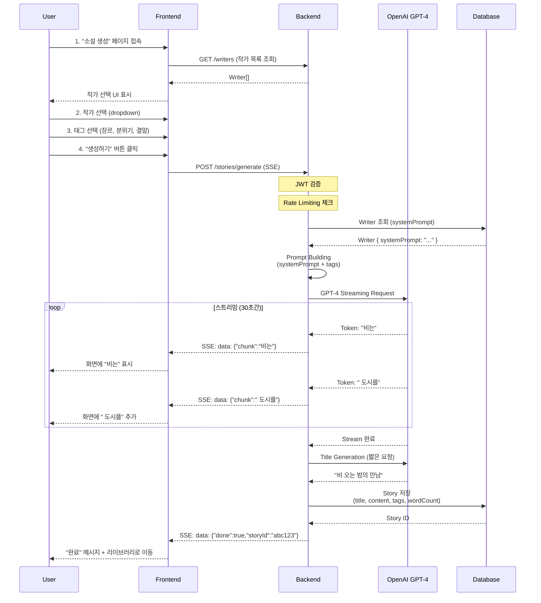

# Phase 4: AI Story Generation - Specification

> **Phase**: 4 - AI 소설 생성 기능 (핵심 기능)
> **Priority**: ⭐⭐⭐⭐⭐ (포트폴리오 평가 40%)
> **Duration**: 1주 (집중 개발 시)
> **Dependencies**: Phase 3 (Writer Management) 완료

---

## 📋 Overview

Phase 3에서 생성한 Writer의 `systemPrompt`를 OpenAI GPT-4에 전달하여 1,500-2,000단어 분량의 한국어 단편 소설을 실시간 스트리밍으로 생성하는 시스템을 구축합니다.

**핵심 차별점**:

- Writer의 `systemPrompt` (100-2000자)가 GPT-4 system message로 전달
- 작가 스타일이 소설에 일관되게 반영
- 스트리밍으로 실시간 토큰 출력 (타자기 효과)

---

## 👤 User Journey

### Primary Flow: 소설 생성



### Alternative Flows

**A1. 생성 실패 (OpenAI API 에러)**:

1. User가 "생성하기" 클릭
2. OpenAI API 에러 (Rate limit, Timeout 등)
3. Backend가 재시도 (최대 3회)
4. 여전히 실패 시 에러 메시지 표시
5. User는 다시 시도 가능

**A2. 부적절한 콘텐츠 생성**:

1. AI가 소설 생성 완료
2. Backend가 Moderation API로 검증
3. 부적절한 콘텐츠 감지
4. 소설 저장하지 않고 재생성 (최대 3회)
5. 계속 실패 시 에러 메시지

**A3. Rate Limiting 초과**:

1. User가 일일 생성 한도 (10회) 초과
2. Backend가 429 Too Many Requests 반환
3. Frontend에서 "내일 다시 시도해주세요" 메시지
4. 내일 00:00에 카운터 리셋

---

## 🎯 Success Criteria

### Functional Requirements

- [ ] **F1. 소설 생성 기본**
  - [ ] Writer 선택 가능 (dropdown)
  - [ ] 태그 선택 가능 (장르, 분위기, 결말 중 최대 3개)
  - [ ] "생성하기" 버튼 클릭 시 소설 생성 시작

- [ ] **F2. 실시간 스트리밍**
  - [ ] GPT-4 토큰이 실시간으로 화면에 표시
  - [ ] 타자기 효과 (typewriter animation)
  - [ ] 스트리밍 중 끊김 없음

- [ ] **F3. 소설 품질**
  - [ ] 1,500-2,000 단어 분량
  - [ ] Writer의 `systemPrompt` 스타일 반영
  - [ ] 한국어 자연스러움
  - [ ] 시작-중간-끝 완전한 구조

- [ ] **F4. 제목 자동 생성**
  - [ ] AI가 소설 내용 기반으로 제목 생성
  - [ ] 10자 이내 간결한 제목

- [ ] **F5. 저장 및 메타데이터**
  - [ ] 생성된 소설 자동 저장
  - [ ] 단어 수 (wordCount) 계산
  - [ ] 예상 읽기 시간 (readTime) 계산
  - [ ] 태그 정보 저장

### Non-Functional Requirements

- [ ] **N1. Performance**
  - [ ] 첫 토큰 응답 시간 < 2초
  - [ ] 전체 생성 시간 < 30초
  - [ ] API 응답 시간 < 500ms (메타데이터 조회)

- [ ] **N2. Reliability**
  - [ ] 생성 성공률 > 95%
  - [ ] 에러 발생 시 자동 재시도 (최대 3회)
  - [ ] OpenAI API 실패 시 Fallback (Claude, OpenRouter)

- [ ] **N3. Safety**
  - [ ] OpenAI Moderation API 통과
  - [ ] 한국어 부적절한 키워드 필터링
  - [ ] 14세 미만 유해 콘텐츠 차단

- [ ] **N4. Scalability**
  - [ ] 동시 생성 요청 100건 처리
  - [ ] Rate Limiting: 사용자당 일일 10회
  - [ ] Queue 시스템 (향후 확장)

- [ ] **N5. Cost Efficiency**
  - [ ] 소설 1건당 비용 < $0.10
  - [ ] 토큰 최적화 (불필요한 프롬프트 제거)
  - [ ] Caching 전략 (Writer systemPrompt)

---

## 💡 Business Requirements

### BR1. AI Provider

**Primary**: OpenAI GPT-4
**Reason**: 한국어 품질, 창의성, 일관성

**Fallback Chain**:

1. OpenAI GPT-4 (Primary)
2. Anthropic Claude 3.5 Sonnet (Fallback 1)
3. OpenRouter Multi-Model (Fallback 2)

### BR2. Content Safety

**필수 준수**:

- 개인정보보호법 (GDPR/KISA)
- 14세 미만 청소년 보호
- 부적절한 콘텐츠 자동 차단

**구현**:

- OpenAI Moderation API
- 한국어 키워드 필터 (정규식)
- 사용자 신고 시스템

### BR3. User Experience

**핵심 가치**:

- 빠른 생성 (30초 이내)
- 실시간 피드백 (스트리밍)
- 작가 스타일 일관성

**측정 지표**:

- 사용자당 평균 생성 횟수
- 소설 완독률
- 재생성 요청 비율

### BR4. Monetization (향후)

**현재 Phase 4**: 무료 (일일 10회 제한)

**Phase 6 이후**:

- 구독 모델: 무제한 생성
- 크레딧 시스템: 건당 과금
- 프리미엄 Writer: 고급 스타일

---

## 🎨 UI/UX Requirements

### 소설 생성 페이지

**Layout**:

```
┌─────────────────────────────────┐
│  ✨ 새로운 소설 생성             │
├─────────────────────────────────┤
│                                  │
│  1️⃣ 작가 선택                   │
│  [Dropdown: 하드보일드 작가 ▼]  │
│                                  │
│  2️⃣ 스타일 조합 (최대 3개)      │
│  [느와르] [스릴러] [반전]       │
│                                  │
│  3️⃣ 생성하기                    │
│  [         소설 생성하기        ] │
│                                  │
└─────────────────────────────────┘
```

**생성 중 화면**:

```
┌─────────────────────────────────┐
│  하드보일드 작가가 쓰고 있어요...│
│  스타일: 느와르, 스릴러, 반전    │
├─────────────────────────────────┤
│                                  │
│  비는 도시를 적시고, 내 사무실   │
│  창문을 두드렸다. 수화기 너머    │
│  여자의 목소리는 떨리고 있었다.▊ │
│                                  │
│  [━━━━━━━━━━━━━━━░░░] 75%       │
│                                  │
└─────────────────────────────────┘
```

### 인터랙션

**상태별 UI**:

- **Ready**: 작가/태그 선택 UI
- **Generating**: 스트리밍 출력 + Progress bar
- **Done**: 완료 메시지 + "라이브러리로 이동" 버튼
- **Error**: 에러 메시지 + "다시 시도" 버튼

**애니메이션**:

- 타자기 효과 (토큰별 부드러운 출력)
- Progress bar (예상 진행도)
- Loading spinner (첫 토큰 대기 중)

---

## 🔐 Security Requirements

### S1. Authentication

- JWT 인증 필수 (모든 생성 요청)
- Token 만료 시 자동 갱신

### S2. Authorization

- 사용자는 본인의 소설만 조회/수정/삭제
- PUBLIC Writer는 모든 사용자 사용 가능
- PRIVATE Writer는 소유자만 사용 가능

### S3. Rate Limiting

- 사용자당 일일 10회
- IP당 시간당 50회 (DDoS 방지)
- Writer당 동시 생성 5건 (리소스 보호)

### S4. Input Validation

- Writer ID 존재 여부 확인
- 태그 개수 1-3개 제한
- 태그 길이 2-20자 제한

### S5. Content Moderation

- Pre-check: Writer systemPrompt 검증
- Post-check: 생성된 소설 검증
- 부적절한 콘텐츠 DB 저장 금지

---

## 📊 Success Metrics

### 정량적 지표

| Metric            | Target      | Measurement                     |
| ----------------- | ----------- | ------------------------------- |
| 생성 성공률       | > 95%       | (성공 건수) / (전체 요청 건수)  |
| 첫 토큰 지연      | < 2초       | OpenAI API 호출 ~ 첫 chunk 수신 |
| 전체 생성 시간    | < 30초      | API 호출 ~ Stream 완료          |
| 평균 단어 수      | 1,500-2,000 | 생성된 소설의 평균 wordCount    |
| 소설당 비용       | < $0.10     | OpenAI API 토큰 비용            |
| Moderation 차단률 | < 1%        | 부적절한 콘텐츠 차단 건수       |

### 정성적 지표

| Aspect             | Evaluation Method      |
| ------------------ | ---------------------- |
| 한국어 자연스러움  | 사용자 설문 (1-5점)    |
| 작가 스타일 일관성 | 블라인드 테스트 (A/B)  |
| 스토리 완성도      | 시작-중간-끝 구조 검증 |
| 창의성             | 반복 패턴 분석         |

---

## 🧪 Acceptance Testing

### Test Scenario 1: 정상 생성 플로우

**Given**: 로그인한 사용자
**When**: 작가 선택 + 태그 3개 선택 + "생성하기" 클릭
**Then**:

- 2초 이내 첫 토큰 출력
- 30초 이내 전체 소설 완성
- 1,500단어 이상 생성
- DB에 저장 확인
- 라이브러리로 자동 이동

### Test Scenario 2: OpenAI API 실패

**Given**: OpenAI API가 503 에러 반환
**When**: 소설 생성 요청
**Then**:

- 3회 재시도 수행
- 3회 실패 후 Fallback (Claude) 사용
- 최종 성공 또는 명확한 에러 메시지

### Test Scenario 3: Moderation 차단

**Given**: 부적절한 키워드 포함 소설 생성
**When**: Moderation 검증
**Then**:

- 소설 저장하지 않음
- 재생성 시도 (최대 3회)
- 계속 실패 시 사용자에게 안내

### Test Scenario 4: Rate Limiting

**Given**: 사용자가 오늘 이미 10회 생성
**When**: 11번째 생성 시도
**Then**:

- 429 Too Many Requests 반환
- "내일 다시 시도해주세요" 메시지
- 내일 00:00 이후 카운터 리셋 확인

---

## 📚 Out of Scope (Phase 4에서 제외)

다음 기능은 **Phase 5 이후**에 구현:

- ❌ 소설 편집 기능
- ❌ 소설 공유 (SNS, URL)
- ❌ 북마크 시스템
- ❌ 소설 검색 (제목, 내용, 태그)
- ❌ 유사 소설 추천 (pgvector)
- ❌ 다국어 지원 (영어, 일본어)
- ❌ TTS (Text-to-Speech)
- ❌ 이미지 생성 (DALL-E)

---

## 🔄 Dependencies

### Prerequisites (Phase 3 완료)

- [x] Writer 모델 (`systemPrompt` 필드 포함)
- [x] Writer CRUD API
- [x] JWT 인증 시스템
- [x] PostgreSQL + Prisma 설정

### Required for Phase 4

- [ ] OpenAI API Key
- [ ] Story 모델 (Prisma)
- [ ] Story Service/Controller
- [ ] Frontend 생성 페이지

---

## 📝 Notes

### 포트폴리오 중요도

Phase 4는 **AI 활용 역량 평가의 40%**를 차지하는 핵심 Phase입니다.

**평가 포인트**:

- OpenAI API 통합 숙련도
- Prompt Engineering 전략
- 스트리밍 구현 능력
- 에러 핸들링 및 Fallback
- 비용 최적화

### AI 도구 활용 전략

**Context7**:

```bash
/context7 openai gpt-4 chat completions
/context7 openai streaming api
/context7 openai prompt engineering
```

**Sequential Thinking**:

- Prompt 구조 설계
- Few-shot vs Fine-tuning 결정
- 토큰 최적화 전략
- 에러 핸들링 로직

---

**다음 단계**: `plan.md`에서 기술적 구현 방법 정의
