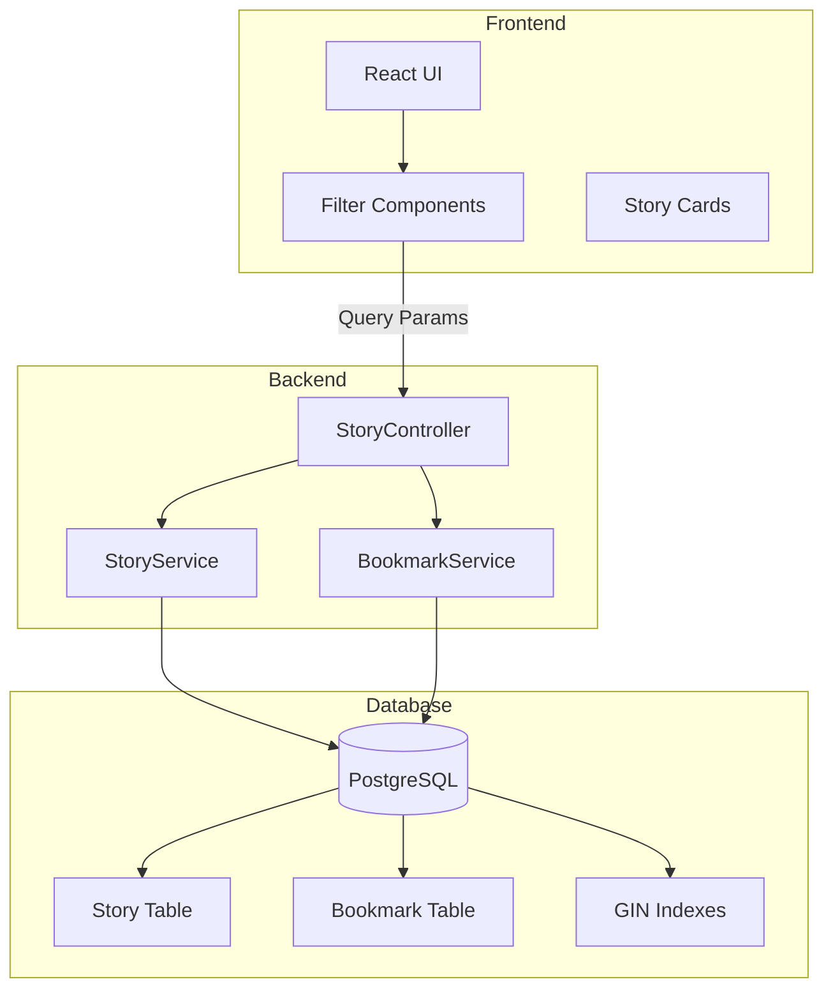
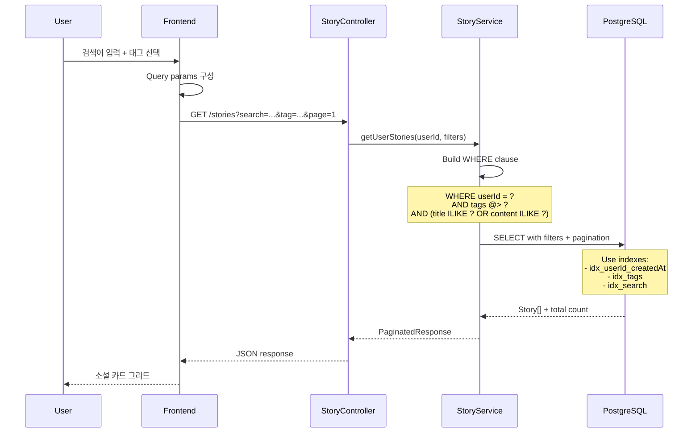

# Phase 5: Story Library - Technical Plan

> **Phase**: 5 - 소설 라이브러리 관리 기능
> **Priority**: ⭐⭐⭐⭐ (포트폴리오 평가 30%)
> **Dependencies**: Phase 4 (Story Generation) 완료

---

## 📐 Architecture Overview

### System Components



### Data Flow - Search & Filter



---

## 🗄️ Database Optimization

### Existing Schema (from Phase 4)

```prisma
model Story {
  id          String   @id @default(cuid())
  title       String
  content     String   @db.Text
  tags        String[]
  wordCount   Int
  readTime    Int

  writerId    String
  writer      Writer   @relation(fields: [writerId], references: [id], onDelete: Cascade)

  userId      String
  user        User     @relation(fields: [userId], references: [id])

  bookmarks   Bookmark[]

  createdAt   DateTime @default(now())
  updatedAt   DateTime @updatedAt

  @@index([userId, createdAt(sort: Desc)])
  @@index([writerId, createdAt(sort: Desc)])
  @@index([tags])
}

model Bookmark {
  id        String   @id @default(cuid())
  userId    String
  storyId   String
  createdAt DateTime @default(now())

  user      User     @relation(fields: [userId], references: [id], onDelete: Cascade)
  story     Story    @relation(fields: [storyId], references: [id], onDelete: Cascade)

  @@unique([userId, storyId])
  @@index([userId])
}
```

### Additional Indexes for Phase 5

```sql
-- Full-text search (향후 Phase 6)
-- CREATE INDEX idx_story_search ON "Story" USING GIN (to_tsvector('korean', title || ' ' || content));

-- Tag array search (GIN index - already exists)
CREATE INDEX idx_story_tags ON "Story" USING GIN (tags);

-- Composite index for common queries
CREATE INDEX idx_story_user_created ON "Story" (userId, createdAt DESC);

-- Word count sorting
CREATE INDEX idx_story_wordcount ON "Story" (wordCount DESC);

-- Read time sorting
CREATE INDEX idx_story_readtime ON "Story" (readTime DESC);
```

### Query Optimization Strategies

```typescript
// 1. 태그 필터링 (Array contains)
// GIN 인덱스 활용
WHERE tags @> ARRAY['느와르']::text[]

// 2. 전문 검색 (ILIKE)
// 현재: LIKE (느림, 인덱스 미사용)
WHERE title ILIKE '%keyword%' OR content ILIKE '%keyword%'

// 향후 (Phase 6): Full-Text Search
WHERE to_tsvector('korean', title || ' ' || content) @@ to_tsquery('korean', 'keyword')

// 3. 정렬 최적화
ORDER BY createdAt DESC  -- 인덱스 사용
ORDER BY wordCount DESC  -- 인덱스 사용
ORDER BY readTime DESC   -- 인덱스 사용

// 4. Pagination
LIMIT 20 OFFSET (page - 1) * 20
```

---

## 🔌 API Design

### Story Endpoints (Enhanced)

```typescript
// apps/server/src/story/story.controller.ts

@Controller('stories')
@UseGuards(JwtAuthGuard)
export class StoryController {
  /**
   * GET /stories
   * 소설 목록 조회 (필터링, 검색, 정렬, pagination)
   */
  @Get()
  async getStories(
    @Query() filters: StoryFiltersDto,
    @CurrentUser('id') userId: string,
  ): Promise<PaginatedResponse<StoryDto>> {
    return this.storyService.getUserStories(userId, filters);
  }

  /**
   * GET /stories/stats
   * 소설 통계 조회
   */
  @Get('stats')
  async getStats(@CurrentUser('id') userId: string): Promise<StoryStatsDto> {
    return this.storyService.getUserStats(userId);
  }

  /**
   * GET /stories/:id
   * 소설 상세 조회 (북마크 상태 포함)
   */
  @Get(':id')
  async getStory(
    @Param('id') id: string,
    @CurrentUser('id') userId: string,
  ): Promise<StoryWithBookmarkDto> {
    return this.storyService.getStoryWithBookmark(id, userId);
  }

  /**
   * DELETE /stories/:id
   * 소설 삭제
   */
  @Delete(':id')
  @HttpCode(HttpStatus.NO_CONTENT)
  async deleteStory(@Param('id') id: string, @CurrentUser('id') userId: string): Promise<void> {
    await this.storyService.deleteStory(id, userId);
  }
}
```

### Bookmark Endpoints

```typescript
// apps/server/src/bookmark/bookmark.controller.ts

@Controller('bookmarks')
@UseGuards(JwtAuthGuard)
export class BookmarkController {
  /**
   * POST /bookmarks
   * 북마크 추가
   */
  @Post()
  async createBookmark(
    @Body() dto: CreateBookmarkDto,
    @CurrentUser('id') userId: string,
  ): Promise<BookmarkDto> {
    return this.bookmarkService.create(dto.storyId, userId);
  }

  /**
   * DELETE /bookmarks/:storyId
   * 북마크 제거
   */
  @Delete(':storyId')
  @HttpCode(HttpStatus.NO_CONTENT)
  async deleteBookmark(
    @Param('storyId') storyId: string,
    @CurrentUser('id') userId: string,
  ): Promise<void> {
    await this.bookmarkService.delete(storyId, userId);
  }

  /**
   * GET /bookmarks/stories
   * 북마크한 소설 목록
   */
  @Get('stories')
  async getBookmarkedStories(
    @Query() filters: PaginationDto,
    @CurrentUser('id') userId: string,
  ): Promise<PaginatedResponse<StoryDto>> {
    return this.bookmarkService.getBookmarkedStories(userId, filters);
  }
}
```

---

## 📦 DTOs

### Enhanced Story Filters

```typescript
// apps/server/src/story/dto/story-filters.dto.ts

import { IsOptional, IsString, IsInt, Min, Max, IsEnum, IsBoolean } from 'class-validator';
import { Type, Transform } from 'class-transformer';

export enum SortField {
  CREATED_AT = 'createdAt',
  WORD_COUNT = 'wordCount',
  READ_TIME = 'readTime',
}

export enum SortOrder {
  ASC = 'asc',
  DESC = 'desc',
}

export class StoryFiltersDto {
  // Pagination
  @IsOptional()
  @Type(() => Number)
  @IsInt()
  @Min(1)
  page?: number = 1;

  @IsOptional()
  @Type(() => Number)
  @IsInt()
  @Min(1)
  @Max(50)
  limit?: number = 20;

  // Search
  @IsOptional()
  @IsString()
  @Length(1, 100)
  search?: string;

  // Filters
  @IsOptional()
  @IsString()
  tag?: string;

  @IsOptional()
  @IsString()
  writerId?: string;

  @IsOptional()
  @Transform(({ value }) => value === 'true')
  @IsBoolean()
  bookmarked?: boolean;

  // Sorting
  @IsOptional()
  @IsEnum(SortField)
  sort?: SortField = SortField.CREATED_AT;

  @IsOptional()
  @IsEnum(SortOrder)
  order?: SortOrder = SortOrder.DESC;
}
```

### Story DTOs

```typescript
// apps/server/src/story/dto/story.dto.ts

export class StoryDto {
  id: string;
  title: string;
  content: string;
  tags: string[];
  wordCount: number;
  readTime: number;
  writerId: string;
  writer?: {
    id: string;
    name: string;
    imageUrl: string | null;
  };
  userId: string;
  createdAt: Date;
  updatedAt: Date;
}

export class StoryWithBookmarkDto extends StoryDto {
  isBookmarked: boolean;
  bookmarkCount: number;
}

export class StoryCardDto {
  id: string;
  title: string;
  preview: string; // content의 첫 200자
  tags: string[];
  wordCount: number;
  readTime: number;
  writer: {
    id: string;
    name: string;
    imageUrl: string | null;
  };
  isBookmarked: boolean;
  createdAt: Date;
}

export class StoryStatsDto {
  totalStories: number;
  totalWords: number;
  totalReadTime: number;
  averageWordCount: number;
  topTags: Array<{ tag: string; count: number }>;
  bookmarkedCount: number;
}
```

### Bookmark DTOs

```typescript
// apps/server/src/bookmark/dto/bookmark.dto.ts

export class CreateBookmarkDto {
  @IsString()
  @IsNotEmpty()
  storyId: string;
}

export class BookmarkDto {
  id: string;
  userId: string;
  storyId: string;
  createdAt: Date;
}
```

---

## 🔧 Service Implementation

### Enhanced StoryService

```typescript
// apps/server/src/story/story.service.ts

import { Injectable, NotFoundException } from '@nestjs/common';
import { PrismaService } from '../prisma/prisma.service';
import { StoryFiltersDto, StoryDto, StoryStatsDto } from './dto';

@Injectable()
export class StoryService {
  constructor(private readonly prisma: PrismaService) {}

  /**
   * 사용자 소설 목록 조회 (필터링, 검색, 정렬)
   */
  async getUserStories(
    userId: string,
    filters: StoryFiltersDto,
  ): Promise<PaginatedResponse<StoryDto>> {
    // WHERE 절 구성
    const where: any = { userId };

    // 태그 필터링
    if (filters.tag) {
      where.tags = { has: filters.tag };
    }

    // 작가 필터링
    if (filters.writerId) {
      where.writerId = filters.writerId;
    }

    // 북마크 필터링
    if (filters.bookmarked) {
      where.bookmarks = {
        some: { userId },
      };
    }

    // 전문 검색
    if (filters.search) {
      where.OR = [
        { title: { contains: filters.search, mode: 'insensitive' } },
        { content: { contains: filters.search, mode: 'insensitive' } },
      ];
    }

    // ORDER BY 절 구성
    const orderBy: any = {};
    orderBy[filters.sort] = filters.order;

    // 쿼리 실행
    const [data, total] = await Promise.all([
      this.prisma.story.findMany({
        where,
        include: {
          writer: {
            select: { id: true, name: true, imageUrl: true },
          },
          bookmarks: {
            where: { userId },
            select: { id: true },
          },
        },
        orderBy,
        skip: (filters.page - 1) * filters.limit,
        take: filters.limit,
      }),
      this.prisma.story.count({ where }),
    ]);

    // isBookmarked 필드 추가
    const storiesWithBookmark = data.map((story) => ({
      ...story,
      isBookmarked: story.bookmarks.length > 0,
      bookmarks: undefined, // 제거
    }));

    return {
      data: storiesWithBookmark,
      meta: {
        total,
        page: filters.page,
        limit: filters.limit,
        totalPages: Math.ceil(total / filters.limit),
      },
    };
  }

  /**
   * 소설 상세 조회 (북마크 상태 포함)
   */
  async getStoryWithBookmark(id: string, userId: string): Promise<StoryWithBookmarkDto> {
    const story = await this.prisma.story.findUnique({
      where: { id },
      include: {
        writer: {
          select: { id: true, name: true, imageUrl: true },
        },
        bookmarks: {
          where: { userId },
          select: { id: true },
        },
        _count: {
          select: { bookmarks: true },
        },
      },
    });

    if (!story) {
      throw new NotFoundException(`Story ${id} not found`);
    }

    if (story.userId !== userId) {
      throw new NotFoundException(`Story ${id} not found`);
    }

    return {
      ...story,
      isBookmarked: story.bookmarks.length > 0,
      bookmarkCount: story._count.bookmarks,
      bookmarks: undefined,
      _count: undefined,
    };
  }

  /**
   * 사용자 소설 통계
   */
  async getUserStats(userId: string): Promise<StoryStatsDto> {
    const [stories, bookmarkedCount] = await Promise.all([
      this.prisma.story.findMany({
        where: { userId },
        select: {
          wordCount: true,
          readTime: true,
          tags: true,
        },
      }),
      this.prisma.bookmark.count({
        where: { userId },
      }),
    ]);

    const totalStories = stories.length;
    const totalWords = stories.reduce((sum, s) => sum + s.wordCount, 0);
    const totalReadTime = stories.reduce((sum, s) => sum + s.readTime, 0);
    const averageWordCount = totalStories > 0 ? Math.round(totalWords / totalStories) : 0;

    // 태그 빈도 계산
    const tagCounts = new Map<string, number>();
    stories.forEach((story) => {
      story.tags.forEach((tag) => {
        tagCounts.set(tag, (tagCounts.get(tag) || 0) + 1);
      });
    });

    const topTags = Array.from(tagCounts.entries())
      .map(([tag, count]) => ({ tag, count }))
      .sort((a, b) => b.count - a.count)
      .slice(0, 5);

    return {
      totalStories,
      totalWords,
      totalReadTime,
      averageWordCount,
      topTags,
      bookmarkedCount,
    };
  }

  /**
   * 소설 삭제 (기존 로직 유지)
   */
  async deleteStory(id: string, userId: string): Promise<void> {
    const story = await this.prisma.story.findUnique({
      where: { id },
    });

    if (!story) {
      throw new NotFoundException(`Story ${id} not found`);
    }

    if (story.userId !== userId) {
      throw new NotFoundException(`Story ${id} not found`);
    }

    await this.prisma.story.delete({ where: { id } });
  }
}
```

### BookmarkService

```typescript
// apps/server/src/bookmark/bookmark.service.ts

import { Injectable, NotFoundException, ConflictException } from '@nestjs/common';
import { PrismaService } from '../prisma/prisma.service';
import { BookmarkDto } from './dto';

@Injectable()
export class BookmarkService {
  constructor(private readonly prisma: PrismaService) {}

  /**
   * 북마크 추가 (중복 방지)
   */
  async create(storyId: string, userId: string): Promise<BookmarkDto> {
    // Story 존재 확인
    const story = await this.prisma.story.findUnique({
      where: { id: storyId },
    });

    if (!story) {
      throw new NotFoundException(`Story ${storyId} not found`);
    }

    try {
      const bookmark = await this.prisma.bookmark.create({
        data: {
          storyId,
          userId,
        },
      });

      return bookmark;
    } catch (error) {
      // Unique constraint 위반 (이미 북마크됨)
      if (error.code === 'P2002') {
        // 이미 존재하는 북마크 반환 (idempotent)
        const existing = await this.prisma.bookmark.findUnique({
          where: {
            userId_storyId: { userId, storyId },
          },
        });
        return existing!;
      }
      throw error;
    }
  }

  /**
   * 북마크 제거
   */
  async delete(storyId: string, userId: string): Promise<void> {
    const bookmark = await this.prisma.bookmark.findUnique({
      where: {
        userId_storyId: { userId, storyId },
      },
    });

    if (!bookmark) {
      throw new NotFoundException('Bookmark not found');
    }

    await this.prisma.bookmark.delete({
      where: { id: bookmark.id },
    });
  }

  /**
   * 북마크한 소설 목록
   */
  async getBookmarkedStories(
    userId: string,
    filters: PaginationDto,
  ): Promise<PaginatedResponse<StoryDto>> {
    const [data, total] = await Promise.all([
      this.prisma.bookmark.findMany({
        where: { userId },
        include: {
          story: {
            include: {
              writer: {
                select: { id: true, name: true, imageUrl: true },
              },
            },
          },
        },
        orderBy: { createdAt: 'desc' },
        skip: (filters.page - 1) * filters.limit,
        take: filters.limit,
      }),
      this.prisma.bookmark.count({ where: { userId } }),
    ]);

    const stories = data.map((bookmark) => ({
      ...bookmark.story,
      isBookmarked: true,
    }));

    return {
      data: stories,
      meta: {
        total,
        page: filters.page,
        limit: filters.limit,
        totalPages: Math.ceil(total / filters.limit),
      },
    };
  }
}
```

---

## 🎨 Frontend Implementation

### Story List Page with Filters

```tsx
// apps/web/src/pages/stories/StoriesPage.tsx

import { useState } from 'react';
import { useQuery } from '@tanstack/react-query';
import { storiesApi } from '@/api/stories.api';
import { StoryCard } from '@/components/story/StoryCard';
import { StoryFilters } from '@/components/story/StoryFilters';
import type { StoryFiltersDto } from '@/api/stories.types';

export function StoriesPage() {
  const [filters, setFilters] = useState<StoryFiltersDto>({
    page: 1,
    limit: 20,
    sort: 'createdAt',
    order: 'desc',
  });

  const { data, isLoading, error } = useQuery({
    queryKey: ['stories', filters],
    queryFn: () => storiesApi.getStories(filters),
  });

  const handleFilterChange = (newFilters: Partial<StoryFiltersDto>) => {
    setFilters((prev) => ({
      ...prev,
      ...newFilters,
      page: 1, // 필터 변경 시 첫 페이지로
    }));
  };

  if (isLoading) {
    return <StoryListSkeleton />;
  }

  if (error) {
    return (
      <div className="flex min-h-screen items-center justify-center">
        <div className="text-lg text-destructive">소설 목록을 불러오는데 실패했습니다.</div>
      </div>
    );
  }

  return (
    <div className="container mx-auto px-4 py-8">
      {/* 헤더 */}
      <div className="mb-8 flex items-center justify-between">
        <div>
          <h1 className="text-3xl font-bold text-foreground">내 소설 라이브러리</h1>
          <p className="mt-2 text-muted-foreground">생성한 소설 {data?.meta.total || 0}편</p>
        </div>
        <Link
          to="/stories/new"
          className="rounded-lg bg-primary px-6 py-3 text-primary-foreground hover:bg-primary/90"
        >
          새 소설 생성
        </Link>
      </div>

      {/* 필터 & 정렬 */}
      <StoryFilters filters={filters} onChange={handleFilterChange} />

      {/* 소설 그리드 */}
      {data && data.data.length > 0 ? (
        <>
          <div className="grid grid-cols-1 gap-6 sm:grid-cols-2 lg:grid-cols-3">
            {data.data.map((story) => (
              <StoryCard key={story.id} story={story} />
            ))}
          </div>

          {/* 페이지네이션 */}
          <Pagination
            currentPage={filters.page}
            totalPages={data.meta.totalPages}
            onPageChange={(page) => setFilters((prev) => ({ ...prev, page }))}
          />
        </>
      ) : (
        <EmptyState
          title="생성된 소설이 없습니다"
          description="새로운 소설을 생성해보세요"
          action={
            <Link to="/stories/new">
              <Button>소설 생성하기</Button>
            </Link>
          }
        />
      )}
    </div>
  );
}
```

### Story Filters Component

```tsx
// apps/web/src/components/story/StoryFilters.tsx

import { useState } from 'react';
import { Input } from '@/components/ui/input';
import { Select } from '@/components/ui/select';
import { Button } from '@/components/ui/button';
import type { StoryFiltersDto } from '@/api/stories.types';

const AVAILABLE_TAGS = [
  '느와르',
  '스릴러',
  '반전',
  '로맨스',
  'SF',
  '힐링',
  '미스터리',
  '드라마',
  '코미디',
  '판타지',
];

const SORT_OPTIONS = [
  { value: 'createdAt-desc', label: '최신순' },
  { value: 'createdAt-asc', label: '오래된순' },
  { value: 'wordCount-desc', label: '긴 소설순' },
  { value: 'wordCount-asc', label: '짧은 소설순' },
  { value: 'readTime-desc', label: '읽기시간 긴순' },
  { value: 'readTime-asc', label: '읽기시간 짧은순' },
];

interface StoryFiltersProps {
  filters: StoryFiltersDto;
  onChange: (filters: Partial<StoryFiltersDto>) => void;
}

export function StoryFilters({ filters, onChange }: StoryFiltersProps) {
  const [searchInput, setSearchInput] = useState(filters.search || '');

  const handleSearch = (e: React.FormEvent) => {
    e.preventDefault();
    onChange({ search: searchInput || undefined });
  };

  const handleSortChange = (value: string) => {
    const [sort, order] = value.split('-');
    onChange({ sort, order });
  };

  return (
    <div className="mb-6 space-y-4">
      {/* 검색 */}
      <form onSubmit={handleSearch} className="flex gap-2">
        <Input
          type="text"
          placeholder="제목이나 내용으로 검색..."
          value={searchInput}
          onChange={(e) => setSearchInput(e.target.value)}
          className="flex-1"
        />
        <Button type="submit">검색</Button>
        {filters.search && (
          <Button
            type="button"
            variant="outline"
            onClick={() => {
              setSearchInput('');
              onChange({ search: undefined });
            }}
          >
            초기화
          </Button>
        )}
      </form>

      {/* 필터 & 정렬 */}
      <div className="flex flex-wrap gap-3">
        {/* 태그 필터 */}
        <Select
          value={filters.tag || ''}
          onValueChange={(value) => onChange({ tag: value || undefined })}
        >
          <option value="">모든 태그</option>
          {AVAILABLE_TAGS.map((tag) => (
            <option key={tag} value={tag}>
              {tag}
            </option>
          ))}
        </Select>

        {/* 정렬 */}
        <Select value={`${filters.sort}-${filters.order}`} onValueChange={handleSortChange}>
          {SORT_OPTIONS.map((option) => (
            <option key={option.value} value={option.value}>
              {option.label}
            </option>
          ))}
        </Select>

        {/* 북마크 필터 */}
        <Button
          variant={filters.bookmarked ? 'default' : 'outline'}
          onClick={() => onChange({ bookmarked: !filters.bookmarked })}
        >
          🔖 북마크만 보기
        </Button>
      </div>

      {/* 활성 필터 표시 */}
      {(filters.tag || filters.search || filters.bookmarked) && (
        <div className="flex flex-wrap gap-2">
          {filters.tag && (
            <Badge variant="secondary">
              태그: {filters.tag}
              <button onClick={() => onChange({ tag: undefined })} className="ml-1">
                ✕
              </button>
            </Badge>
          )}
          {filters.search && (
            <Badge variant="secondary">
              검색: {filters.search}
              <button
                onClick={() => {
                  setSearchInput('');
                  onChange({ search: undefined });
                }}
                className="ml-1"
              >
                ✕
              </button>
            </Badge>
          )}
          {filters.bookmarked && (
            <Badge variant="secondary">
              북마크만
              <button onClick={() => onChange({ bookmarked: false })} className="ml-1">
                ✕
              </button>
            </Badge>
          )}
        </div>
      )}
    </div>
  );
}
```

### Story Card Component

```tsx
// apps/web/src/components/story/StoryCard.tsx

import { Link } from 'react-router-dom';
import { useMutation, useQueryClient } from '@tanstack/react-query';
import { bookmarksApi } from '@/api/bookmarks.api';
import type { StoryCardDto } from '@/api/stories.types';

interface StoryCardProps {
  story: StoryCardDto;
}

export function StoryCard({ story }: StoryCardProps) {
  const queryClient = useQueryClient();

  const toggleBookmark = useMutation({
    mutationFn: () =>
      story.isBookmarked ? bookmarksApi.delete(story.id) : bookmarksApi.create(story.id),
    onSuccess: () => {
      queryClient.invalidateQueries({ queryKey: ['stories'] });
    },
  });

  const handleBookmarkClick = (e: React.MouseEvent) => {
    e.preventDefault();
    toggleBookmark.mutate();
  };

  return (
    <Link
      to={`/stories/${story.id}`}
      className="group overflow-hidden rounded-lg border border-border bg-card transition-all hover:border-primary hover:shadow-lg"
    >
      <div className="p-6">
        <div className="mb-3 flex items-start justify-between">
          <h3 className="flex-1 text-xl font-semibold text-foreground group-hover:text-primary">
            {story.title}
          </h3>
          <button
            onClick={handleBookmarkClick}
            className="ml-2 text-2xl transition-colors hover:scale-110"
          >
            {story.isBookmarked ? '🔖' : '📑'}
          </button>
        </div>

        {/* 태그 */}
        <div className="mb-3 flex flex-wrap gap-1">
          {story.tags.slice(0, 3).map((tag) => (
            <span key={tag} className="rounded-full bg-primary/10 px-2 py-0.5 text-xs text-primary">
              {tag}
            </span>
          ))}
        </div>

        {/* 미리보기 */}
        <p className="line-clamp-3 text-sm text-muted-foreground">{story.preview}</p>

        {/* 메타데이터 */}
        <div className="mt-4 flex items-center gap-3 text-xs text-muted-foreground">
          <span>{story.wordCount.toLocaleString()}단어</span>
          <span>약 {story.readTime}분</span>
          {story.writer && <span>by {story.writer.name}</span>}
        </div>

        <div className="mt-2 text-xs text-muted-foreground">
          {new Date(story.createdAt).toLocaleDateString()}
        </div>
      </div>
    </Link>
  );
}
```

---

## ⚡ Performance Optimization

### Caching Strategy

```typescript
// apps/server/src/story/story.service.ts

import { CACHE_MANAGER, Inject } from '@nestjs/common';
import { Cache } from 'cache-manager';

@Injectable()
export class StoryService {
  constructor(@Inject(CACHE_MANAGER) private cacheManager: Cache) {}

  /**
   * 사용자 통계 캐싱 (5분)
   */
  async getUserStats(userId: string): Promise<StoryStatsDto> {
    const cacheKey = `user-stats:${userId}`;
    const cached = await this.cacheManager.get<StoryStatsDto>(cacheKey);

    if (cached) {
      return cached;
    }

    const stats = await this.calculateStats(userId);

    await this.cacheManager.set(cacheKey, stats, 300); // 5분

    return stats;
  }
}
```

### Query Optimization

```typescript
// Prisma 쿼리 최적화

// ❌ N+1 문제
const stories = await prisma.story.findMany();
for (const story of stories) {
  const writer = await prisma.writer.findUnique({ where: { id: story.writerId } });
}

// ✅ Include로 해결
const stories = await prisma.story.findMany({
  include: {
    writer: {
      select: { id: true, name: true, imageUrl: true },
    },
  },
});

// ✅ Select로 필요한 필드만
const stories = await prisma.story.findMany({
  select: {
    id: true,
    title: true,
    tags: true,
    wordCount: true,
    readTime: true,
    writer: {
      select: { name: true },
    },
  },
});
```

---

## 🧪 Testing Strategy

### Unit Tests

```typescript
// apps/server/src/story/story.service.spec.ts

describe('StoryService', () => {
  describe('getUserStories', () => {
    it('should filter by tag', async () => {
      const result = await service.getUserStories('user-id', {
        tag: '느와르',
        page: 1,
        limit: 20,
      });

      expect(result.data.every((s) => s.tags.includes('느와르'))).toBe(true);
    });

    it('should search by title and content', async () => {
      const result = await service.getUserStories('user-id', {
        search: '비오는 밤',
        page: 1,
        limit: 20,
      });

      expect(result.data.length).toBeGreaterThan(0);
    });

    it('should filter by bookmark', async () => {
      const result = await service.getUserStories('user-id', {
        bookmarked: true,
        page: 1,
        limit: 20,
      });

      expect(result.data.every((s) => s.isBookmarked)).toBe(true);
    });
  });
});
```

### E2E Tests

```typescript
// apps/server/test/story.e2e-spec.ts

describe('Story API (e2e)', () => {
  it('GET /stories?tag=느와르', () => {
    return request(app.getHttpServer())
      .get('/stories?tag=느와르')
      .set('Authorization', `Bearer ${token}`)
      .expect(200)
      .expect((res) => {
        expect(res.body.data.every((s) => s.tags.includes('느와르'))).toBe(true);
      });
  });

  it('POST /bookmarks', () => {
    return request(app.getHttpServer())
      .post('/bookmarks')
      .set('Authorization', `Bearer ${token}`)
      .send({ storyId: 'story-id' })
      .expect(201);
  });
});
```

---

## ✅ Success Criteria Checklist

### Backend

- [ ] StoryService 필터링/검색/정렬 구현
- [ ] BookmarkService CRUD 구현
- [ ] 인덱스 최적화 완료
- [ ] 통계 API 구현

### Frontend

- [ ] StoryFilters 컴포넌트 작동
- [ ] StoryCard 북마크 토글
- [ ] Pagination 작동
- [ ] Empty State 처리
- [ ] Loading Skeleton UI

### Performance

- [ ] 목록 조회 < 500ms
- [ ] 검색 < 1초
- [ ] 인덱스 활용 확인

---

**다음 단계**: `tasks.md`에서 구현 작업 분해
