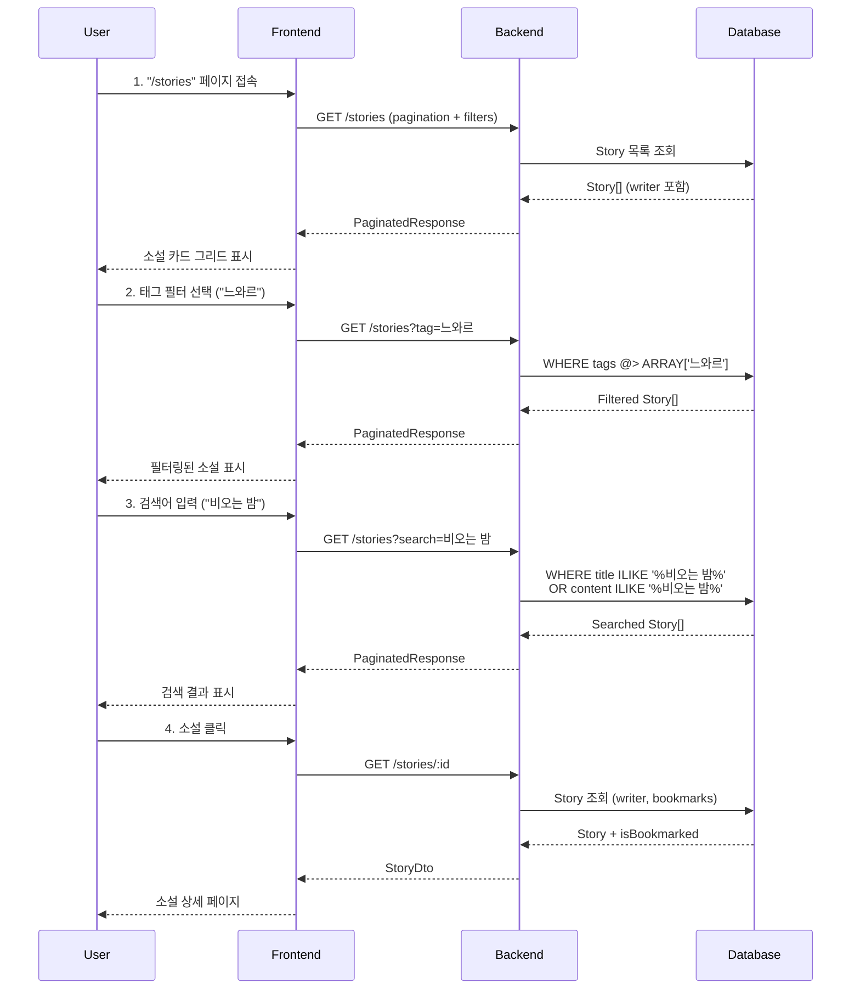

# Phase 5: Story Library - Specification

> **Phase**: 5 - 소설 라이브러리 관리 기능
> **Priority**: ⭐⭐⭐⭐ (포트폴리오 평가 30%)
> **Duration**: 1주 (집중 개발 시)
> **Dependencies**: Phase 4 (Story Generation) 완료

---

## 📋 Overview

Phase 4에서 생성한 소설을 효율적으로 관리, 검색, 북마크하는 라이브러리 시스템을 구축합니다.

**핵심 차별점**:

- 태그 기반 필터링 (장르/분위기/결말)
- 전문 검색 (제목 + 내용)
- 북마크 시스템 (즐겨찾기)
- 정렬 옵션 (최신순, 단어수순, 읽기시간순)

---

## 👤 User Journey

### Primary Flow: 소설 검색 및 읽기



### Alternative Flows

**A1. 북마크 추가/제거**:

1. User가 소설 상세 페이지에서 "북마크" 아이콘 클릭
2. Frontend가 POST /bookmarks (storyId)
3. Backend가 Bookmark 생성 (unique constraint 체크)
4. Frontend 캐시 무효화 및 UI 업데이트

**A2. 북마크 목록 조회**:

1. User가 "북마크" 탭 클릭
2. Frontend가 GET /stories?bookmarked=true
3. Backend가 Bookmark JOIN Story 조회
4. 북마크된 소설만 표시

**A3. 정렬 변경**:

1. User가 정렬 옵션 선택 (최신순/단어수순/읽기시간순)
2. Frontend가 GET /stories?sort=wordCount&order=desc
3. Backend가 ORDER BY 적용
4. 정렬된 목록 표시

---

## 🎯 Success Criteria

### Functional Requirements

- [ ] **F1. 소설 목록 조회**
  - [ ] Pagination (page, limit)
  - [ ] 태그 필터링 (단일 태그)
  - [ ] 전문 검색 (제목 + 내용, case-insensitive)
  - [ ] 작가 필터링 (writerId)
  - [ ] 정렬 옵션 (최신순, 단어수순, 읽기시간순)

- [ ] **F2. 소설 상세 조회**
  - [ ] 소설 전문 표시
  - [ ] 작가 정보 표시
  - [ ] 태그 표시
  - [ ] 메타데이터 (단어수, 읽기시간, 생성일)
  - [ ] 북마크 상태 표시

- [ ] **F3. 북마크 시스템**
  - [ ] 북마크 추가 (중복 방지)
  - [ ] 북마크 제거
  - [ ] 북마크된 소설만 조회
  - [ ] 북마크 개수 표시

- [ ] **F4. 소설 삭제**
  - [ ] 소유자만 삭제 가능
  - [ ] CASCADE 삭제 (북마크도 함께)
  - [ ] 삭제 확인 다이얼로그

- [ ] **F5. 소설 통계**
  - [ ] 총 소설 수
  - [ ] 총 단어 수
  - [ ] 평균 읽기 시간
  - [ ] 가장 많이 사용된 태그

### Non-Functional Requirements

- [ ] **N1. Performance**
  - [ ] 목록 조회 < 500ms
  - [ ] 전문 검색 < 1초
  - [ ] 페이지당 20개 제한 (무한 스크롤 지원)
  - [ ] 인덱스 활용 (tags, createdAt, userId)

- [ ] **N2. Scalability**
  - [ ] 사용자당 1,000개 소설 지원
  - [ ] 동시 조회 100+ 요청 처리
  - [ ] 검색 쿼리 캐싱 (5분)

- [ ] **N3. User Experience**
  - [ ] 반응형 디자인 (모바일/데스크톱)
  - [ ] 로딩 스켈레톤 UI
  - [ ] 빈 상태 처리 (Empty State)
  - [ ] 에러 메시지 명확화

---

## 💡 Business Requirements

### BR1. Data Management

**소설 라이프사이클**:

- 생성 (Phase 4) → 저장 → 조회/검색 → 북마크 → 삭제

**데이터 보존**:

- 사용자가 탈퇴해도 소설은 유지 (userId NULL)
- 작가 삭제 시 소설도 CASCADE 삭제

### BR2. Search Strategy

**검색 우선순위**:

1. 태그 필터링 (정확한 매칭)
2. 제목 검색 (LIKE, case-insensitive)
3. 내용 전문 검색 (LIKE, 느림)

**검색 최적화**:

- GIN 인덱스 (PostgreSQL tags array)
- 부분 일치 (ILIKE '%keyword%')
- 향후: Full-Text Search (tsvector)

### BR3. User Engagement

**핵심 지표**:

- 소설 완독률 (readTime 기반)
- 북마크 비율
- 재방문 비율
- 평균 검색 횟수

**개선 방향**:

- 추천 시스템 (Phase 6 이후)
- 읽기 진행률 저장 (Phase 6 이후)
- 공유 기능 (Phase 6 이후)

---

## 🎨 UI/UX Requirements

### 소설 목록 페이지

**Layout**:

```
┌─────────────────────────────────────────┐
│  📚 내 소설 라이브러리 (총 45편)         │
│  [+ 새 소설 생성]                        │
├─────────────────────────────────────────┤
│  🔍 [검색...]  [태그 ▼]  [정렬 ▼]       │
├─────────────────────────────────────────┤
│  ┌──────────┐  ┌──────────┐  ┌──────────┐ │
│  │  카드 1  │  │  카드 2  │  │  카드 3  │ │
│  │ 제목     │  │ 제목     │  │ 제목     │ │
│  │ 태그     │  │ 태그     │  │ 태그     │ │
│  │ 미리보기 │  │ 미리보기 │  │ 미리보기 │ │
│  │ 1,500단어│  │ 2,000단어│  │ 1,800단어│ │
│  └──────────┘  └──────────┘  └──────────┘ │
│                                           │
│  [< 이전]  1 / 3  [다음 >]                │
└─────────────────────────────────────────┘
```

**소설 카드 (Story Card)**:

```
┌─────────────────────────────┐
│  비 오는 밤의 만남           │  ← 제목
│  [느와르] [스릴러] [반전]   │  ← 태그 (최대 3개)
│  ────────────────────────   │
│  비는 도시를 적시고, 내      │  ← 미리보기 (3줄)
│  사무실 창문을 두드렸다...   │
│  ────────────────────────   │
│  1,800단어 · 약 9분          │  ← 메타
│  by 하드보일드 작가          │  ← 작가
│  2025-01-15                  │  ← 날짜
│  [🔖 북마크]                 │  ← 액션
└─────────────────────────────┘
```

### 소설 상세 페이지

**Layout**:

```
┌─────────────────────────────────────────┐
│  ← 뒤로가기                              │
├─────────────────────────────────────────┤
│  비 오는 밤의 만남                       │  ← 제목 (큰 폰트)
│  [느와르] [스릴러] [반전]               │  ← 태그
│  1,800단어 · 약 9분 · by 작가 · 2025-01 │  ← 메타
│  [🔖 북마크] [🗑️ 삭제]                  │  ← 액션
├─────────────────────────────────────────┤
│  ┌───────────────────────────────────┐   │
│  │                                   │   │
│  │  비는 도시를 적시고, 내 사무실    │   │
│  │  창문을 두드렸다. 수화기 너머     │   │  ← 소설 본문
│  │  여자의 목소리는 떨리고 있었다... │   │  (전문, 스크롤)
│  │                                   │   │
│  │  [... 1,800 단어 ...]             │   │
│  │                                   │   │
│  └───────────────────────────────────┘   │
└─────────────────────────────────────────┘
```

### 필터 & 정렬 UI

**태그 필터 드롭다운**:

```
[태그 선택 ▼]
┌─────────────┐
│ ☐ 전체      │
│ ☑ 느와르    │
│ ☐ 로맨스    │
│ ☐ SF        │
│ ☐ 스릴러    │
└─────────────┘
```

**정렬 드롭다운**:

```
[정렬 ▼]
┌─────────────────┐
│ • 최신순        │
│ ○ 오래된순      │
│ ○ 긴 소설순     │
│ ○ 짧은 소설순   │
│ ○ 읽기시간 긴순 │
└─────────────────┘
```

### 반응형 디자인

**Desktop (> 1024px)**:

- 3열 그리드
- 사이드바 필터

**Tablet (768px - 1024px)**:

- 2열 그리드
- 상단 필터 바

**Mobile (< 768px)**:

- 1열 리스트
- 하단 시트 필터

---

## 🔐 Security Requirements

### S1. Authorization

- 사용자는 본인의 소설만 조회/수정/삭제
- PUBLIC Writer로 생성한 소설은 타인 조회 가능 (Phase 6 이후)
- PRIVATE Writer로 생성한 소설은 소유자만 조회

### S2. Input Validation

- search: 100자 이하
- tag: 태그 리스트에 존재하는 값만
- page: 1 이상 정수
- limit: 1-50 범위

### S3. Rate Limiting

- 목록 조회: 사용자당 분당 60회
- 검색: 사용자당 분당 30회
- 북마크: 사용자당 분당 20회

---

## 📊 Success Metrics

### 정량적 지표

| Metric         | Target  | Measurement                 |
| -------------- | ------- | --------------------------- |
| 목록 조회 시간 | < 500ms | API 응답 시간               |
| 검색 응답 시간 | < 1초   | LIKE 쿼리 성능              |
| 북마크 비율    | > 20%   | (북마크 수) / (소설 수)     |
| 평균 소설 수   | 5-10편  | 사용자당 평균               |
| 완독률         | > 60%   | (읽은 소설) / (클릭한 소설) |

### 정성적 지표

| Aspect      | Evaluation Method      |
| ----------- | ---------------------- |
| 검색 정확도 | 사용자 피드백 (관련성) |
| 필터 유용성 | 필터 사용 빈도         |
| UI 직관성   | 첫 방문 사용자 성공률  |
| 모바일 UX   | 터치 친화도 평가       |

---

## 🧪 Acceptance Testing

### Test Scenario 1: 소설 검색

**Given**: 사용자가 10개의 소설을 가지고 있음 (태그: 느와르 3개, 로맨스 7개)
**When**: 태그 필터를 "느와르"로 선택
**Then**:

- 3개의 소설만 표시
- 모든 소설에 "느와르" 태그 포함
- 500ms 이내 응답

### Test Scenario 2: 북마크 추가

**Given**: 사용자가 소설 상세 페이지를 보고 있음
**When**: "북마크" 버튼 클릭
**Then**:

- 북마크 아이콘이 채워진 상태로 변경
- DB에 Bookmark 레코드 생성 확인
- 중복 클릭 시 "이미 북마크됨" 메시지 없이 무시

### Test Scenario 3: 전문 검색

**Given**: 사용자가 검색 입력란에 "비오는 밤" 입력
**When**: 검색 실행
**Then**:

- 제목에 "비오는 밤"이 포함된 소설 표시
- 제목에 없지만 내용에 있는 소설도 표시
- 대소문자 구분 없음
- 1초 이내 응답

### Test Scenario 4: Pagination

**Given**: 사용자가 30개의 소설을 가지고 있음
**When**: 첫 페이지 로드 (limit=20)
**Then**:

- 20개 소설 표시
- "다음" 버튼 활성화
- "이전" 버튼 비활성화
- 페이지 정보 "1 / 2" 표시

---

## 📚 Out of Scope (Phase 5에서 제외)

다음 기능은 **Phase 6 이후**에 구현:

- ❌ 소설 공유 (SNS, URL)
- ❌ 소설 편집 (내용 수정)
- ❌ 공개/비공개 설정
- ❌ 읽기 진행률 저장
- ❌ 추천 시스템 (유사 소설)
- ❌ Full-Text Search (PostgreSQL tsvector)
- ❌ 무한 스크롤 (Intersection Observer)
- ❌ 소설 통계 대시보드
- ❌ Export (PDF, ePub)

---

## 🔄 Dependencies

### Prerequisites (Phase 4 완료)

- [x] Story 모델 (title, content, tags, wordCount, readTime)
- [x] Writer 관계
- [x] 소설 생성 API
- [x] JWT 인증 시스템

### Required for Phase 5

- [ ] Bookmark 모델 (Prisma)
- [ ] 검색 최적화 인덱스
- [ ] Pagination 헬퍼 함수
- [ ] Frontend 필터/정렬 UI

---

## 📝 Notes

### 포트폴리오 중요도

Phase 5는 **CRUD 숙련도 평가의 30%**를 차지합니다.

**평가 포인트**:

- RESTful API 설계 완성도
- 복잡한 쿼리 최적화 (WHERE + JOIN + ORDER BY)
- Pagination 구현
- 필터/검색 로직 정확성
- Frontend 상태 관리

### AI 도구 활용 전략

**Context7**:

```bash
/context7 prisma pagination
/context7 prisma array contains query
/context7 react query pagination
/context7 tanstack query infinite scroll
```

**Sequential Thinking**:

- 검색 쿼리 최적화 전략
- 인덱스 설계 결정
- 캐싱 전략 수립
- Pagination vs Infinite Scroll 선택

---

**다음 단계**: `plan.md`에서 기술적 구현 방법 정의
